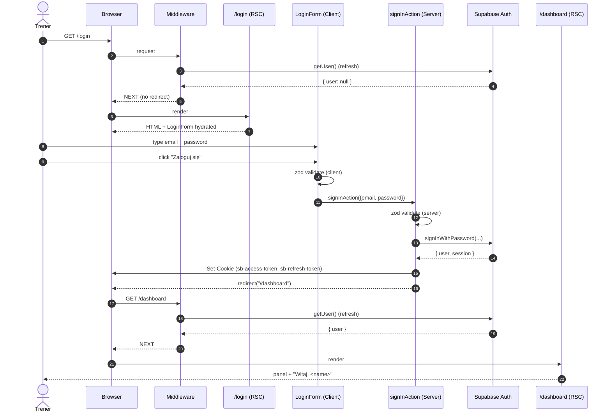
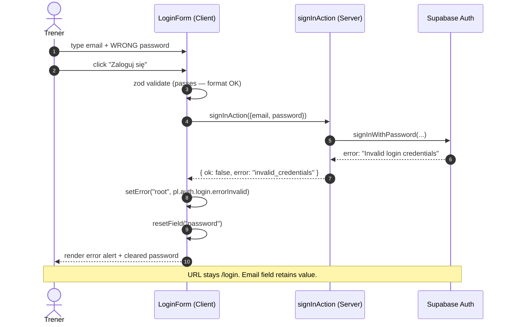
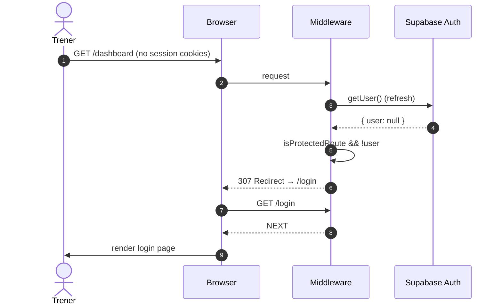

# US-001 — Logowanie trenera do panelu — Technical Design

## Overview & Goals

This story delivers the foundation for every authenticated coach interaction in DudiCoach: a `/login` page (email + password), the supporting Supabase Auth wiring through `@supabase/ssr`, a placeholder `/dashboard` to redirect into, and a `LogoutButton` for the dashboard navbar. Because session-refresh middleware and the SSR helper clients are already scaffolded under `lib/supabase/`, the work centers on (a) the form UI, (b) the server-side sign-in / sign-out entry points, and (c) the first real Supabase migration — a `public.profiles` table — so the migration + RLS pipeline is exercised end-to-end on day one.

**Non-goals (explicit):**

- No public signup page. The trainer account is created manually in Supabase Studio (`auth.users`).
- No password reset flow ("Forgot password?"). Out of scope; deferred to a future story.
- No multi-factor authentication (MFA / TOTP / WebAuthn).
- No magic link / OAuth providers.
- No password change UI.
- No "Remember me" toggle — Supabase's default cookie lifetime is acceptable.
- No multi-tenant / multi-coach considerations. Single-coach is locked.

## Data model impact

### Decision: Create `public.profiles` now

I recommend creating `public.profiles` in this story, even though the immediate UI need is small. Reasons:

1. **Display name in navbar** — AC-4 implies a logout button visible in the dashboard chrome. UX-wise, we want "Witaj, <name>" rather than the raw email. `display_name` lives somewhere; the obvious somewhere is `profiles`.
2. **Migration pipeline shakedown** — every later story will assume this pipeline works. Doing the first migration on a trivial table now finds plumbing bugs (env vars, types regen, RLS test approach, naming conventions) before they pollute a complex feature.
3. **RLS pipeline shakedown** — same logic. The first time we write `auth.uid() = <col>` on a real table is a moment we want isolated, not buried inside the athletes/plans CRUD migration.
4. **Cheaper now than retrofit** — adding a `profiles` table later means writing a backfill migration for existing `auth.users` rows. Doing it now means a single forward-only migration with a trigger that handles future inserts automatically.
5. **Single-user mode is fine with this** — `profiles` is a 1-row table for the foreseeable future. The cost is negligible.

### Schema

```sql
create table public.profiles (
  id uuid primary key references auth.users(id) on delete cascade,
  display_name text,
  created_at timestamptz not null default now(),
  updated_at timestamptz not null default now()
);

comment on table public.profiles is
  'Per-user metadata for authenticated users (single-coach mode: 1 row).';
comment on column public.profiles.display_name is
  'Human-readable name shown in coach navbar; defaults to email local-part.';
```

No additional indexes required — `id` is the PK and is the only access path; the table is single-row in practice.

### Triggers

**Trigger 1 — auto-create profile on signup.** Even though signups happen manually in Supabase Studio, the trigger removes a class of "I forgot to create the profile row" mistakes and is a project-wide convention I want to lock in early.

```sql
create or replace function public.handle_new_user()
returns trigger
language plpgsql
security definer
set search_path = public
as $$
begin
  insert into public.profiles (id, display_name)
  values (
    new.id,
    coalesce(
      new.raw_user_meta_data->>'display_name',
      split_part(new.email, '@', 1)
    )
  );
  return new;
end;
$$;

create trigger on_auth_user_created
  after insert on auth.users
  for each row execute function public.handle_new_user();
```

`security definer` is required because the trigger runs against `auth.users`, which is owned by `supabase_auth_admin`. The fixed `search_path` is a security hardening measure (prevents search_path-injection attacks against `security definer` functions).

**Trigger 2 — `updated_at` auto-touch.** Use Supabase's standard `moddatetime` extension pattern.

```sql
create extension if not exists moddatetime schema extensions;

create trigger profiles_updated_at
  before update on public.profiles
  for each row execute function extensions.moddatetime(updated_at);
```

## RLS policies

```sql
alter table public.profiles enable row level security;

-- A user can read their own profile row.
create policy "profiles_select_own"
  on public.profiles
  for select
  to authenticated
  using (auth.uid() = id);

-- A user can update only their own profile row.
create policy "profiles_update_own"
  on public.profiles
  for update
  to authenticated
  using (auth.uid() = id)
  with check (auth.uid() = id);
```

**Deliberate omissions:**

- **No INSERT policy** — inserts are performed exclusively by the `on_auth_user_created` trigger, which runs as `security definer` and bypasses RLS. Application code must never insert into `profiles` directly.
- **No DELETE policy** — deletes happen only via cascade from `auth.users`. The application has no "delete my profile" UX in single-user mode.
- **No anon policy** — `profiles` is never readable by unauthenticated requests.

## API surface

### Decision: Server Actions, not Route Handlers

For authentication mutations in this story, I choose **Server Actions** (`"use server"` functions invoked from a Client Component form). Justification:

1. Server Actions colocate the credential-handling code with the form that calls it, eliminating an entire class of "frontend forgot to call the right endpoint" bugs.
2. With `@supabase/ssr`, both Server Actions and Route Handlers can read/write cookies via `cookies()`. Capability is identical, but Server Actions skip the JSON serialization round-trip and let us redirect via `redirect()` in the same call stack.
3. We do not need a public HTTP API for auth — there is no third-party client. If a future story needs one (e.g. a mobile app), we can layer a Route Handler on top of the same internal helper without rework.

This is a project-wide convention I am also encoding as **ADR-0001** (see "Open questions / ADR candidates" below) so that downstream stories don't re-debate it.

### Action: `signInAction`

- **Path**: `app/(coach)/login/actions.ts` — exported async function `signInAction(formData: FormData)`.
- **Invocation**: Called from `LoginForm` via `react-hook-form`'s `handleSubmit` -> `startTransition` -> `await signInAction(...)`. We pass plain object payloads, validated server-side with the same `loginSchema` used client-side.
- **Request body** (validated by `loginSchema` in `lib/validation/auth.ts`):
  ```ts
  type SignInInput = {
    email: string; // valid email
    password: string; // min 8 chars
  };
  ```
- **Success path**: Sets session cookies via the SSR client, then `redirect("/dashboard")` (Next.js will throw `NEXT_REDIRECT`, which the form treats as success).
- **Failure response shape**:
  ```ts
  type SignInResult =
    | { ok: true } // never actually returned in practice — redirect throws first
    | { ok: false; error: "invalid_credentials" | "network" | "generic" };
  ```
  The `LoginForm` maps `error` to a Polish string from `pl.auth.login.errorInvalid` / `errorNetwork` / `errorGeneric`.

### AC-2 generic-error contract (security-critical)

Both "email does not exist" and "password is wrong" must return **the same** `error: "invalid_credentials"` value. Supabase Auth already returns a unified `Invalid login credentials` for both cases, but the Server Action must:

1. **Never echo back the email.** No "no account found for X" messages.
2. **Never log the email or password to Sentry.** Use `logger.warn("login failed", { reason: "invalid_credentials" })` with no PII.
3. **Use a constant-time comparison path** — Supabase handles this server-side; we must not add our own pre-checks (like "is this email known?") that would create a timing oracle.
4. **Never expose Supabase error codes to the client.** Map any Supabase error to one of three internal categories: `invalid_credentials`, `network`, `generic`.

### Action: `signOutAction`

- **Path**: `app/(coach)/logout/actions.ts` — exported async function `signOutAction()`.
- **Invocation**: Called from `LogoutButton` (client component) on click.
- **Behavior**: Calls `supabase.auth.signOut()`, which clears cookies via the SSR helper, then `redirect("/login")`.
- **Failure**: On any error, still redirect to `/login` (a stuck logout button is worse than a slightly inconsistent server state; the next middleware pass will fix the cookies anyway).

### No `app/api/auth/*` Route Handlers

The DoD line "API route `/api/auth/*` (lub użycie helpers `@supabase/ssr`)" leaves a choice. We pick "use helpers + Server Actions" and treat that DoD checkbox as satisfied by the actions above. The PR description must call this out explicitly so reviewers don't look for `app/api/auth/`.

## Component tree

```
app/(coach)/login/page.tsx                       [Server Component]
  └─ <LoginPage>
       ├─ <h1>{pl.auth.login.title}</h1>
       ├─ <p>{pl.auth.login.subtitle}</p>
       └─ <LoginForm>                            [Client Component]
            ├─ <FormField name="email">          [react-hook-form]
            │    ├─ <Label>{pl.auth.login.emailLabel}</Label>
            │    └─ <Input
            │         type="email"
            │         autoComplete="email"
            │         placeholder={pl.auth.login.emailPlaceholder} />
            ├─ <FormField name="password">       [react-hook-form]
            │    ├─ <Label>{pl.auth.login.passwordLabel}</Label>
            │    └─ <Input
            │         type="password"
            │         autoComplete="current-password"
            │         placeholder={pl.auth.login.passwordPlaceholder} />
            ├─ <ErrorAlert>                      [renders only if state.error]
            │    {pl.auth.login.errorInvalid | errorNetwork | errorGeneric}
            ├─ <SubmitButton disabled={isPending}>
            │    {isPending ? pl.auth.login.submitting : pl.auth.login.submitButton}
            └─ </form>

app/(coach)/dashboard/page.tsx                   [Server Component]
  └─ <DashboardPage>
       ├─ <CoachNavbar>                          [Server Component, renders user]
       │    ├─ "Witaj, {profile.display_name ?? user.email}"
       │    └─ <LogoutButton />                  [Client Component]
       └─ <p>{pl.coach.dashboard.welcome}</p>
       └─ <p>{pl.coach.dashboard.noAthletes}</p>
```

### String-to-key map (non-negotiable)

| Element | i18n key |
|---|---|
| Page heading | `pl.auth.login.title` |
| Subtitle | `pl.auth.login.subtitle` |
| Email label | `pl.auth.login.emailLabel` |
| Email placeholder | `pl.auth.login.emailPlaceholder` |
| Password label | `pl.auth.login.passwordLabel` |
| Password placeholder | `pl.auth.login.passwordPlaceholder` |
| Submit button (idle) | `pl.auth.login.submitButton` |
| Submit button (pending) | `pl.auth.login.submitting` |
| Invalid credentials error | `pl.auth.login.errorInvalid` |
| Network error | `pl.auth.login.errorNetwork` |
| Generic error | `pl.auth.login.errorGeneric` |
| Logout button | `pl.auth.logout.button` |
| Logout in-flight | `pl.auth.logout.confirming` |
| Email format error (zod) | `pl.validation.emailInvalid` |
| Required field error (zod) | `pl.validation.required` |
| Password length error (zod) | `pl.validation.passwordTooShort` |

### Field-level requirements

- **Email field**: `type="email"`, `autoComplete="email"`, `inputMode="email"`, `aria-invalid` and `aria-describedby` wired to the error message id when invalid. Auto-focus on mount.
- **Password field**: `type="password"`, `autoComplete="current-password"`, `aria-invalid` / `aria-describedby` likewise.
- **Submit failure side-effect**: On `error: "invalid_credentials"`, **clear the password field** (AC-2: "pole hasła jest wyczyszczone") via `form.resetField("password")`. Do **not** clear the email — the user will likely retype the same email.
- **Disabled state**: `submit` button is disabled while `isPending || !form.formState.isValid`.

### LogoutButton component

```
components/coach/LogoutButton.tsx                [Client Component]
  └─ <form action={signOutAction}>
       └─ <button type="submit" disabled={isPending}>
            {isPending ? pl.auth.logout.confirming : pl.auth.logout.button}
          </button>
     </form>
```

It uses a plain `<form action={...}>` rather than `onClick` so it works with JS disabled. `useFormStatus()` provides `pending`.

## Sequence diagrams

### Happy path — successful login



### Failure path — wrong password



### Protected route — unauthenticated dashboard access



## Validation schemas

Location: `lib/validation/auth.ts`

```ts
import { z } from "zod";
import { pl } from "@/lib/i18n/pl";

export const loginSchema = z.object({
  email: z
    .string({ required_error: pl.validation.required })
    .min(1, pl.validation.required)
    .email(pl.validation.emailInvalid),
  password: z
    .string({ required_error: pl.validation.required })
    .min(1, pl.validation.required)
    .min(8, pl.validation.passwordTooShort),
});

export type LoginInput = z.infer<typeof loginSchema>;
```

**Notes:**

- Two `.min` calls on `password` are intentional: the first catches "empty string" with the `required` message, the second catches "too short but non-empty" with the dedicated message. zod evaluates `min` checks in order and reports the first failure.
- The schema is re-used in `signInAction` for server-side validation. The `react-hook-form` resolver is `@hookform/resolvers/zod`'s `zodResolver(loginSchema)`.
- Polish messages come from `pl.validation.*`. We do **not** introduce new keys for this story — the existing keys (`required`, `emailInvalid`, `passwordTooShort`) cover everything.

## Edge cases & failure modes

| # | Case | Handling |
|---|---|---|
| 1 | User tries `/login` while already logged in | Already handled by middleware (`if (user && pathname === "/login") redirect("/dashboard")`). No frontend change needed. |
| 2 | Network error during `signInWithPassword` | Action catches the exception, returns `{ ok: false, error: "network" }`. Form renders `pl.auth.login.errorNetwork`. |
| 3 | Supabase service down (5xx response) | Action catches, returns `{ ok: false, error: "generic" }`. Form renders `pl.auth.login.errorGeneric`. Server logs `console.error` (Sentry will pick it up once Sentry is wired in a later story; for US-001 stdout is acceptable). |
| 4 | Cookies disabled in browser | Sign-in succeeds on the server but the browser drops `Set-Cookie`. The follow-up redirect to `/dashboard` will be intercepted by middleware (no user) and bounce back to `/login` in an infinite-feeling loop. **Mitigation**: in `LoginForm`, after server reports `ok: true`, do a one-shot client-side `document.cookie` probe; if it's empty, render an inline notice using `pl.auth.login.errorGeneric` plus a hardcoded fallback `"Włącz pliki cookie w przeglądarce, aby się zalogować."` (we will add a dedicated `errorCookiesDisabled` key in pl.ts as part of this story — see "Files to create / modify"). |
| 5 | Rate limiting | Supabase Auth has built-in IP-based rate limits (default ~30 requests/hour for password sign-in). For US-001 we rely entirely on those defaults. No custom throttling. If Supabase responds with a rate-limit error, we surface `pl.auth.login.errorGeneric` and let the user retry later. A future story may add explicit "too many attempts" UX. |
| 6 | User submits an unverified email account | Supabase returns the same "Invalid login credentials" error. Treated as `invalid_credentials`. (Manual creation in Supabase Studio means we control whether `email_confirmed_at` is set.) |
| 7 | Trigger fails to create the profile row | Login still succeeds (the trigger runs on `auth.users` insert, not on sign-in). `CoachNavbar` must defensively coalesce: `profile?.display_name ?? user.email ?? ""`. |
| 8 | Server Action invoked outside a form (e.g. devtools) | The server-side `loginSchema.safeParse` rejects malformed input and returns `{ ok: false, error: "generic" }`. No leak. |

## Testing hooks

I do not write the tests; this section enumerates them so `qa-dev` and `qa-test` have unambiguous targets.

### Unit tests (Vitest) — owned by qa-dev

- `tests/unit/lib/validation/auth.test.ts`
  - `loginSchema` accepts a valid email + 8+ char password.
  - Rejects empty email with `pl.validation.required`.
  - Rejects malformed email with `pl.validation.emailInvalid`.
  - Rejects 7-char password with `pl.validation.passwordTooShort`.
  - Rejects empty password with `pl.validation.required`.
  - Rejects whitespace-only email with `pl.validation.emailInvalid`.

### Integration tests (Vitest, mocked Supabase) — owned by qa-dev

- `tests/integration/middleware.test.ts`
  - Unauthenticated `/dashboard` request → 307 to `/login`.
  - Unauthenticated `/athletes/abc` request → 307 to `/login`.
  - Unauthenticated `/login` request → no redirect (NEXT).
  - Authenticated `/login` request → 307 to `/dashboard`.
  - Unauthenticated `/` request → no redirect (public landing page).
  - Cookie-refresh side-effect: middleware writes refreshed cookies onto the response.
- `tests/integration/auth/sign-in-action.test.ts`
  - Mock Supabase client; `signInAction` with valid creds calls `signInWithPassword` then redirects to `/dashboard`.
  - Mock returns `Invalid login credentials` → action returns `{ ok: false, error: "invalid_credentials" }`.
  - Mock throws `TypeError: fetch failed` → action returns `{ ok: false, error: "network" }`.
  - Mock returns 503 → action returns `{ ok: false, error: "generic" }`.
  - Action with malformed input (`email: "not-an-email"`) returns `{ ok: false, error: "generic" }` and never calls `signInWithPassword`.
  - **PII assertion**: action's logger output never contains the submitted email or password substring.

### E2E tests (Playwright) — owned by qa-test

Single spec `tests/e2e/coach-login.spec.ts` covering all five Gherkin ACs:

- **AC-1 happy path**: seed test trainer in Supabase test project → visit `/login` → fill valid creds → submit → assert URL is `/dashboard` → assert `pl.coach.dashboard.welcome` text visible → assert `pl.coach.dashboard.noAthletes` visible.
- **AC-2 wrong password**: visit `/login` → fill valid email + wrong password → submit → assert URL is still `/login` → assert error alert text equals `pl.auth.login.errorInvalid` → assert password input value is empty string → assert email input retains its value.
- **AC-3 protected route**: visit `/dashboard` cold (no cookies) → assert final URL is `/login`.
- **AC-4 logout**: log in via UI → click `LogoutButton` → assert URL is `/login` → manually visit `/dashboard` again → assert redirected back to `/login`.
- **AC-5 dark theme + Polish**: on `/login`, assert all visible labels match `pl.auth.login.*`. Assert background color via `await page.evaluate(() => getComputedStyle(document.body).backgroundColor)` resolves to `rgb(10, 15, 26)` (= `#0A0F1A`). Assert form card background resolves to `rgb(17, 24, 39)` (= `#111827`). Assert `font-family` on body computes to a string starting with `"DM Sans"`.
- **a11y sweep**: `await injectAxe(page)` then `await checkA11y(page)` on the login page. No violations of WCAG 2.1 AA.

### Test data setup

- A Supabase test project (or local Supabase via `supabase start`) with one trainer:
  - email `qa-trainer@dudicoach.test`
  - password `Test1234!` (8+ chars)
  - email_confirmed_at set to NOW
- This test fixture lives in `tests/e2e/fixtures/seed-coach.ts` (created by `qa-test`, not in scope for this design).

## Files to create / modify

All paths are absolute. Existing files only modified where noted.

### (a) Backend files — owned by `developer-backend`

- **CREATE** `C:\Users\dudeu\Desktop\Claude Code\DudiCoach\supabase\migrations\20260409120000_US-001_profiles_and_rls.sql`
  - Creates `public.profiles` table.
  - Creates `handle_new_user()` function and `on_auth_user_created` trigger.
  - Enables `moddatetime` extension and creates `profiles_updated_at` trigger.
  - Enables RLS on `profiles`.
  - Creates `profiles_select_own` and `profiles_update_own` policies.
  - File is forward-only; no down migration. Follow the project naming convention `YYYYMMDDHHMMSS_US-XXX_description.sql`.
- **MODIFY** `C:\Users\dudeu\Desktop\Claude Code\DudiCoach\lib\supabase\database.types.ts`
  - Regenerate via `npx supabase gen types typescript --project-id <id> > lib/supabase/database.types.ts` after the migration is applied. The placeholder file is replaced with the real generated schema. The `profiles` table will appear under `Database['public']['Tables']`.
- **CREATE** `C:\Users\dudeu\Desktop\Claude Code\DudiCoach\app\(coach)\login\actions.ts`
  - Exports `signInAction(input: LoginInput): Promise<SignInResult>`.
  - `"use server"` directive at top.
  - Uses `createClient()` from `lib/supabase/server.ts`.
  - Validates input with `loginSchema.safeParse`.
  - Catches and categorizes errors per the contract above.
  - Calls `redirect("/dashboard")` on success.
- **CREATE** `C:\Users\dudeu\Desktop\Claude Code\DudiCoach\app\(coach)\logout\actions.ts`
  - Exports `signOutAction(): Promise<void>`.
  - `"use server"` directive at top.
  - Calls `supabase.auth.signOut()` then `redirect("/login")`.
- **CREATE** `C:\Users\dudeu\Desktop\Claude Code\DudiCoach\lib\validation\auth.ts`
  - Exports `loginSchema` and `LoginInput` per "Validation schemas" above.

### (b) Frontend files — owned by `developer-frontend`

- **CREATE** `C:\Users\dudeu\Desktop\Claude Code\DudiCoach\app\(coach)\login\page.tsx`
  - Server Component. Renders `<LoginForm />` inside a centered card.
  - Tailwind v4 utilities only — `bg-card`, `text-foreground`, `border-border`, etc. (these come automatically from the `@theme` tokens in `globals.css`).
  - No hardcoded Polish — pulls from `pl.auth.login.*`.
- **CREATE** `C:\Users\dudeu\Desktop\Claude Code\DudiCoach\app\(coach)\login\LoginForm.tsx`
  - `"use client"`. react-hook-form + `zodResolver(loginSchema)`.
  - Submits via `signInAction`. Wraps the call in `startTransition` to drive a pending state.
  - On error, calls `form.setError("root", { message: <pl key> })` and `form.resetField("password")`.
  - Renders a single error alert when `form.formState.errors.root` is set.
- **CREATE** `C:\Users\dudeu\Desktop\Claude Code\DudiCoach\app\(coach)\dashboard\page.tsx`
  - Server Component. Reads the current user via `createClient().auth.getUser()`.
  - Reads the user's profile row: `supabase.from("profiles").select("display_name").eq("id", user.id).single()`.
  - Renders `<CoachNavbar profile={profile} email={user.email} />` and a placeholder welcome message using `pl.coach.dashboard.*` keys.
- **CREATE** `C:\Users\dudeu\Desktop\Claude Code\DudiCoach\components\coach\CoachNavbar.tsx`
  - Server Component. Renders "Witaj, {display_name ?? email}" plus `<LogoutButton />`.
- **CREATE** `C:\Users\dudeu\Desktop\Claude Code\DudiCoach\components\coach\LogoutButton.tsx`
  - `"use client"`. `<form action={signOutAction}>` with a single button.
  - Uses `useFormStatus()` to render `pl.auth.logout.confirming` while pending.
- **MODIFY** `C:\Users\dudeu\Desktop\Claude Code\DudiCoach\lib\i18n\pl.ts`
  - Add one new key: `auth.login.errorCookiesDisabled = "Włącz pliki cookie w przeglądarce, aby się zalogować."` (used by edge case #4 in "Edge cases & failure modes").
  - No other strings added — everything else already exists under `auth.login.*` and `auth.logout.*`.

### (c) New migration file (already listed under backend, repeated here for clarity)

- `C:\Users\dudeu\Desktop\Claude Code\DudiCoach\supabase\migrations\20260409120000_US-001_profiles_and_rls.sql`

### Files explicitly NOT touched

- `C:\Users\dudeu\Desktop\Claude Code\DudiCoach\middleware.ts` — already correct.
- `C:\Users\dudeu\Desktop\Claude Code\DudiCoach\lib\supabase\middleware.ts` — already correct; the protected route set (`/dashboard`, `/athletes/*`) and `/login` redirect rules described in the AC-3 sequence diagram are already implemented.
- `C:\Users\dudeu\Desktop\Claude Code\DudiCoach\lib\supabase\server.ts` and `client.ts` — already correct.
- `C:\Users\dudeu\Desktop\Claude Code\DudiCoach\app\layout.tsx` and `globals.css` — already provide DM Sans, dark theme tokens, and form element styling.

## Open questions / ADR candidates

### ADR-0001 — Server Actions vs Route Handlers for mutations

This story makes a project-wide commitment ("Server Actions for all mutations originated from our own UI; Route Handlers only when a third-party client needs HTTP access"). That commitment will affect every future story (athletes CRUD, plans, AI generation), so it warrants an ADR.

**I will write the ADR** at `C:\Users\dudeu\Desktop\Claude Code\DudiCoach\docs\adr\0001-server-actions-vs-route-handlers.md` as part of this design pass.

### Resolved during design (no questions remaining for developers)

- **Profiles table?** Yes, created in this story. See "Data model impact".
- **Display name source?** Trigger defaults from email local-part. Coach can edit later (UI for editing is out of scope for US-001 — the navbar reads it; an "edit profile" page is a separate story).
- **Server Actions vs Route Handlers?** Server Actions. See ADR-0001.
- **`/api/auth/*` route?** Not created. DoD checkbox satisfied by Server Actions.
- **Route group naming?** `app/(coach)/login/page.tsx` so the URL stays `/login` while colocating the file with the rest of the coach area. Same for `app/(coach)/dashboard/page.tsx`.
- **Where do client-side validation messages live?** `lib/validation/auth.ts` imports from `lib/i18n/pl.ts`. zod schemas reference Polish strings directly. No separate translation layer.

### Unresolved (does NOT block US-001)

- **Sentry wiring** — failure logging in `signInAction` currently uses `console.error`. A future story will add Sentry; this design assumes the migration is mechanical.
- **Profile editing UI** — navbar reads `display_name`, but US-001 has no editor. A later story should add a settings page.
- **Password reset** — explicitly out of scope. Track as a future story.
- **MFA** — explicitly out of scope.

