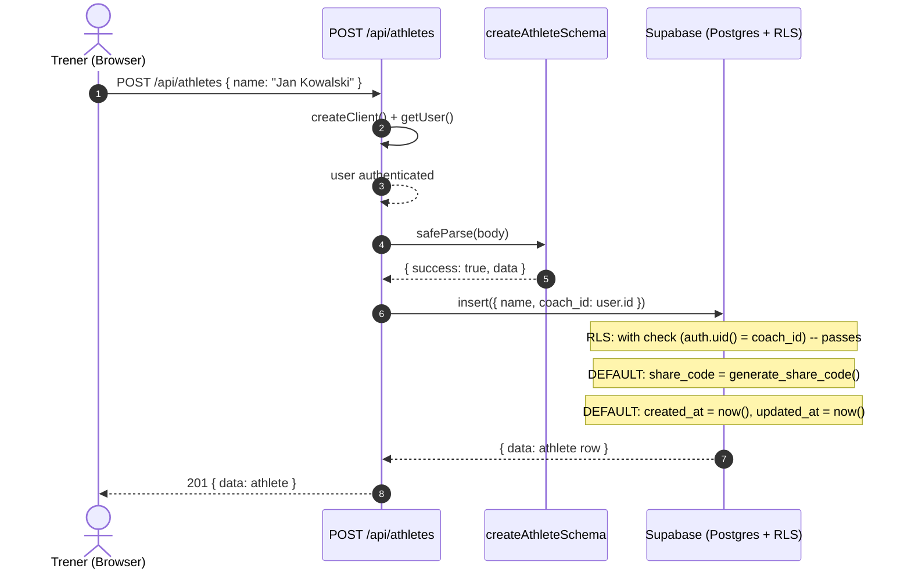
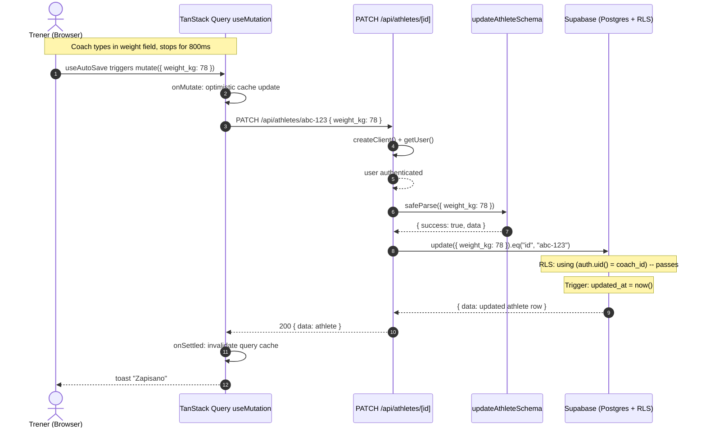
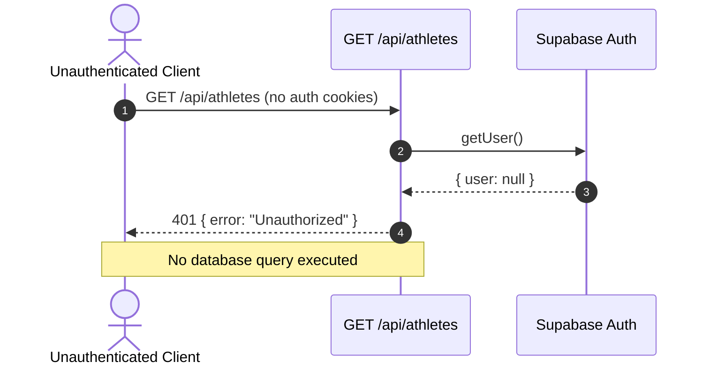
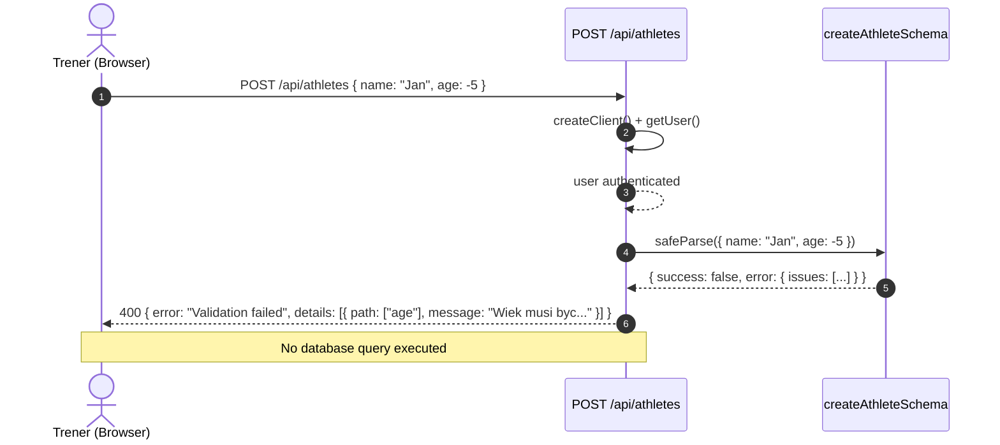

# US-002 — Backend CRUD zawodnika — Technical Design

## Overview & Goals

This story delivers the complete backend surface for athlete management: the `athletes` Postgres table with RLS, zod validation schemas, and five Route Handler endpoints (POST, GET list, GET single, PATCH, DELETE). US-003 (frontend list + edit with auto-save) consumes these endpoints and is the sole client.

**Non-goals (explicit):**

- No frontend pages, components, or hooks (US-003).
- No auto-save logic or debounce (US-003 -- the client-side concern).
- No athlete sharing / share-code consumption flow (US-004).
- No tests, injuries, diagnostics, progressions, or plans sub-resources (later stories).
- No multi-coach / multi-tenant considerations. Single-coach is locked.

### Why Route Handlers instead of Server Actions

ADR-0001 establishes Server Actions as the default mutation surface. This story uses Route Handlers as a justified exception. The reasoning is documented fully in ADR-0002 (`docs/adr/0002-route-handlers-for-crud-with-tanstack-query.md`), but the core argument is:

1. **US-003 consumes these endpoints via TanStack Query's `useMutation` and `useQuery`**, which are designed around `fetch()` to HTTP endpoints. TanStack Query's entire value proposition -- cache invalidation via query keys, optimistic updates via `onMutate`/`onSettled`, retry logic, stale-while-revalidate -- operates on the assumption that mutations return promises wrapping fetch responses.

2. **Auto-save with debounce calls the mutation function imperatively from a `useEffect`**, not from a form submission event. Server Actions are optimized for the `<form action={...}>` and `startTransition(() => action(...))` patterns. Wrapping a Server Action to work with `useMutation` requires an awkward adapter function that negates the "less boilerplate" advantage cited in ADR-0001.

3. **PATCH partial updates are the primary mutation pattern.** Auto-save sends only changed fields. Route Handlers with `PATCH` semantics map cleanly to this. Server Actions do not have HTTP method semantics -- you would need to encode the operation type in the payload.

4. **This exception is narrow and principled.** It applies specifically to CRUD endpoints consumed by TanStack Query with auto-save. Form-based mutations (login, logout) remain Server Actions per ADR-0001. The boundary is clear: if the consumer is `useMutation`/`useQuery`, use Route Handlers; if the consumer is a `<form>` or `startTransition`, use Server Actions.

## Data model

### Table: `public.athletes`

```sql
create table public.athletes (
  id              uuid         primary key default gen_random_uuid(),
  coach_id        uuid         not null references auth.users(id) on delete cascade,
  name            text         not null,
  age             integer,
  weight_kg       numeric(5,1),
  height_cm       numeric(5,1),
  sport           text,
  training_start_date  date,
  training_days_per_week integer,
  session_minutes integer,
  current_phase   text,
  goal            text,
  notes           text,
  share_code      char(6)      not null unique default generate_share_code(),
  created_at      timestamptz  not null default now(),
  updated_at      timestamptz  not null default now(),

  constraint athletes_age_check
    check (age is null or (age >= 10 and age <= 100)),
  constraint athletes_weight_check
    check (weight_kg is null or (weight_kg >= 30 and weight_kg <= 250)),
  constraint athletes_height_check
    check (height_cm is null or (height_cm >= 100 and height_cm <= 250)),
  constraint athletes_training_days_check
    check (training_days_per_week is null or (training_days_per_week >= 1 and training_days_per_week <= 7)),
  constraint athletes_session_minutes_check
    check (session_minutes is null or (session_minutes >= 20 and session_minutes <= 180)),
  constraint athletes_current_phase_check
    check (current_phase is null or current_phase in ('preparatory', 'base', 'building', 'peak', 'transition'))
);

comment on table public.athletes is
  'Athlete profiles managed by the coach. One coach owns many athletes.';
comment on column public.athletes.coach_id is
  'FK to auth.users — the coach who owns this athlete. RLS anchor.';
comment on column public.athletes.sport is
  'Free-form sport name. NOT an enum — avoids painful migrations when new sports are added.';
comment on column public.athletes.current_phase is
  'Training periodization phase. Constrained by CHECK, not enum, for migration friendliness.';
comment on column public.athletes.share_code is
  'Unique 6-char uppercase alphanumeric code for athlete panel access (US-004).';
```

### Design decisions on column types

**`sport` as plain `text`, NOT `sport_enum`:** The story's Implementation Notes suggest `sport` as a Postgres enum. I override this. The original spec lists 10 sports but also includes "Inny" (Other) with "Test wlasny" -- the coach will want to add arbitrary sports. Postgres enums require an `ALTER TYPE ... ADD VALUE` migration for each new value, which cannot run inside a transaction. Plain `text` with optional client-side suggestions is simpler, cheaper to maintain, and loses nothing (we have no queries that filter by sport enum value).

**`current_phase` as `text` with CHECK constraint, NOT `phase_enum`:** Same reasoning. CHECK constraints are trivially alterable (`ALTER TABLE ... DROP CONSTRAINT ... ADD CONSTRAINT ...`) within a transaction. Postgres enums are not.

**`level` is NOT stored in the database:** The original spec says level is "calculated automatically from training start date" using thresholds (0-6m beginner, 6-18m intermediate, 18-48m advanced, 48m+ elite). This is a pure function of `training_start_date` and the current date. Storing it would create a stale-data problem: every day that passes could change an athlete's level. Computing it client-side in US-003's `calculateLevel(startDate)` function is correct. The API returns `training_start_date` and the frontend derives `level`.

**`share_code` auto-generated via `generate_share_code()`:** A Postgres function that generates a random 6-character uppercase alphanumeric string and retries on collision. Set as DEFAULT on the column so every INSERT automatically gets a unique code without application logic.

### Function: `generate_share_code()`

```sql
create or replace function public.generate_share_code()
returns char(6)
language plpgsql
as $$
declare
  chars text := 'ABCDEFGHJKLMNPQRSTUVWXYZ23456789';
  result char(6);
  collision boolean;
begin
  loop
    result := '';
    for i in 1..6 loop
      result := result || substr(chars, floor(random() * length(chars) + 1)::integer, 1);
    end loop;
    select exists(select 1 from public.athletes where share_code = result) into collision;
    if not collision then
      return result;
    end if;
  end loop;
end;
$$;
```

Note: The character set deliberately excludes ambiguous characters (0/O, 1/I/L) to reduce athlete data-entry errors when typing the code.

### Trigger: `updated_at` auto-touch

```sql
-- moddatetime extension already enabled in US-001 migration
create trigger athletes_updated_at
  before update on public.athletes
  for each row execute function extensions.moddatetime(updated_at);
```

### Indexes

```sql
-- coach_id: RLS filtering performance
create index idx_athletes_coach_id on public.athletes(coach_id);

-- updated_at DESC: default sort order for athlete list
create index idx_athletes_updated_at on public.athletes(updated_at desc);

-- share_code UNIQUE: already enforced by the UNIQUE constraint (implicit unique index)
```

No index on `created_at` -- the story's Implementation Notes suggest it, but we never sort or filter by `created_at` in any known query. The default list sort is `updated_at DESC` (AC-3). Adding unused indexes wastes write performance.

## RLS policies

```sql
alter table public.athletes enable row level security;

-- Coach can read only their own athletes
create policy "athletes_select_own"
  on public.athletes
  for select
  to authenticated
  using (auth.uid() = coach_id);

-- Coach can insert athletes only for themselves
create policy "athletes_insert_own"
  on public.athletes
  for insert
  to authenticated
  with check (auth.uid() = coach_id);

-- Coach can update only their own athletes
create policy "athletes_update_own"
  on public.athletes
  for update
  to authenticated
  using (auth.uid() = coach_id)
  with check (auth.uid() = coach_id);

-- Coach can delete only their own athletes
create policy "athletes_delete_own"
  on public.athletes
  for delete
  to authenticated
  using (auth.uid() = coach_id);
```

**No anon policies.** Unauthenticated requests get zero rows. The share-code access path (US-004) will add a separate SELECT policy scoped to `share_code` matching, likely using an RPC function or a separate anon policy -- that is US-004's concern, not US-002's.

## API surface

### Decision: Route Handlers

See "Why Route Handlers instead of Server Actions" in Overview above and ADR-0002 for the full rationale.

All endpoints live under `app/api/athletes/`. Every handler follows this pattern:

1. Create Supabase server client via `createClient()` from `lib/supabase/server.ts`.
2. Call `supabase.auth.getUser()`. If no user, return `401 { error: "Unauthorized" }`.
3. Validate request body (POST/PATCH) with zod. If invalid, return `400 { error: "Validation failed", details: ZodIssue[] }`.
4. Execute the Supabase query. RLS automatically scopes to the authenticated coach.
5. Return the appropriate response.

### `POST /api/athletes` -- create athlete

- **File:** `app/api/athletes/route.ts` (export `POST`)
- **Request body:** Validated by `createAthleteSchema`. Only `name` is required.
- **Behavior:** Inserts a new row with `coach_id = user.id`. The `share_code`, `created_at`, and `updated_at` columns are auto-populated by defaults/triggers.
- **Response:** `201 { data: Athlete }`
- **Errors:** `401` (no auth), `400` (validation), `500` (unexpected)

```ts
// Pseudocode
export async function POST(request: NextRequest) {
  const supabase = await createClient();
  const { data: { user }, error: authError } = await supabase.auth.getUser();
  if (!user) return NextResponse.json({ error: "Unauthorized" }, { status: 401 });

  const body = await request.json();
  const parsed = createAthleteSchema.safeParse(body);
  if (!parsed.success) {
    return NextResponse.json(
      { error: "Validation failed", details: parsed.error.issues },
      { status: 400 }
    );
  }

  const { data, error } = await supabase
    .from("athletes")
    .insert({ ...parsed.data, coach_id: user.id })
    .select()
    .single();

  if (error) return NextResponse.json({ error: error.message }, { status: 500 });
  return NextResponse.json({ data }, { status: 201 });
}
```

### `GET /api/athletes` -- list all coach's athletes

- **File:** `app/api/athletes/route.ts` (export `GET`)
- **Behavior:** Selects all athletes for the authenticated coach, sorted by `updated_at DESC`. RLS ensures only the coach's athletes are returned.
- **Response:** `200 { data: Athlete[] }`
- **Errors:** `401` (no auth), `500` (unexpected)

```ts
// Pseudocode
export async function GET() {
  const supabase = await createClient();
  const { data: { user } } = await supabase.auth.getUser();
  if (!user) return NextResponse.json({ error: "Unauthorized" }, { status: 401 });

  const { data, error } = await supabase
    .from("athletes")
    .select("*")
    .order("updated_at", { ascending: false });

  if (error) return NextResponse.json({ error: error.message }, { status: 500 });
  return NextResponse.json({ data });
}
```

### `GET /api/athletes/[id]` -- single athlete

- **File:** `app/api/athletes/[id]/route.ts` (export `GET`)
- **Behavior:** Selects a single athlete by `id`. RLS ensures the coach can only read their own athlete.
- **Response:** `200 { data: Athlete }` or `404 { error: "Not found" }`
- **Errors:** `401` (no auth), `404` (not found or not owned), `500` (unexpected)

```ts
// Pseudocode
export async function GET(
  _request: NextRequest,
  { params }: { params: Promise<{ id: string }> }
) {
  const { id } = await params;
  const supabase = await createClient();
  const { data: { user } } = await supabase.auth.getUser();
  if (!user) return NextResponse.json({ error: "Unauthorized" }, { status: 401 });

  const { data, error } = await supabase
    .from("athletes")
    .select("*")
    .eq("id", id)
    .single();

  if (error || !data) return NextResponse.json({ error: "Not found" }, { status: 404 });
  return NextResponse.json({ data });
}
```

### `PATCH /api/athletes/[id]` -- partial update

- **File:** `app/api/athletes/[id]/route.ts` (export `PATCH`)
- **Request body:** Validated by `updateAthleteSchema`. All fields optional.
- **Behavior:** Updates only the provided fields. RLS ensures the coach can only update their own athlete. The `updated_at` trigger fires automatically.
- **Response:** `200 { data: Athlete }` (the full updated row)
- **Errors:** `401` (no auth), `400` (validation), `404` (not found or not owned), `500` (unexpected)

Note: US-003 calls this endpoint via auto-save debounce. Each call sends the full form state (all fields), not just the changed field. This simplifies the frontend (`useAutoSave` does not need to diff) and the backend (no merge logic). The overhead of sending ~12 fields on every keystroke-debounce is negligible.

```ts
// Pseudocode
export async function PATCH(
  request: NextRequest,
  { params }: { params: Promise<{ id: string }> }
) {
  const { id } = await params;
  const supabase = await createClient();
  const { data: { user } } = await supabase.auth.getUser();
  if (!user) return NextResponse.json({ error: "Unauthorized" }, { status: 401 });

  const body = await request.json();
  const parsed = updateAthleteSchema.safeParse(body);
  if (!parsed.success) {
    return NextResponse.json(
      { error: "Validation failed", details: parsed.error.issues },
      { status: 400 }
    );
  }

  const { data, error } = await supabase
    .from("athletes")
    .update(parsed.data)
    .eq("id", id)
    .select()
    .single();

  if (error || !data) return NextResponse.json({ error: "Not found" }, { status: 404 });
  return NextResponse.json({ data });
}
```

### `DELETE /api/athletes/[id]` -- delete athlete

- **File:** `app/api/athletes/[id]/route.ts` (export `DELETE`)
- **Behavior:** Deletes the athlete by `id`. RLS ensures the coach can only delete their own athlete.
- **Response:** `204` (no body)
- **Errors:** `401` (no auth), `404` (not found or not owned), `500` (unexpected)

```ts
// Pseudocode
export async function DELETE(
  _request: NextRequest,
  { params }: { params: Promise<{ id: string }> }
) {
  const { id } = await params;
  const supabase = await createClient();
  const { data: { user } } = await supabase.auth.getUser();
  if (!user) return NextResponse.json({ error: "Unauthorized" }, { status: 401 });

  const { error, count } = await supabase
    .from("athletes")
    .delete()
    .eq("id", id);

  if (error) return NextResponse.json({ error: error.message }, { status: 500 });
  return new NextResponse(null, { status: 204 });
}
```

### Error response shapes

All error responses follow a consistent shape:

```ts
// 401
{ "error": "Unauthorized" }

// 400 (validation)
{
  "error": "Validation failed",
  "details": [
    { "code": "too_small", "minimum": 10, "path": ["age"], "message": "Wiek musi byc miedzy 10 a 100" }
  ]
}

// 404
{ "error": "Not found" }

// 500
{ "error": "Internal server error" }
```

Note on 500 errors: never expose raw Supabase error messages to the client in production. The pseudocode above shows `error.message` for clarity; the real implementation should log the full error server-side and return a generic message.

## Validation schemas

**File:** `lib/validation/athlete.ts`

```ts
import { z } from "zod";

import { pl } from "@/lib/i18n/pl";

const CURRENT_PHASES = ["preparatory", "base", "building", "peak", "transition"] as const;

export const createAthleteSchema = z.object({
  name: z
    .string()
    .min(1, pl.validation.required),
  age: z
    .number()
    .int()
    .min(10, pl.validation.ageRange)
    .max(100, pl.validation.ageRange)
    .nullable()
    .optional(),
  weight_kg: z
    .number()
    .min(30, pl.validation.weightRange)
    .max(250, pl.validation.weightRange)
    .nullable()
    .optional(),
  height_cm: z
    .number()
    .min(100, pl.validation.heightRange)
    .max(250, pl.validation.heightRange)
    .nullable()
    .optional(),
  sport: z
    .string()
    .nullable()
    .optional(),
  training_start_date: z
    .string()   // ISO date string "YYYY-MM-DD"
    .nullable()
    .optional(),
  training_days_per_week: z
    .number()
    .int()
    .min(1, pl.validation.trainingDaysRange)
    .max(7, pl.validation.trainingDaysRange)
    .nullable()
    .optional(),
  session_minutes: z
    .number()
    .int()
    .min(20, pl.validation.sessionMinutesRange)
    .max(180, pl.validation.sessionMinutesRange)
    .nullable()
    .optional(),
  current_phase: z
    .enum(CURRENT_PHASES)
    .nullable()
    .optional(),
  goal: z
    .string()
    .nullable()
    .optional(),
  notes: z
    .string()
    .nullable()
    .optional(),
});

export const updateAthleteSchema = createAthleteSchema.partial();

export type CreateAthleteInput = z.infer<typeof createAthleteSchema>;
export type UpdateAthleteInput = z.infer<typeof updateAthleteSchema>;
```

**Design notes:**

- `training_start_date` is validated as a string (ISO date format) because JSON does not have a native date type. The Supabase client handles the string-to-date cast on insert/update.
- All fields except `name` are `.nullable().optional()` to support auto-save: the frontend may send a partial form state where many fields are still empty.
- `updateAthleteSchema` uses `createAthleteSchema.partial()` which makes `name` optional too -- this is correct because PATCH should not require name to be re-sent on every keystroke.
- Validation messages reference existing keys in `lib/i18n/pl.ts`. No new i18n keys are needed for US-002.

## Sequence diagrams

### POST create athlete (happy path)



### PATCH update athlete (auto-save from US-003)



### Unauthenticated request -- 401



### Validation failure -- 400



## Testing hooks

I do not write the tests; this section enumerates them so `qa-dev` has unambiguous targets.

### Unit tests (Vitest) -- `tests/unit/lib/validation/athlete.test.ts`

- `createAthleteSchema` accepts `{ name: "Jan" }` (minimal valid input).
- `createAthleteSchema` accepts full valid input with all fields populated.
- Rejects missing `name` with `pl.validation.required`.
- Rejects empty string `name` with `pl.validation.required`.
- Rejects `age: 9` (below minimum 10) with `pl.validation.ageRange`.
- Rejects `age: 101` (above maximum 100) with `pl.validation.ageRange`.
- Rejects `weight_kg: 29` with `pl.validation.weightRange`.
- Rejects `weight_kg: 251` with `pl.validation.weightRange`.
- Rejects `height_cm: 99` with `pl.validation.heightRange`.
- Rejects `height_cm: 251` with `pl.validation.heightRange`.
- Rejects `training_days_per_week: 0` with `pl.validation.trainingDaysRange`.
- Rejects `training_days_per_week: 8` with `pl.validation.trainingDaysRange`.
- Rejects `session_minutes: 19` with `pl.validation.sessionMinutesRange`.
- Rejects `session_minutes: 181` with `pl.validation.sessionMinutesRange`.
- Rejects `current_phase: "nonexistent"` (not in enum).
- Accepts `current_phase: null` (nullable).
- `updateAthleteSchema` accepts `{}` (empty object -- all fields optional).
- `updateAthleteSchema` accepts `{ weight_kg: 75 }` (single field).

### Integration tests (Vitest, mocked Supabase) -- `tests/integration/api/athletes.test.ts`

For each Route Handler:

- **POST /api/athletes**
  - Authenticated + valid body -> 201 + athlete in response.
  - Authenticated + invalid body (age: -5) -> 400 + validation details.
  - Authenticated + missing name -> 400.
  - Unauthenticated -> 401.

- **GET /api/athletes**
  - Authenticated + 3 athletes in DB -> 200 + array of 3, sorted by `updated_at DESC`.
  - Authenticated + 0 athletes -> 200 + empty array.
  - Unauthenticated -> 401.

- **GET /api/athletes/[id]**
  - Authenticated + existing athlete -> 200 + athlete.
  - Authenticated + non-existent ID -> 404.
  - Unauthenticated -> 401.

- **PATCH /api/athletes/[id]**
  - Authenticated + valid partial body -> 200 + updated athlete.
  - Authenticated + invalid body -> 400.
  - Authenticated + non-existent ID -> 404.
  - Unauthenticated -> 401.

- **DELETE /api/athletes/[id]**
  - Authenticated + existing athlete -> 204 + no body.
  - Authenticated + non-existent ID -> 404 (or 204 -- see open questions).
  - Unauthenticated -> 401.

## Files to create / modify

All paths are absolute.

### (a) Migration -- owned by `developer-backend`

- **CREATE** `C:\Users\dudeu\Desktop\Claude Code\DudiCoach\supabase\migrations\20260410120000_US-002_athletes_table.sql`
  - Creates `generate_share_code()` function.
  - Creates `public.athletes` table with all columns, CHECK constraints, and defaults.
  - Enables RLS on `athletes`.
  - Creates four RLS policies (`select_own`, `insert_own`, `update_own`, `delete_own`).
  - Creates `athletes_updated_at` trigger using `moddatetime`.
  - Creates indexes on `coach_id` and `updated_at DESC`.

### (b) Validation schema -- owned by `developer-backend`

- **CREATE** `C:\Users\dudeu\Desktop\Claude Code\DudiCoach\lib\validation\athlete.ts`
  - Exports `createAthleteSchema`, `updateAthleteSchema`, `CreateAthleteInput`, `UpdateAthleteInput`.

### (c) Route Handlers -- owned by `developer-backend`

- **CREATE** `C:\Users\dudeu\Desktop\Claude Code\DudiCoach\app\api\athletes\route.ts`
  - Exports `POST` and `GET` handlers.

- **CREATE** `C:\Users\dudeu\Desktop\Claude Code\DudiCoach\app\api\athletes\[id]\route.ts`
  - Exports `GET`, `PATCH`, and `DELETE` handlers.

### (d) Regenerated types -- owned by `developer-backend`

- **MODIFY** `C:\Users\dudeu\Desktop\Claude Code\DudiCoach\lib\supabase\database.types.ts`
  - Regenerate via `npx supabase gen types typescript --project-id qpsgpfnqlbbrvawjeeaj > lib/supabase/database.types.ts` after migration is applied. The `athletes` table will appear under `Database['public']['Tables']`.

### (e) i18n -- no changes needed

- `C:\Users\dudeu\Desktop\Claude Code\DudiCoach\lib\i18n\pl.ts` already contains all required validation keys (`ageRange`, `weightRange`, `heightRange`, `trainingDaysRange`, `sessionMinutesRange`, `required`). No new keys needed for US-002.

### Files explicitly NOT touched

- `middleware.ts` -- no change. Route Handlers under `/api/*` are not protected by the middleware redirect; auth is checked inside each handler via `getUser()`.
- `lib/supabase/server.ts` -- already provides `createClient()` usable from Route Handlers.
- `lib/i18n/pl.ts` -- all needed keys already exist.

## Open questions

### Resolved during design

- **Route Handlers vs Server Actions?** Route Handlers. Justified in this doc and formalized in ADR-0002.
- **`sport` as enum or text?** Plain text. See Data Model section.
- **`current_phase` as enum or CHECK?** CHECK constraint on text. See Data Model section.
- **Store `level` in DB?** No. Computed client-side from `training_start_date`. See Data Model section.
- **`share_code` generation?** Postgres function with collision-retry loop, set as column DEFAULT. Excludes ambiguous characters (0/O, 1/I/L).
- **DELETE of non-existent athlete: 404 or 204?** Use 404. The Supabase `.delete().eq("id", id)` returns no rows if the ID does not exist (or RLS blocks it). We treat "zero affected rows" as 404 to give the frontend a clear signal. This is consistent with the GET single endpoint.
- **ADR-0002 warranted?** Yes. The Route Handlers exception will apply to future CRUD stories (US-005 plans CRUD, US-006 progressions) that also use TanStack Query consumption. A one-paragraph justification in this design doc would be repeated in every future design. The ADR captures it once.

### Unresolved (does NOT block US-002)

- **Rate limiting on athlete creation.** Not needed for single-coach. If abuse is ever a concern, add Vercel Edge rate limiting in a future story.
- **Soft delete vs hard delete.** Current design uses hard delete (`ON DELETE CASCADE`). If "undo delete" is ever needed, a future story would add a `deleted_at` column and modify RLS to filter soft-deleted rows. Not needed now.
