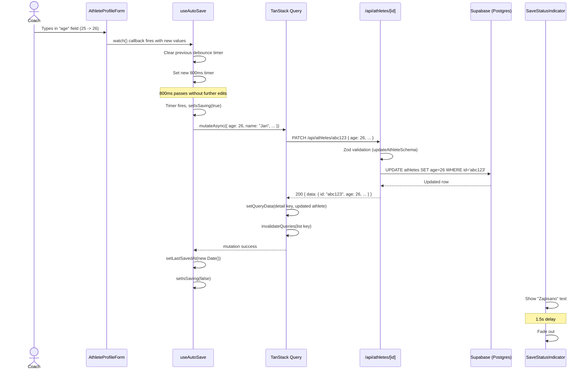
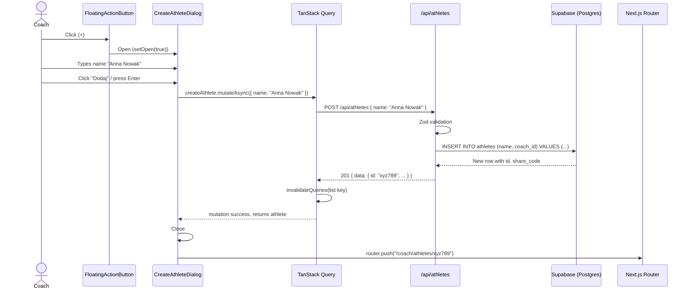

# US-003 Design — Frontend lista + edycja zawodnika z auto-save

## Context

US-003 delivers the core athlete management UI: a dashboard listing athlete cards, a floating
action button to create new athletes, and an athlete editor with auto-save. It builds on
US-001 (coach login) and US-002 (backend CRUD API). The backend API routes are already in
place at `/api/athletes` (GET, POST) and `/api/athletes/[id]` (GET, PATCH, DELETE).

This is the first story that introduces TanStack Query for server-state management and
the auto-save pattern (ADR-0001) that will be reused across all future editor screens.

---

## 1. Page Routing Structure

```
app/
  (coach)/
    layout.tsx                     -- NEW: coach layout with QueryClientProvider
    dashboard/
      page.tsx                     -- MODIFY: RSC, fetches athletes, renders list
    athletes/
      [id]/
        page.tsx                   -- NEW: RSC, fetches single athlete, renders editor
```

### Route Details

| Route | Type | Auth | Description |
|---|---|---|---|
| `/coach/dashboard` | RSC (Server Component) | Middleware-protected | Lists athlete cards, stats counter, FAB |
| `/coach/athletes/[id]` | RSC (Server Component) | Middleware-protected | Athlete editor with tabs, auto-save form |

Both routes are already protected by the existing middleware in `lib/supabase/middleware.ts`
which redirects unauthenticated users hitting `/coach/**` to `/login`.

---

## 2. Component Tree

```
app/(coach)/layout.tsx [RSC]
  QueryProvider [CC] -- wraps children in QueryClientProvider
    {children}

app/(coach)/dashboard/page.tsx [RSC]
  CoachNavbar [RSC] (existing)
  DashboardContent [CC]
    AthleteStatsBar [CC]
    AthleteCardGrid [CC]
      AthleteCard [CC] (mapped per athlete)
        LevelBadge [CC]
    EmptyState [CC] (when no athletes)
    CreateAthleteDialog [CC]
    FloatingActionButton [CC]

app/(coach)/athletes/[id]/page.tsx [RSC]
  CoachNavbar [RSC] (existing)
  AthleteEditorShell [CC]
    BackButton [CC]
    SaveStatusIndicator [CC]
    TabPills [CC]
    AthleteProfileForm [CC]
      LevelDisplay [CC]
        LevelProgressBar [CC]
```

### RSC vs CC Rationale

| Component | Type | Why |
|---|---|---|
| `page.tsx` (both) | RSC | Initial data fetch + auth check on server, passes to CC |
| `QueryProvider` | CC | TanStack QueryClientProvider requires client-side React context |
| `DashboardContent` | CC | Needs TanStack Query for data fetching, FAB interaction |
| `AthleteCard` | CC | Click handler for navigation |
| `CreateAthleteDialog` | CC | Form + mutation interaction |
| `FloatingActionButton` | CC | onClick to open dialog |
| `AthleteEditorShell` | CC | Houses form, auto-save hook, tabs |
| `AthleteProfileForm` | CC | react-hook-form, auto-save |
| `LevelDisplay` | CC | Reacts to training_start_date changes in real time |

---

## 3. Data Flow — TanStack Query

### 3.1 Query Keys

```typescript
export const athleteKeys = {
  all:    ["athletes"] as const,
  list:   () => [...athleteKeys.all, "list"] as const,
  detail: (id: string) => [...athleteKeys.all, "detail", id] as const,
};
```

Place in: `lib/api/athletes.ts`

### 3.2 Query / Mutation Functions

```typescript
// lib/api/athletes.ts

import type { Tables } from "@/lib/supabase/database.types";

export type Athlete = Tables<"athletes">;

// --- Queries ---

export async function fetchAthletes(): Promise<Athlete[]> {
  const res = await fetch("/api/athletes");
  if (!res.ok) throw new Error("Failed to fetch athletes");
  const json = await res.json();
  return json.data;
}

export async function fetchAthlete(id: string): Promise<Athlete> {
  const res = await fetch(`/api/athletes/${id}`);
  if (!res.ok) throw new Error("Failed to fetch athlete");
  const json = await res.json();
  return json.data;
}

// --- Mutations ---

export async function createAthlete(input: { name: string }): Promise<Athlete> {
  const res = await fetch("/api/athletes", {
    method: "POST",
    headers: { "Content-Type": "application/json" },
    body: JSON.stringify(input),
  });
  if (!res.ok) {
    const err = await res.json();
    throw new Error(err.error ?? "Failed to create athlete");
  }
  const json = await res.json();
  return json.data;
}

export async function updateAthlete(
  id: string,
  input: Partial<Omit<Athlete, "id" | "coach_id" | "created_at" | "updated_at" | "share_code">>
): Promise<Athlete> {
  const res = await fetch(`/api/athletes/${id}`, {
    method: "PATCH",
    headers: { "Content-Type": "application/json" },
    body: JSON.stringify(input),
  });
  if (!res.ok) {
    const err = await res.json();
    throw new Error(err.error ?? "Failed to update athlete");
  }
  const json = await res.json();
  return json.data;
}
```

### 3.3 Custom Hooks

```typescript
// lib/hooks/use-athletes.ts

export function useAthletes() {
  return useQuery({
    queryKey: athleteKeys.list(),
    queryFn: fetchAthletes,
  });
}

export function useAthlete(id: string) {
  return useQuery({
    queryKey: athleteKeys.detail(id),
    queryFn: () => fetchAthlete(id),
  });
}

export function useCreateAthlete() {
  const queryClient = useQueryClient();
  return useMutation({
    mutationFn: createAthlete,
    onSuccess: () => {
      queryClient.invalidateQueries({ queryKey: athleteKeys.list() });
    },
  });
}

export function useUpdateAthlete(id: string) {
  const queryClient = useQueryClient();
  return useMutation({
    mutationFn: (input: UpdateAthleteInput) => updateAthlete(id, input),
    onSuccess: (updatedAthlete) => {
      // Replace cache entry with server response
      queryClient.setQueryData(athleteKeys.detail(id), updatedAthlete);
      // Also invalidate list so dashboard reflects changes
      queryClient.invalidateQueries({ queryKey: athleteKeys.list() });
    },
    retry: 1,
  });
}
```

---

## 4. useAutoSave Hook Design

Defined in: `lib/hooks/use-auto-save.ts`

See ADR-0001 for the full decision rationale.

### Interface

```typescript
interface UseAutoSaveOptions<TFormValues extends FieldValues> {
  watch: UseFormWatch<TFormValues>;
  formState: FormState<TFormValues>;
  setError: UseFormSetError<TFormValues>;
  mutationFn: (data: TFormValues) => Promise<unknown>;
  debounceMs?: number;  // default 800
}

interface UseAutoSaveReturn {
  isSaving: boolean;
  lastSavedAt: Date | null;
  saveError: string | null;
}
```

### Pseudocode

```
function useAutoSave({ watch, formState, setError, mutationFn, debounceMs = 800 }) {
  const [isSaving, setIsSaving] = useState(false)
  const [lastSavedAt, setLastSavedAt] = useState<Date | null>(null)
  const [saveError, setSaveError] = useState<string | null>(null)
  const timeoutRef = useRef<NodeJS.Timeout>()
  const isFirstRender = useRef(true)

  useEffect(() => {
    // watch() returns a subscription; use watch(callback) form
    const subscription = watch((formValues) => {
      // Skip the initial render (form just loaded server data)
      if (isFirstRender.current) {
        isFirstRender.current = false
        return
      }

      // Skip if form has validation errors
      if (Object.keys(formState.errors).length > 0) return

      // Clear previous debounce timer
      if (timeoutRef.current) clearTimeout(timeoutRef.current)

      // Set new debounce timer
      timeoutRef.current = setTimeout(async () => {
        setIsSaving(true)
        setSaveError(null)
        try {
          await mutationFn(formValues as TFormValues)
          setLastSavedAt(new Date())
        } catch (err) {
          const message = err instanceof Error ? err.message : "Save failed"
          setSaveError(message)
          setError("root", { message })
        } finally {
          setIsSaving(false)
        }
      }, debounceMs)
    })

    return () => {
      subscription.unsubscribe()
      if (timeoutRef.current) clearTimeout(timeoutRef.current)
    }
  }, [watch, formState.errors, mutationFn, debounceMs, setError])

  return { isSaving, lastSavedAt, saveError }
}
```

### Key Design Decisions

1. **watch(callback) form** -- react-hook-form's `watch()` called with a callback
   returns a subscription. This is more efficient than `watch()` without args (which
   would cause the entire component to re-render on every field change).

2. **Skip first render** -- When the form loads with server data via `reset()`, the
   watch fires. We skip this to avoid a spurious save-back of the same data.

3. **Full form payload** -- The mutation always sends the entire form object (not just
   the changed field). This is simpler and matches the `updateAthleteSchema.partial()`
   on the backend which accepts any subset. The tradeoff is slightly larger payloads,
   but athlete profiles are small (~200 bytes).

4. **Form IS the optimistic state** -- We do NOT do optimistic updates on the TanStack
   Query cache before the mutation succeeds. The user already sees their edits in the
   form fields. After mutation success, we replace the query cache with the server
   response (which includes server-set fields like `updated_at`).

5. **Toast is external** -- `useAutoSave` returns `lastSavedAt`. The consuming component
   uses a separate `useEffect` to show/hide the toast based on `lastSavedAt` changes.
   This keeps the hook UI-framework agnostic.

---

## 5. SaveStatusIndicator / Toast

A lightweight component that watches `lastSavedAt` from `useAutoSave`:

```
SaveStatusIndicator [CC]
  - Watches: isSaving, lastSavedAt, saveError
  - When isSaving: show spinner + "Zapisuję..."
  - When lastSavedAt changes: show "Zapisano" for 1.5s, then fade out
  - When saveError: show error text in red
  - Position: fixed top-right or inline in the editor header
```

Implementation approach:
- Use `useEffect` watching `lastSavedAt` to set a `visible` flag to true
- `setTimeout(1500)` sets `visible` back to false
- CSS transition for fade-in/fade-out (opacity + translate)
- Uses `pl.common.saved` and `pl.common.saving` for text

---

## 6. calculateLevel Utility

Defined in: `lib/utils/calculate-level.ts`

### Interface

```typescript
type Level = "beginner" | "intermediate" | "advanced" | "elite";

interface LevelInfo {
  level: Level;
  label: string;           // Polish label from pl.ts
  monthsTraining: number;  // total months since start
  progressToNext: number;  // 0.0 to 1.0 progress within current tier
  color: string;           // Tailwind color class for the badge
}

function calculateLevel(startDate: string | null): LevelInfo | null;
```

### Thresholds

| Level | Months | Color | i18n key |
|---|---|---|---|
| beginner | 0 -- 6 | `text-success` (green #34d399) | `pl.coach.athlete.level.beginner` |
| intermediate | 6 -- 18 | `text-primary` (cyan #22d3ee) | `pl.coach.athlete.level.intermediate` |
| advanced | 18 -- 48 | `text-warning` (orange #fb923c) | `pl.coach.athlete.level.advanced` |
| elite | 48+ | `text-yellow` (gold #fbbf24) | `pl.coach.athlete.level.elite` |

### Progress Calculation

```
progressToNext = (monthsTraining - tierStart) / (tierEnd - tierStart)
```

For elite (48+), progress is clamped at 1.0.

### Edge Cases

- `startDate` is `null` or undefined: return `null` (no level to display)
- `startDate` is in the future: treat as 0 months (beginner, 0% progress)
- Use `Date` arithmetic with month-level precision (no day-level rounding needed)

---

## 7. CreateAthleteDialog

A modal dialog for quickly creating a new athlete. Minimalist -- only asks for name.

### Flow

1. Coach clicks FAB (+) on dashboard
2. Dialog opens with single "name" input field
3. Coach types name, clicks "Dodaj" (or presses Enter)
4. `useCreateAthlete` mutation fires
5. On success: dialog closes, router navigates to `/coach/athletes/{newId}`
6. On error: inline error message in dialog

### Design

- Use a simple dialog/modal (can be a div overlay, or shadcn Dialog if installed)
- Single field: name (required, min 1 char, uses `createAthleteSchema.pick({ name: true })`)
- Submit button with loading state
- This is the ONE exception to "no Save buttons" -- creation requires explicit action
- Keyboard: Enter submits, Escape closes

---

## 8. Dashboard — AthleteCardGrid

### AthleteCard Layout

```
+------------------------------------------+
|  [Sport icon]  Jan Kowalski              |
|                                          |
|  Wiek: 25    Sport: Pilka nozna          |
|                                          |
|  [Sredniozaawansowany]  -- colored badge  |
+------------------------------------------+
```

- Card uses `bg-card border-border rounded-card` classes (matching existing pattern)
- Click anywhere on card navigates to `/coach/athletes/{id}`
- LevelBadge: pill shape (`rounded-pill`), background color matching level tier,
  text from `calculateLevel(athlete.training_start_date)`
- If `training_start_date` is null, no badge shown

### AthleteStatsBar

Simple stats counter above the grid:

```
"3 zawodników"
```

Uses `athletes.length` and `pl.coach.dashboard.stats.athletes` label.

### EmptyState

Shown when `athletes.length === 0`. Reuses the existing empty state card pattern
already in the dashboard page. Text from `pl.coach.dashboard.noAthletes` and
`pl.coach.dashboard.noAthletesCta`.

---

## 9. Athlete Editor Page — AthleteEditorShell

### Layout

```
+--------------------------------------------------+
|  <- Wstecz        [SaveStatusIndicator]          |
+--------------------------------------------------+
|  [Profil]  [Testy]  [Kontuzje]  ...  (pills)    |
+--------------------------------------------------+
|                                                  |
|  Imie i nazwisko:  [__________________________]  |
|  Sport:           [dropdown___________________]  |
|  Wiek:            [____]                         |
|  Waga (kg):       [____]                         |
|  Wzrost (cm):     [____]                         |
|  Data rozpoczecia: [date picker_______________]  |
|                                                  |
|  Poziom:  [Sredniozaawansowany] ===[====]---     |
|                                                  |
|  Dni treningowe:  [____]                         |
|  Minuty na sesje: [____]                         |
|  Faza treningowa: [dropdown___________________]  |
|  Cel treningowy:  [textarea___________________]  |
|  Notatki:         [textarea___________________]  |
|                                                  |
+--------------------------------------------------+
```

### Tab Pills

- Only "Profil" is active in US-003; remaining tabs are visible but disabled (greyed out)
- Pill shape: `rounded-pill` (20px), active pill gets `bg-primary text-primary-foreground`
- Inactive pills: `bg-card text-muted-foreground border-border`
- Tabs use simple state toggle (no routing -- all content on same page)
- Future stories (US-010, US-011, etc.) will activate their respective tabs

### Form Fields

| Field | Input Type | Zod Field | Notes |
|---|---|---|---|
| name | text | `name` | Required |
| sport | select/dropdown | `sport` | Options: common sports list |
| age | number | `age` | Min 10, max 100 |
| weight_kg | number | `weight_kg` | Min 30, max 250 |
| height_cm | number | `height_cm` | Min 100, max 250 |
| training_start_date | date input | `training_start_date` | ISO string |
| training_days_per_week | number | `training_days_per_week` | Min 1, max 7 |
| session_minutes | number | `session_minutes` | Min 20, max 180 |
| current_phase | select/dropdown | `current_phase` | Uses phase enum |
| goal | textarea | `goal` | Free text |
| notes | textarea | `notes` | Free text |

Level is NOT a form field -- it is a read-only computed display derived from
`training_start_date` via `calculateLevel()`.

### Sport Dropdown Options

Hardcoded list in `lib/constants/sports.ts`:

```typescript
export const SPORTS = [
  "pilka_nozna",
  "koszykowka",
  "siatkowka",
  "tenis",
  "plywanie",
  "lekkoatletyka",
  "fitness",
  "crossfit",
  "boks",
  "mma",
  "inne",
] as const;
```

With Polish labels in `pl.ts` under `coach.athlete.sport.*`.

### Phase Dropdown Options

Already defined in `lib/validation/athlete.ts` as `CURRENT_PHASES`. Polish labels
already exist in `pl.coach.athlete.phase.*`.

---

## 10. QueryProvider Setup

TanStack Query requires a `QueryClientProvider` wrapping the component tree. This must
be a Client Component.

### New File: `app/(coach)/providers.tsx`

```typescript
"use client";

import { QueryClient, QueryClientProvider } from "@tanstack/react-query";
import { useState } from "react";

export function QueryProvider({ children }: { children: React.ReactNode }) {
  const [queryClient] = useState(
    () =>
      new QueryClient({
        defaultOptions: {
          queries: {
            staleTime: 30_000,       // 30s before refetch
            refetchOnWindowFocus: true,
          },
          mutations: {
            retry: 1,
          },
        },
      }),
  );

  return (
    <QueryClientProvider client={queryClient}>
      {children}
    </QueryClientProvider>
  );
}
```

### New File: `app/(coach)/layout.tsx`

```typescript
import { QueryProvider } from "./providers";

export default function CoachLayout({ children }: { children: React.ReactNode }) {
  return <QueryProvider>{children}</QueryProvider>;
}
```

This layout wraps all `/coach/**` routes and provides TanStack Query context.

---

## 11. Sequence Diagram — Auto-save Flow



---

## 12. Sequence Diagram — Create Athlete Flow



---

## 13. i18n Keys Needed

The following keys must be added to `lib/i18n/pl.ts`. Most already exist. New keys
marked with `[NEW]`.

```typescript
coach: {
  dashboard: {
    title: "Panel trenera",              // exists
    welcome: "Witaj z powrotem!",        // exists
    noAthletes: "...",                    // exists
    noAthletesCta: "...",                 // exists
    stats: {
      athletes: "Zawodnicy",             // exists
      // ...
    },
    athleteCount: "{count} zawodników",   // [NEW] — dynamic count label
    addAthlete: "Dodaj zawodnika",        // [NEW] — FAB aria-label
  },
  athlete: {
    newTitle: "Nowy zawodnik",           // exists
    editTitle: "Edytor zawodnika",       // exists
    tabs: { ... },                       // exists
    profile: { ... },                    // exists
    level: { ... },                      // exists
    phase: { ... },                      // exists
    sport: {                             // [NEW] — sport dropdown labels
      pilka_nozna: "Pilka nozna",
      koszykowka: "Koszykowka",
      siatkowka: "Siatkowka",
      tenis: "Tenis",
      plywanie: "Plywanie",
      lekkoatletyka: "Lekkoatletyka",
      fitness: "Fitness",
      crossfit: "CrossFit",
      boks: "Boks",
      mma: "MMA",
      inne: "Inne",
    },
    createDialog: {                      // [NEW] — create dialog strings
      title: "Nowy zawodnik",
      namePlaceholder: "Imie i nazwisko",
      submit: "Dodaj",
      submitting: "Dodaje...",
      errorGeneric: "Nie udalo sie utworzyc zawodnika.",
    },
    deleteConfirm: {                     // [NEW] — for future but define now
      title: "Usun zawodnika",
      message: "Czy na pewno chcesz usunac tego zawodnika?",
    },
  },
},
common: {
  saved: "Zapisano",                     // exists (note: spec says "Zapisano" without checkmark prefix)
  saving: "Zapisuje...",                 // exists
  // ...
},
```

Note: `pl.common.saved` currently contains the checkmark character. The story spec says
the toast should show "Zapisano" with a checkmark. The existing value `"Zapisano"` already
includes it. No change needed.

---

## 14. File Inventory — New Files to Create

| File | Owner Agent | Purpose |
|---|---|---|
| `app/(coach)/layout.tsx` | developer-frontend | Coach route group layout with QueryProvider |
| `app/(coach)/providers.tsx` | developer-frontend | QueryClientProvider wrapper (CC) |
| `app/(coach)/athletes/[id]/page.tsx` | developer-frontend | Athlete editor RSC page |
| `lib/api/athletes.ts` | developer-frontend | Fetch functions + query keys + types |
| `lib/hooks/use-athletes.ts` | developer-frontend | TanStack Query hooks for athlete CRUD |
| `lib/hooks/use-auto-save.ts` | developer-frontend | Reusable auto-save hook (ADR-0001) |
| `lib/utils/calculate-level.ts` | developer-frontend | Level calculation utility |
| `lib/constants/sports.ts` | developer-frontend | Sports enum + list |
| `components/coach/DashboardContent.tsx` | developer-frontend | Dashboard client-side content |
| `components/coach/AthleteCard.tsx` | developer-frontend | Athlete card for dashboard grid |
| `components/coach/AthleteStatsBar.tsx` | developer-frontend | "N zawodnikow" counter |
| `components/coach/LevelBadge.tsx` | developer-frontend | Colored level pill badge |
| `components/coach/FloatingActionButton.tsx` | developer-frontend | FAB (+) button |
| `components/coach/CreateAthleteDialog.tsx` | developer-frontend | Modal for creating athlete |
| `components/coach/AthleteEditorShell.tsx` | developer-frontend | Editor wrapper with tabs + status |
| `components/coach/AthleteProfileForm.tsx` | developer-frontend | Profile tab form with auto-save |
| `components/coach/SaveStatusIndicator.tsx` | developer-frontend | "Zapisano" toast/indicator |
| `components/coach/LevelDisplay.tsx` | developer-frontend | Level + progress bar display |
| `components/coach/TabPills.tsx` | developer-frontend | Tab navigation pills |
| `components/coach/BackButton.tsx` | developer-frontend | Back arrow navigation |

### Files to Modify

| File | Change |
|---|---|
| `app/(coach)/dashboard/page.tsx` | Replace empty state with DashboardContent, pass initial data |
| `lib/i18n/pl.ts` | Add new i18n keys (sport labels, create dialog, athleteCount, etc.) |

---

## 15. Styling Notes

All components follow the established dark theme from `app/globals.css`:

- Background: `bg-background` (#0A0F1A)
- Cards: `bg-card` (#111827) with `border-border` (#1E293B)
- Card radius: `rounded-card` (10px)
- Input radius: `rounded-input` (6px)
- Pill radius: `rounded-pill` (20px)
- Primary accent: `text-primary` / `bg-primary` (cyan #22d3ee)
- Focus: 2px solid primary outline (already in globals.css)
- Font: DM Sans (already configured in root layout)

### FAB Styling

- Position: `fixed bottom-6 right-6` (or `bottom-4 right-4` on mobile)
- Size: `w-14 h-14` (56px, Material Design standard)
- Shape: full circle `rounded-full`
- Color: `bg-primary text-primary-foreground`
- Shadow: `shadow-lg`
- Icon: `+` text (or Lucide Plus icon if available)
- Hover: `hover:opacity-90`
- z-index: `z-20` (above cards, below modals)

### Responsive Breakpoints

- Mobile (375px -- 640px): single column cards, full-width form fields
- Tablet (640px -- 900px): 2-column card grid, form fields get some side margin
- All form fields are full-width within their container on all breakpoints

---

## 16. Decision Log

| # | Decision | Alternatives Considered | Rationale |
|---|---|---|---|
| D1 | Use `watch(callback)` subscription form | `watch()` + useEffect on return value | Subscription avoids full re-render on every keystroke |
| D2 | Send full form payload on each save | Send only changed fields (diff) | Simpler code; athlete profile is tiny (~200 bytes); backend accepts partial updates anyway |
| D3 | Create dialog asks for name only | Full form in dialog | Faster creation flow; coach immediately enters editor for the rest |
| D4 | Level is computed client-side, not stored in DB | Store level in DB column | Level depends only on `training_start_date` and current date; storing it would require a cron job or trigger to keep it current; client computation is instant and always accurate |
| D5 | Tab pills with local state, no URL routing | URL segments for tabs (e.g. `/athletes/[id]/profile`) | Only one tab is active now; URL routing adds complexity for no benefit; can revisit when more tabs are active |
| D6 | QueryProvider at `(coach)/layout.tsx` level | Root layout | Only coach routes need TanStack Query; athlete panel (future) may use a different setup |
| D7 | Coach layout is a new file (does not modify root layout) | Add QueryProvider to root layout | Separation of concerns; athlete panel routes should not load TanStack Query overhead |

---

## 17. Open Questions

| # | Question | Impact | Proposed Resolution |
|---|---|---|---|
| Q1 | Should we install shadcn/ui Dialog component or build a simple modal? | Low -- either works | Use a simple overlay div for now. Install shadcn Dialog only if we need it for multiple dialogs in future stories. Developer-frontend can decide. |
| Q2 | Should the FAB be visible on the athlete editor page too, or only on dashboard? | UX | Only on dashboard. Editor has back button to return. |
| Q3 | Should typing in number fields (age, weight) auto-strip non-numeric chars? | Polish UX | Yes -- use `inputMode="numeric"` and `type="number"` for native behavior. Let react-hook-form + zod handle validation. |

None of these are blockers. The developer-frontend agent can proceed with the proposed resolutions.

---

## 18. Testing Strategy (for qa-dev reference)

### Unit Tests (Vitest)

- `calculateLevel()` -- test all tier boundaries: 0m, 3m, 6m, 12m, 18m, 36m, 48m, 60m
- `calculateLevel(null)` returns null
- `calculateLevel(futureDate)` returns beginner with 0 progress
- `useAutoSave` -- test with fake timers: debounce fires after 800ms, does not fire before, handles errors

### Component Tests (Vitest + Testing Library)

- `AthleteCard` renders name, sport, age, level badge
- `LevelBadge` shows correct color and label
- `SaveStatusIndicator` shows and hides toast
- `CreateAthleteDialog` submits name and calls mutation

### E2E Tests (Playwright -- for qa-test)

- Create athlete, verify appears on dashboard
- Edit athlete age, wait for auto-save toast, verify DB updated
- Check level recalculates when training_start_date changes
- Mobile viewport (375px) -- verify responsive layout
