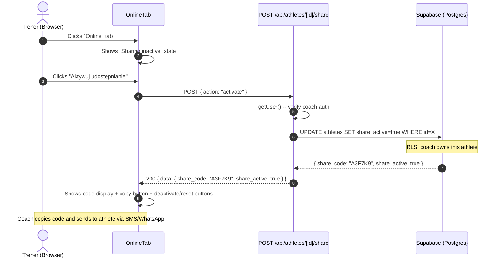
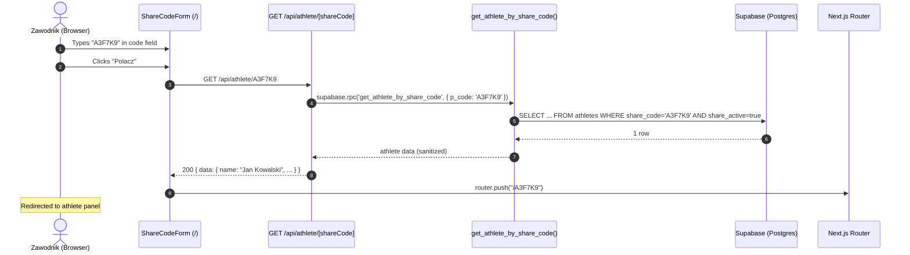
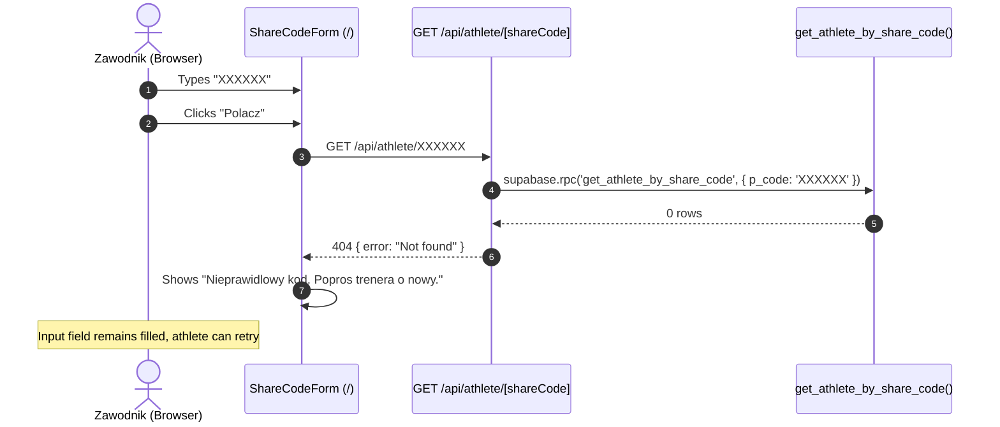
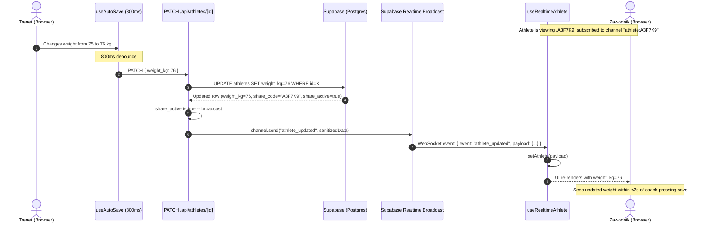
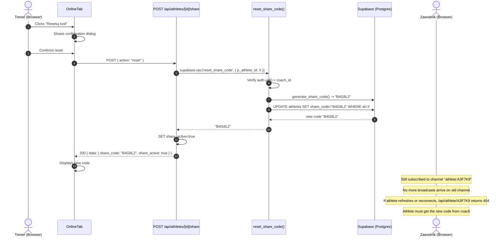
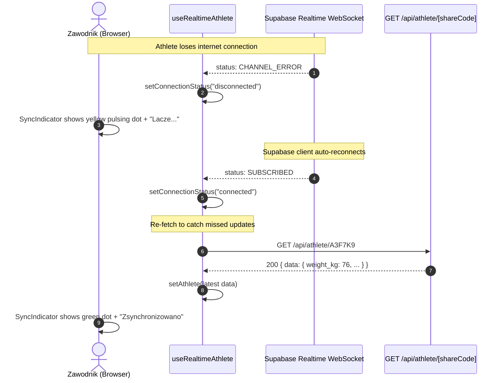

# US-004 Design -- Share code + panel zawodnika + real-time sync

## Context

US-004 delivers the athlete-facing side of DudiCoach: the coach activates sharing for an
athlete via an "Online" tab, the athlete enters a 6-character share code on a public page,
and sees a read-only profile that updates in real-time as the coach edits.

This is the first story that introduces:
- **Anonymous (unauthenticated) access** to athlete data.
- **Supabase Realtime** for live coach-to-athlete synchronization.
- **A public route group** (`app/(athlete)/`) outside the auth-protected coach layout.

The access pattern is documented in ADR-0003: SECURITY DEFINER RPC for initial data fetch,
Realtime broadcast channels for live updates.

### What already exists

The `athletes` table (US-002 migration) already has:
- `share_code char(6) NOT NULL UNIQUE DEFAULT generate_share_code()` column.
- `generate_share_code()` PL/pgSQL function with collision retry and ambiguous character exclusion.
- Every athlete gets an auto-generated share code on INSERT.

The story's AC-1 mentions creating a `share_codes` record, but the existing schema stores the
code directly on the `athletes` row. This design uses the existing `share_code` column on
`athletes` rather than creating a separate `share_codes` table. See Decision Log D1.

---

## 1. Data Model Impact

### 1.1 No new tables

The existing `athletes.share_code` column is sufficient. A separate `share_codes` table
would add JOIN complexity with no benefit for single-coach. The code is 1:1 with the athlete.

### 1.2 New column: `share_active`

Add a boolean column to control whether sharing is enabled. When `false`, the share code
exists but is inactive -- the RPC function will not return data for it.

```sql
-- In migration: 20260413120000_US-004_share_active_and_rpc.sql

ALTER TABLE public.athletes
  ADD COLUMN share_active boolean NOT NULL DEFAULT false;

COMMENT ON COLUMN public.athletes.share_active IS
  'Whether the share code is active. When false, the athlete panel returns "code not found".';
```

This allows the coach to deactivate sharing without deleting the code (toggle on/off).

### 1.3 RPC function: `get_athlete_by_share_code`

A SECURITY DEFINER function that bypasses RLS, validates the share code, and returns a
sanitized athlete row (excluding `coach_id`).

```sql
CREATE OR REPLACE FUNCTION public.get_athlete_by_share_code(p_code char(6))
RETURNS TABLE (
  id                     uuid,
  name                   text,
  age                    integer,
  weight_kg              numeric(5,1),
  height_cm              numeric(5,1),
  sport                  text,
  training_start_date    date,
  training_days_per_week integer,
  session_minutes        integer,
  current_phase          text,
  goal                   text,
  notes                  text,
  share_code             char(6),
  updated_at             timestamptz
)
LANGUAGE plpgsql
SECURITY DEFINER
SET search_path = public
AS $$
BEGIN
  RETURN QUERY
    SELECT
      a.id,
      a.name,
      a.age,
      a.weight_kg,
      a.height_cm,
      a.sport,
      a.training_start_date,
      a.training_days_per_week,
      a.session_minutes,
      a.current_phase,
      a.goal,
      a.notes,
      a.share_code,
      a.updated_at
    FROM public.athletes a
    WHERE a.share_code = UPPER(p_code)
      AND a.share_active = true;
END;
$$;

-- Grant execute to both anon and authenticated roles
GRANT EXECUTE ON FUNCTION public.get_athlete_by_share_code(char) TO anon;
GRANT EXECUTE ON FUNCTION public.get_athlete_by_share_code(char) TO authenticated;
```

**Key design points:**
- `SECURITY DEFINER` bypasses RLS -- the function runs with the privileges of the function owner (postgres superuser).
- Returns zero rows if the code is invalid or `share_active = false`. The API layer interprets zero rows as 404.
- `UPPER(p_code)` normalizes input so lowercase entries still match.
- `coach_id` and `created_at` are deliberately excluded from the return type.
- `SET search_path = public` prevents search_path injection attacks (a Supabase best practice for SECURITY DEFINER functions).

### 1.4 RPC function: `reset_share_code`

Allows the coach to generate a new share code for an athlete. Returns the new code.

```sql
CREATE OR REPLACE FUNCTION public.reset_share_code(p_athlete_id uuid)
RETURNS char(6)
LANGUAGE plpgsql
SECURITY DEFINER
SET search_path = public
AS $$
DECLARE
  v_new_code char(6);
BEGIN
  -- Verify the caller owns this athlete (RLS-equivalent check)
  IF NOT EXISTS (
    SELECT 1 FROM public.athletes
    WHERE id = p_athlete_id
      AND coach_id = auth.uid()
  ) THEN
    RAISE EXCEPTION 'Not found or not authorized';
  END IF;

  v_new_code := public.generate_share_code();

  UPDATE public.athletes
  SET share_code = v_new_code
  WHERE id = p_athlete_id;

  RETURN v_new_code;
END;
$$;

GRANT EXECUTE ON FUNCTION public.reset_share_code(uuid) TO authenticated;
```

**Why SECURITY DEFINER here too:** The function needs to call `generate_share_code()` which
queries the athletes table. Rather than adding an anon SELECT policy, we keep the function
self-contained and verify ownership manually with `auth.uid()`.

### 1.5 Index

The existing UNIQUE constraint on `share_code` already creates an implicit unique index.
No additional index is needed -- the RPC function's `WHERE share_code = ?` query will use it.

### 1.6 Database types update

After migration, regenerate types. The `athletes` table's Row type will gain `share_active: boolean`.
The Functions section will gain `get_athlete_by_share_code` and `reset_share_code`.

---

## 2. API Surface

### 2.1 `POST /api/athletes/[id]/share` -- Toggle sharing / reset code

**File:** `app/api/athletes/[id]/share/route.ts`

This endpoint handles three operations via the request body's `action` field:

```typescript
// Request body schema
const shareActionSchema = z.object({
  action: z.enum(["activate", "deactivate", "reset"]),
});

// Response shapes
// activate:  200 { data: { share_code: "A3F7K9", share_active: true } }
// deactivate: 200 { data: { share_code: "A3F7K9", share_active: false } }
// reset:     200 { data: { share_code: "B4G8L2", share_active: true } }
```

**Behavior:**

- `activate`: Sets `share_active = true` on the athlete. Returns the existing share code.
- `deactivate`: Sets `share_active = false`. The code is preserved but stops working.
- `reset`: Calls `reset_share_code` RPC, sets `share_active = true`. Returns the new code.

**Auth:** Required (coach only). Uses `getUser()` check. RLS ensures coach ownership.

**Why a dedicated route instead of using PATCH?** The share code and share_active fields
should not be settable via the general PATCH endpoint. The `updateAthleteSchema` does not
include `share_code` or `share_active`. Sharing is an explicit action, not an auto-save
field. This matches ADR-0002's principle: explicit actions can use Route Handlers with
clear semantics.

### 2.2 `GET /api/athlete/[shareCode]` -- Public athlete fetch

**File:** `app/api/athlete/[shareCode]/route.ts`

Note the singular "athlete" (not "athletes") to distinguish the public route from the
coach CRUD routes.

```typescript
// Request: GET /api/athlete/A3F7K9
// No auth required.

// Response (success):
// 200 { data: { id, name, age, weight_kg, ... share_code, updated_at } }

// Response (not found / inactive):
// 404 { error: "Not found" }
```

**Behavior:**

1. Validate `shareCode` param: must be 6 characters, alphanumeric, uppercase-normalized.
2. Create an anonymous Supabase client (no auth cookies needed).
3. Call `supabase.rpc('get_athlete_by_share_code', { p_code: shareCode })`.
4. If zero rows returned, return 404.
5. Return the athlete data.

**No auth check.** This route is intentionally public. The share code itself is the
access credential (ADR-0003).

### 2.3 Modified: `PATCH /api/athletes/[id]` -- Add broadcast after save

**File:** `app/api/athletes/[id]/route.ts` (existing, modify)

After a successful PATCH save, the handler broadcasts the updated athlete data to the
Supabase Realtime broadcast channel `athlete:{shareCode}`.

```typescript
// Pseudocode addition to existing PATCH handler:

// ... existing save logic ...
const { data, error } = await supabase
  .from("athletes")
  .update(parsed.data)
  .eq("id", id)
  .select()
  .single();

if (data && data.share_active) {
  // Broadcast updated data to athlete panel subscribers
  const channel = supabase.channel(`athlete:${data.share_code}`);
  await channel.send({
    type: "broadcast",
    event: "athlete_updated",
    payload: sanitizeAthleteForPublic(data),
  });
  supabase.removeChannel(channel);
}

return NextResponse.json({ data });
```

The `sanitizeAthleteForPublic` helper strips `coach_id` and `created_at` from the payload.

**Important:** The broadcast only fires when `share_active` is `true`. If sharing is off,
no broadcast is sent even if the athlete has a share code.

---

## 3. Supabase Realtime Channel Design

### 3.1 Channel naming

Channel name: `athlete:{shareCode}` (e.g., `athlete:A3F7K9`).

This is a **broadcast** channel, not a `postgres_changes` channel. See ADR-0003 for the
rationale (anonymous users cannot subscribe to postgres_changes due to RLS).

### 3.2 Event schema

```typescript
// Broadcast event
{
  type: "broadcast",
  event: "athlete_updated",
  payload: {
    id: string;
    name: string;
    age: number | null;
    weight_kg: number | null;
    height_cm: number | null;
    sport: string | null;
    training_start_date: string | null;
    training_days_per_week: number | null;
    session_minutes: number | null;
    current_phase: string | null;
    goal: string | null;
    notes: string | null;
    share_code: string;
    updated_at: string;
  }
}
```

### 3.3 Flow

1. Athlete opens `/A3F7K9`. The `useRealtimeAthlete` hook subscribes to channel `athlete:A3F7K9`.
2. Coach edits athlete on `/coach/athletes/{id}`. Auto-save fires after 800ms.
3. PATCH handler saves to DB, then broadcasts to `athlete:A3F7K9`.
4. Athlete's subscription callback receives the event, updates local state.
5. SyncIndicator shows green "Zsynchronizowano".

### 3.4 Reconnection handling

Supabase Realtime client handles WebSocket reconnection automatically. The `useRealtimeAthlete`
hook tracks the channel's subscription status:

- `SUBSCRIBED` -> green dot
- `CHANNEL_ERROR` / `TIMED_OUT` / `CLOSED` -> yellow pulsing dot
- On reconnect (`SUBSCRIBED` again) -> re-fetch via RPC to get any updates missed during disconnection

---

## 4. Component Tree

### 4.1 Coach side: "Online" tab in athlete editor

```
app/(coach)/athletes/[id]/page.tsx [RSC] (existing)
  CoachNavbar [RSC] (existing)
  AthleteEditorShell [CC] (existing, modified)
    BackButton [CC] (existing)
    SaveStatusIndicator [CC] (existing)
    TabPills [CC] (existing)
    AthleteProfileForm [CC] (existing, active when tab="profile")
    OnlineTab [CC] (NEW, active when tab="online")
      ShareCodeDisplay [CC] (NEW)
        ShareCodeValue [CC] -- large monospace code display
        CopyButton [CC] -- copies code to clipboard
      ShareToggle [CC] (NEW) -- activate/deactivate sharing
      ResetCodeButton [CC] (NEW) -- reset share code with confirmation
      ShareLink [CC] (NEW) -- displays the full URL to share
```

### 4.2 Athlete side: share code entry + profile view

```
app/(athlete)/layout.tsx [RSC] (NEW)
  {children}

app/(athlete)/[shareCode]/page.tsx [RSC] (NEW)
  AthletePanel [CC] (NEW)
    SyncIndicator [CC] (NEW)
    AthleteProfileView [CC] (NEW) -- read-only profile display
      LevelDisplay [CC] (existing from US-003, reuse)

app/page.tsx [RSC] (MODIFY -- add share code entry form)
  HomePageContent [CC] (NEW)
    ShareCodeForm [CC] (NEW) -- 6-char input + "Polacz" button
```

### 4.3 RSC vs CC rationale

| Component | Type | Why |
|---|---|---|
| `(athlete)/layout.tsx` | RSC | Static layout wrapper, no interactivity |
| `(athlete)/[shareCode]/page.tsx` | RSC | Initial data fetch via RPC on server, passes to CC |
| `AthletePanel` | CC | Realtime subscription, reactive state |
| `SyncIndicator` | CC | Reactive to channel status changes |
| `AthleteProfileView` | CC | Receives live-updated data from parent |
| `OnlineTab` | CC | Button interactions, mutations |
| `ShareCodeDisplay` | CC | Clipboard API interaction |
| `ShareCodeForm` | CC | Form interaction, navigation |
| `HomePageContent` | CC | Contains ShareCodeForm + existing coach login link |

---

## 5. Routing Structure

### 5.1 New routes

```
app/
  (athlete)/
    layout.tsx              -- minimal layout, no auth, no QueryProvider
    [shareCode]/
      page.tsx              -- RSC: validates code, fetches via RPC, renders AthletePanel
  page.tsx                  -- MODIFY: add ShareCodeForm alongside coach login CTA
```

### 5.2 Route details

| Route | Auth | Description |
|---|---|---|
| `/` | None | Home page with share code input + coach login link |
| `/{shareCode}` | None (public) | Athlete panel with real-time profile view |
| `/coach/athletes/[id]` | Required | Athlete editor (existing), "Online" tab added |

### 5.3 Why `app/(athlete)/[shareCode]/` and not `app/[shareCode]/`

Using the `(athlete)` route group:
- Separates the layout from coach routes (no QueryProvider, no CoachNavbar).
- Makes the middleware exclusion explicit.
- Prevents the catch-all `[shareCode]` from conflicting with other top-level routes
  like `/login` or `/coach`.

**Route conflict prevention:** The `[shareCode]` dynamic segment could match paths like
`/login` or `/coach`. Next.js resolves this by prioritizing static segments over dynamic
ones. Since `/login` and `/coach` are explicit routes, they take priority. The `(athlete)`
route group is a URL-invisible grouping, so `/(athlete)/[shareCode]` maps to `/{shareCode}`
in the URL. This works correctly because:
- `/login` matches `app/(coach)/login/page.tsx` (static, higher priority)
- `/coach/...` matches `app/(coach)/...` routes (static prefix, higher priority)
- Any other single-segment path matches `app/(athlete)/[shareCode]/page.tsx`

The page.tsx will validate that the share code is a valid 6-char alphanumeric string and
return 404 for anything else (e.g., `/favicon.ico` or `/random-path`).

---

## 6. Middleware Changes

### 6.1 Current state

The middleware in `lib/supabase/middleware.ts` protects `/coach/**` routes and redirects
unauthenticated users to `/login`. It does NOT block other routes.

### 6.2 Required change

**No middleware changes needed.** The current middleware only protects paths starting with
`/coach`. The athlete routes (`/{shareCode}`) do not start with `/coach`, so they pass
through the middleware without authentication checks. The session cookie refresh in
`getUser()` runs but does not block -- an anonymous user simply has `user = null`, and
since the path does not start with `/coach`, no redirect occurs.

The middleware matcher already excludes static files:
```
"/((?!_next/static|_next/image|favicon.ico|.*\\.(?:svg|png|jpg|jpeg|gif|webp|ico)$).*)"
```

This matches `/{shareCode}` paths, which is fine -- the middleware runs, refreshes the
session cookie (no-op for anonymous users), and passes through.

---

## 7. useRealtimeAthlete Hook Design

**File:** `lib/hooks/use-realtime-athlete.ts`

### 7.1 Interface

```typescript
import type { RealtimeChannel } from "@supabase/supabase-js";

type ConnectionStatus = "connected" | "connecting" | "disconnected";

interface UseRealtimeAthleteOptions {
  shareCode: string;
  initialData: AthletePublic;
}

interface UseRealtimeAthleteReturn {
  athlete: AthletePublic;
  connectionStatus: ConnectionStatus;
}
```

### 7.2 Pseudocode

```typescript
function useRealtimeAthlete({
  shareCode,
  initialData,
}: UseRealtimeAthleteOptions): UseRealtimeAthleteReturn {
  const [athlete, setAthlete] = useState<AthletePublic>(initialData);
  const [connectionStatus, setConnectionStatus] = useState<ConnectionStatus>("connecting");
  const supabase = useMemo(() => createBrowserClient(), []);

  useEffect(() => {
    const channel = supabase.channel(`athlete:${shareCode}`);

    channel
      .on("broadcast", { event: "athlete_updated" }, (payload) => {
        setAthlete(payload.payload as AthletePublic);
      })
      .subscribe((status) => {
        if (status === "SUBSCRIBED") {
          setConnectionStatus("connected");
        } else if (status === "CHANNEL_ERROR" || status === "TIMED_OUT") {
          setConnectionStatus("disconnected");
        } else if (status === "CLOSED") {
          setConnectionStatus("disconnected");
        }
      });

    return () => {
      supabase.removeChannel(channel);
    };
  }, [shareCode, supabase]);

  // Re-fetch on reconnect to catch missed updates
  useEffect(() => {
    if (connectionStatus === "connected") {
      // Fetch latest data via API to catch any updates missed during disconnection
      fetch(`/api/athlete/${shareCode}`)
        .then((res) => res.json())
        .then((json) => {
          if (json.data) setAthlete(json.data);
        })
        .catch(() => {
          // Silent fail -- we already have data, reconnect will try again
        });
    }
  }, [connectionStatus, shareCode]);

  return { athlete, connectionStatus };
}
```

### 7.3 Key design decisions

1. **`createBrowserClient`** -- Uses the existing browser Supabase client from
   `lib/supabase/client.ts`. Realtime connections require a browser client with the
   anon key. No auth is needed for broadcast channel subscription.

2. **State, not TanStack Query** -- The athlete panel does NOT use TanStack Query.
   It uses plain `useState` for the athlete data and the Realtime subscription for
   updates. TanStack Query is overkill for a read-only view with a single data source
   that pushes updates. The `(athlete)` layout does not need a `QueryClientProvider`.

3. **Re-fetch on reconnect** -- Broadcast is fire-and-forget. If the athlete is
   disconnected when the coach saves, they miss the update. The hook re-fetches from
   the API when the channel transitions back to `SUBSCRIBED`.

4. **No debounce on incoming updates** -- Coach edits are already debounced (800ms)
   before the PATCH fires. The broadcast arrives at most once per 800ms. No client-side
   deduplication is needed.

---

## 8. SyncIndicator Component Design

**File:** `components/athlete/SyncIndicator.tsx`

### 8.1 Interface

```typescript
interface SyncIndicatorProps {
  status: "connected" | "connecting" | "disconnected";
}
```

### 8.2 Visual states

| Status | Dot | Text | Animation |
|---|---|---|---|
| `connected` | Green (#34d399, `--color-success`) | "Zsynchronizowano" | None (static) |
| `connecting` | Yellow (#fbbf24, `--color-yellow`) | "Lacze..." | Pulsing (CSS animation) |
| `disconnected` | Yellow (#fbbf24, `--color-yellow`) | "Lacze..." | Pulsing (CSS animation) |

### 8.3 Rendering sketch

```tsx
function SyncIndicator({ status }: SyncIndicatorProps) {
  const isConnected = status === "connected";
  const dotColor = isConnected ? "bg-success" : "bg-yellow";
  const text = isConnected ? pl.athletePanel.syncedJustNow : pl.athletePanel.syncing;

  return (
    <div className="flex items-center gap-2 text-xs text-muted-foreground">
      <span
        className={cn(
          "h-2.5 w-2.5 rounded-full",
          dotColor,
          !isConnected && "animate-pulse"
        )}
        aria-hidden="true"
      />
      <span>{text}</span>
    </div>
  );
}
```

### 8.4 Position

Top-right corner of the athlete panel, inside the header bar. Fixed position on mobile
so it is always visible without scrolling.

---

## 9. OnlineTab Component Design

**File:** `components/coach/OnlineTab.tsx`

### 9.1 States

The "Online" tab has three visual states based on `athlete.share_active`:

**State A: Sharing inactive (share_active = false)**
```
+--------------------------------------------------+
|  Udostepnianie nieaktywne                        |
|                                                  |
|  [Aktywuj udostepnianie]  (button)               |
+--------------------------------------------------+
```

**State B: Sharing active (share_active = true)**
```
+--------------------------------------------------+
|  Kod dostepu                                     |
|                                                  |
|     A 3 F 7 K 9        [Kopiuj]                 |
|                                                  |
|  Link: dudicoach.app/A3F7K9      [Kopiuj link]  |
|                                                  |
|  [Dezaktywuj]    [Resetuj kod]                   |
+--------------------------------------------------+
```

### 9.2 Mutations

The tab uses a custom hook or direct fetch calls to `POST /api/athletes/[id]/share`:

```typescript
// In OnlineTab component:
async function handleActivate() {
  const res = await fetch(`/api/athletes/${athlete.id}/share`, {
    method: "POST",
    headers: { "Content-Type": "application/json" },
    body: JSON.stringify({ action: "activate" }),
  });
  // Update local state with response
}

async function handleDeactivate() {
  // Same pattern, action: "deactivate"
}

async function handleReset() {
  // Confirm dialog first, then action: "reset"
}
```

After any mutation, the component invalidates the TanStack Query cache for the athlete
detail so the editor shell reflects the updated `share_active` and `share_code`.

### 9.3 Copy to clipboard

Uses `navigator.clipboard.writeText()` with a fallback for older browsers. Shows a brief
"Skopiowano!" toast or inline checkmark on success.

---

## 10. Home Page Modification

### 10.1 Current state

The home page (`app/page.tsx`) has a coach login CTA and a "Panel zawodnika wkrotce"
placeholder text.

### 10.2 New design

Replace the placeholder with a functional share code entry form.

```
+--------------------------------------------------+
|                                                  |
|  DudiCoach                                       |
|  Profesjonalne zarzadzanie...                    |
|                                                  |
|  [Logowanie trenera]                             |
|                                                  |
|  ---- lub ----                                   |
|                                                  |
|  Panel zawodnika                                 |
|  Wpisz 6-znakowy kod otrzymany od trenera        |
|                                                  |
|  [______]  [Polacz]                              |
|                                                  |
|  (error message area)                            |
+--------------------------------------------------+
```

### 10.3 ShareCodeForm component

**File:** `components/athlete/ShareCodeForm.tsx`

```typescript
interface ShareCodeFormProps {
  // No props needed -- self-contained
}
```

**Behavior:**
1. 6-character input field, monospace font, auto-uppercase.
2. Client-side validation: must be exactly 6 chars, only valid characters (A-Z without O/I, 2-9 without 0/1).
3. On submit: call `GET /api/athlete/{code}`. If 200, redirect to `/{code}`. If 404, show error.
4. Error text: `pl.athletePanel.errorInvalidCode`.
5. The input uses `inputMode="text"`, `autoCapitalize="characters"`, `maxLength={6}`.
6. Auto-transform input to uppercase via `onChange` handler.

---

## 11. AthletePublic Type

**File:** `lib/types/athlete-public.ts`

```typescript
/**
 * Sanitized athlete data returned to the public athlete panel.
 * Excludes coach_id and created_at (internal fields).
 */
export interface AthletePublic {
  id: string;
  name: string;
  age: number | null;
  weight_kg: number | null;
  height_cm: number | null;
  sport: string | null;
  training_start_date: string | null;
  training_days_per_week: number | null;
  session_minutes: number | null;
  current_phase: string | null;
  goal: string | null;
  notes: string | null;
  share_code: string;
  updated_at: string;
}
```

Also export a `sanitizeAthleteForPublic` helper:

```typescript
// lib/utils/sanitize-athlete.ts
import type { Athlete } from "@/lib/api/athletes";
import type { AthletePublic } from "@/lib/types/athlete-public";

export function sanitizeAthleteForPublic(athlete: Athlete): AthletePublic {
  const { coach_id, created_at, share_active, ...publicFields } = athlete;
  return publicFields;
}
```

---

## 12. Sequence Diagrams

### 12.1 Share code activation flow



### 12.2 Athlete enters share code flow



### 12.3 Athlete enters invalid code



### 12.4 Real-time sync flow (coach edits, athlete sees update)



### 12.5 Share code reset flow



### 12.6 Reconnection flow



---

## 13. i18n Keys

### 13.1 Existing keys (already in pl.ts)

```typescript
athletePanel: {
  loginTitle: "Panel zawodnika",          // already exists
  loginSubtitle: "Wpisz 6-znakowy...",   // already exists
  codePlaceholder: "ABCDEF",             // already exists
  connect: "Polacz",                     // already exists
  connecting: "Lacze...",                // already exists
  errorInvalidCode: "Nieprawidlowy...",  // already exists
  disconnect: "Rozlacz",                // already exists
  refresh: "Odswiez",                   // already exists
  syncedJustNow: "Zsynchronizowano",    // already exists
  syncing: "Lacze...",                   // already exists
}
```

### 13.2 New keys to add

```typescript
coach: {
  athlete: {
    tabs: {
      online: "Online",   // already exists
    },
    online: {                                              // [NEW section]
      sharingInactive: "Udostepnianie nieaktywne",
      sharingInactiveDesc: "Aktywuj udostepnianie, aby zawodnik mogl zobaczyc swoj profil online.",
      activate: "Aktywuj udostepnianie",
      deactivate: "Dezaktywuj",
      resetCode: "Resetuj kod",
      resetConfirmTitle: "Resetuj kod dostepu",
      resetConfirmMessage: "Stary kod przestanie dzialac. Zawodnik bedzie potrzebowal nowego kodu.",
      accessCode: "Kod dostepu",
      shareLink: "Link dla zawodnika",
      copied: "Skopiowano!",
      copyCode: "Kopiuj kod",
      copyLink: "Kopiuj link",
      sharingActive: "Udostepnianie aktywne",
    },
  },
},

athletePanel: {
  // ... existing keys ...
  profileTitle: "Profil zawodnika",                        // [NEW]
  noData: "Brak danych",                                   // [NEW]
  connectionLost: "Polaczenie utracone. Ponawiam...",      // [NEW]
},

home: {
  // ... existing keys ...
  athletePanelTitle: "Panel zawodnika",                     // [NEW] replaces athletePanelComingSoon
  athletePanelSubtitle: "Wpisz kod otrzymany od trenera",  // [NEW]
  orSeparator: "lub",                                      // [NEW]
}
```

---

## 14. Security Considerations

### 14.1 Share code as access credential

- 32^6 = 1,073,741,824 possible codes (~1 billion).
- With <100 active athletes, probability of guessing a valid code on a single attempt is <1 in 10 million.
- No rate limiting is implemented in this story (single-coach, low-traffic app). If needed later, Vercel Edge rate limiting can be added.

### 14.2 Data exposure

- The public API and RPC function never expose `coach_id` or `created_at`.
- The broadcast payload is sanitized with the same function.
- The athlete sees their own profile data only -- no cross-athlete leakage.

### 14.3 RLS unchanged

- No new RLS policies on the `athletes` table for anon users.
- All anonymous access goes through the `SECURITY DEFINER` RPC function.
- Coach-side RLS policies remain unchanged.

### 14.4 Code deactivation

- Setting `share_active = false` immediately stops the RPC function from returning data.
- Resetting the code changes the channel name, so old subscriptions receive no further broadcasts.
- There is no "session" for the athlete -- they cannot be "logged out" in real-time. But refreshing or re-entering the old code will fail.

### 14.5 Broadcast channel security

- Supabase Realtime broadcast channels are accessible to anyone with the anon key and the channel name.
- The channel name `athlete:{shareCode}` is effectively a secret (the share code).
- An attacker would need to know the exact share code to subscribe to the channel.
- Broadcast payloads contain no sensitive data beyond the athlete's public profile.

---

## 15. Files to Create / Modify

### New files

| File | Owner Agent | Purpose |
|---|---|---|
| `supabase/migrations/20260413120000_US-004_share_active_and_rpc.sql` | developer-backend | Migration: share_active column, RPC functions |
| `app/api/athletes/[id]/share/route.ts` | developer-backend | Share management endpoint (activate/deactivate/reset) |
| `app/api/athlete/[shareCode]/route.ts` | developer-backend | Public athlete fetch via RPC |
| `lib/types/athlete-public.ts` | developer-backend | AthletePublic type definition |
| `lib/utils/sanitize-athlete.ts` | developer-backend | Helper to strip internal fields |
| `lib/validation/share-code.ts` | developer-backend | Zod schema for share code validation |
| `app/(athlete)/layout.tsx` | developer-frontend | Minimal layout for athlete routes |
| `app/(athlete)/[shareCode]/page.tsx` | developer-frontend | Athlete panel RSC page |
| `components/athlete/AthletePanel.tsx` | developer-frontend | Main athlete panel client component |
| `components/athlete/AthleteProfileView.tsx` | developer-frontend | Read-only profile display |
| `components/athlete/SyncIndicator.tsx` | developer-frontend | Connection status indicator |
| `components/athlete/ShareCodeForm.tsx` | developer-frontend | Share code entry form for home page |
| `components/coach/OnlineTab.tsx` | developer-frontend | "Online" tab content in athlete editor |
| `components/coach/ShareCodeDisplay.tsx` | developer-frontend | Large code display with copy button |
| `lib/hooks/use-realtime-athlete.ts` | developer-frontend | Realtime subscription hook |

### Modified files

| File | Owner Agent | Change |
|---|---|---|
| `app/api/athletes/[id]/route.ts` | developer-backend | Add broadcast after PATCH save |
| `app/page.tsx` | developer-frontend | Replace "coming soon" with ShareCodeForm |
| `components/coach/AthleteEditorShell.tsx` | developer-frontend | Enable "Online" tab, render OnlineTab |
| `lib/i18n/pl.ts` | developer-frontend | Add new i18n keys |
| `lib/supabase/database.types.ts` | developer-backend | Regenerate after migration |

### Files NOT modified

| File | Reason |
|---|---|
| `middleware.ts` | No change needed -- athlete routes are not under `/coach` |
| `lib/supabase/middleware.ts` | No change needed -- only protects `/coach/**` |
| `lib/supabase/server.ts` | No change needed |
| `lib/supabase/client.ts` | No change needed -- used as-is for Realtime in browser |

---

## 16. Validation Schema

**File:** `lib/validation/share-code.ts`

```typescript
import { z } from "zod";

const VALID_CHARS = /^[ABCDEFGHJKLMNPQRSTUVWXYZ23456789]{6}$/;

export const shareCodeSchema = z
  .string()
  .length(6)
  .transform((val) => val.toUpperCase())
  .refine((val) => VALID_CHARS.test(val), {
    message: "Invalid share code format",
  });

export const shareActionSchema = z.object({
  action: z.enum(["activate", "deactivate", "reset"]),
});
```

---

## 17. Decision Log

| # | Decision | Alternatives Considered | Rationale |
|---|---|---|---|
| D1 | Reuse existing `athletes.share_code` column, no separate `share_codes` table | Separate `share_codes` table with FK to athletes | 1:1 relationship, no benefit from a separate table. The column already exists with UNIQUE constraint and auto-generation. Adding a table would mean a JOIN on every lookup. |
| D2 | Add `share_active` boolean column | Use NULL share_code to indicate inactive sharing | Explicit boolean is clearer. NULL would prevent the code from being preserved when deactivated. Coach might want to deactivate temporarily and reactivate with the same code. |
| D3 | SECURITY DEFINER RPC for anonymous fetch | RLS policy on anon role; separate public view | RLS policies for anon are problematic with Realtime. Views do not support Realtime. RPC is explicit, auditable, and works with the anon key. See ADR-0003. |
| D4 | Broadcast channels, not postgres_changes | postgres_changes subscription for anon | postgres_changes requires RLS to allow SELECT for the subscriber's role. Anon has no SELECT policy on athletes. Broadcast is explicit and decoupled from DB permissions. See ADR-0003. |
| D5 | Plain useState in athlete panel, not TanStack Query | TanStack Query for athlete data | Read-only view with push updates. No mutations, no cache invalidation, no stale-while-revalidate needed. useState + Realtime is simpler and avoids loading QueryClientProvider in the athlete layout. |
| D6 | Re-fetch on reconnect to catch missed broadcasts | Rely solely on broadcast events | Broadcast is fire-and-forget. If the athlete is offline when the coach saves, the update is lost. Re-fetching on reconnect ensures consistency. |
| D7 | Single POST endpoint with `action` field for activate/deactivate/reset | Separate endpoints for each action | Three actions on the same resource (share settings). A single endpoint with an action discriminator is cleaner than three route files. |
| D8 | No rate limiting on share code lookup | Add rate limiting | Single-coach app with low traffic. 1 billion possible codes. Brute-force is impractical. Can add Vercel Edge rate limiting later if needed. |
| D9 | Broadcast from PATCH handler, not from a DB trigger | Postgres trigger + pg_notify + Supabase webhook | Application-level broadcast is simpler to debug, test, and maintain. DB triggers are opaque and harder to test. The PATCH handler is the single write path. |
| D10 | Athlete routes under `app/(athlete)/[shareCode]/` | Top-level `app/[shareCode]/` without route group | Route group provides layout isolation (no coach navbar, no QueryProvider). Clearer code organization. |

---

## 18. Open Questions

| # | Question | Impact | Proposed Resolution |
|---|---|---|---|
| Q1 | Should the athlete panel page (`/[shareCode]`) do SSR fetch via RPC, or client-side fetch only? | Performance | SSR. The page.tsx (RSC) calls the RPC function server-side and passes `initialData` to the client component. This gives instant first paint. The Realtime hook then takes over for live updates. |
| Q2 | Should the share code input on the home page auto-submit when 6 characters are entered? | UX polish | No. Require explicit "Polacz" click or Enter press. Auto-submit could frustrate users who mistype and want to correct before submitting. |
| Q3 | Should the coach be able to see whether the athlete is currently online (connected to the channel)? | Future feature | Out of scope for US-004. Would require presence tracking on the broadcast channel. Can be added in a future story. |

None of these are blockers. The proposed resolutions are the recommended approach.

---

## 19. Testing Strategy (for qa-dev reference)

### Unit tests (Vitest)

- `shareCodeSchema` validation: accepts valid 6-char codes, rejects invalid formats, transforms lowercase to uppercase.
- `sanitizeAthleteForPublic`: strips `coach_id`, `created_at`, `share_active` from athlete object.
- `shareActionSchema`: accepts valid actions, rejects invalid strings.
- SyncIndicator: renders correct dot color and text for each status.

### Integration tests (Vitest, mocked Supabase)

- `POST /api/athletes/[id]/share` with action `activate`: sets `share_active = true`, returns code.
- `POST /api/athletes/[id]/share` with action `deactivate`: sets `share_active = false`.
- `POST /api/athletes/[id]/share` with action `reset`: generates new code, returns it.
- `POST /api/athletes/[id]/share` unauthenticated: returns 401.
- `GET /api/athlete/[shareCode]` with valid active code: returns sanitized athlete data.
- `GET /api/athlete/[shareCode]` with invalid code: returns 404.
- `GET /api/athlete/[shareCode]` with deactivated code: returns 404.
- `PATCH /api/athletes/[id]` with `share_active = true`: triggers broadcast.
- `PATCH /api/athletes/[id]` with `share_active = false`: does NOT trigger broadcast.

### E2E tests (Playwright)

- Two browser contexts: coach edits athlete weight, athlete panel shows updated weight within 5 seconds.
- Athlete enters invalid code, sees error message.
- Athlete enters valid code, sees profile data.
- Coach resets code, old code stops working.
- SyncIndicator shows correct states.

---

## 20. Implementation Order

1. **developer-backend** (first):
   - Migration: `share_active` column + RPC functions.
   - `lib/types/athlete-public.ts` + `lib/utils/sanitize-athlete.ts` + `lib/validation/share-code.ts`.
   - `POST /api/athletes/[id]/share/route.ts`.
   - `GET /api/athlete/[shareCode]/route.ts`.
   - Modify `PATCH /api/athletes/[id]/route.ts` to add broadcast.
   - Regenerate database types.

2. **developer-frontend** (second, after backend):
   - `components/coach/OnlineTab.tsx` + `ShareCodeDisplay.tsx`.
   - Modify `AthleteEditorShell.tsx` to enable "Online" tab.
   - `app/(athlete)/layout.tsx` + `app/(athlete)/[shareCode]/page.tsx`.
   - `components/athlete/AthletePanel.tsx` + `AthleteProfileView.tsx` + `SyncIndicator.tsx`.
   - `lib/hooks/use-realtime-athlete.ts`.
   - `components/athlete/ShareCodeForm.tsx`.
   - Modify `app/page.tsx` to include ShareCodeForm.
   - Add i18n keys to `lib/i18n/pl.ts`.
