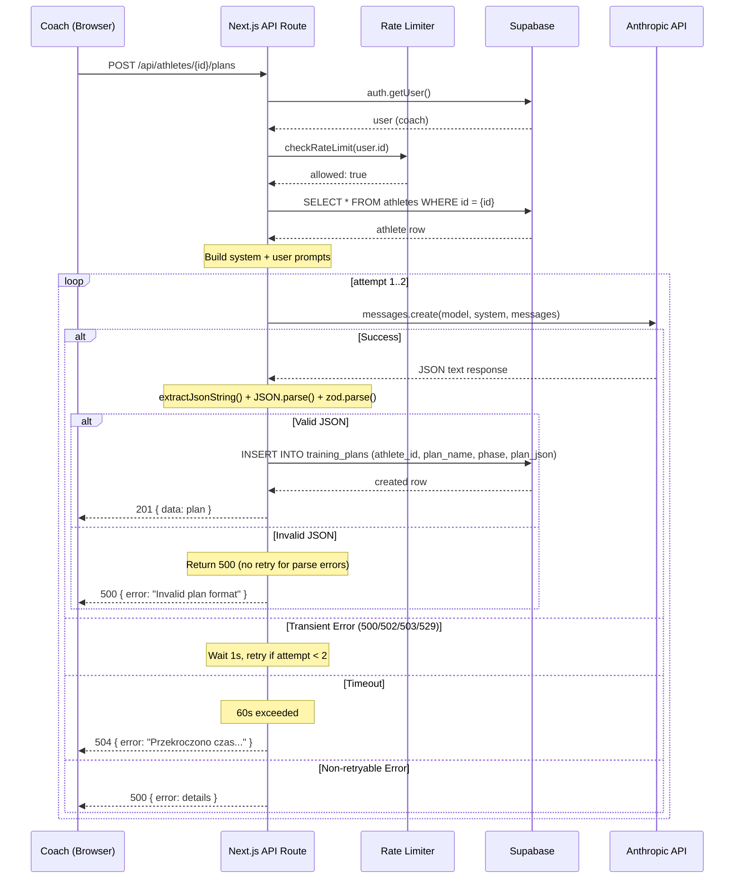

# US-005 Design -- AI Training Plan Generation

## Context

This story introduces the first AI integration in DudiCoach. The coach clicks
"Generuj plan AI" on the "Plany" tab of the athlete editor, the system collects
athlete data, calls Claude API (claude-sonnet-4-6), parses the JSON response,
stores the plan in Postgres, and displays it in a minimal Plan Viewer.

Dependencies satisfied: US-002 (athlete CRUD backend) and US-003 (athlete CRUD
frontend) are both in InE2E status. The `athletes` table, API routes, editor
shell, and tab navigation already exist.

Cross-cutting decisions about the Anthropic SDK integration pattern are recorded
in ADR-0001.

---

## 1. Data Model Impact

### 1.1 New Table: `training_plans`

```sql
CREATE TABLE training_plans (
  id          UUID PRIMARY KEY DEFAULT gen_random_uuid(),
  athlete_id  UUID NOT NULL REFERENCES athletes(id) ON DELETE CASCADE,
  plan_name   TEXT NOT NULL,
  phase       TEXT,
  plan_json   JSONB NOT NULL,
  created_at  TIMESTAMPTZ NOT NULL DEFAULT now()
);

-- Index for listing plans by athlete (most recent first)
CREATE INDEX idx_training_plans_athlete_created
  ON training_plans (athlete_id, created_at DESC);

-- RLS
ALTER TABLE training_plans ENABLE ROW LEVEL SECURITY;

-- Coach can read/insert/delete their own athletes' plans
CREATE POLICY "coach_select_own_plans" ON training_plans
  FOR SELECT USING (
    athlete_id IN (
      SELECT id FROM athletes WHERE coach_id = auth.uid()
    )
  );

CREATE POLICY "coach_insert_own_plans" ON training_plans
  FOR INSERT WITH CHECK (
    athlete_id IN (
      SELECT id FROM athletes WHERE coach_id = auth.uid()
    )
  );

CREATE POLICY "coach_delete_own_plans" ON training_plans
  FOR DELETE USING (
    athlete_id IN (
      SELECT id FROM athletes WHERE coach_id = auth.uid()
    )
  );
```

**Notes:**
- No `updated_at` column -- plans are immutable once generated (re-generate
  creates a new row). Manual editing is a future story (US-017).
- `plan_json` stores the full Claude response conforming to the
  `TrainingPlanJson` zod schema (section 4).
- `plan_name` and `phase` are denormalized from `plan_json` for display in the
  plan list without parsing JSONB.
- `ON DELETE CASCADE` -- deleting an athlete removes all their plans.
- RLS policies use a subquery on `athletes.coach_id` because the coach does not
  own `training_plans` directly.

### 1.2 Database Types Update

After migration, regenerate types:
```
npx supabase gen types typescript --project-id <project-id>
```

The `training_plans` table will appear in `Database["public"]["Tables"]`.

---

## 2. API Contract

### 2.1 POST /api/athletes/[id]/plans

Generate a new AI training plan for the given athlete.

**Route file:** `app/api/athletes/[id]/plans/route.ts`

#### Request

```
POST /api/athletes/{athleteId}/plans
Authorization: (Supabase cookie-based auth)
Content-Type: application/json
Body: {} (empty -- all data derived server-side from athlete record)
```

No request body is needed. The route fetches athlete data from Supabase,
constructs the prompt, calls Claude, parses the response, stores the plan, and
returns it.

#### Response -- 201 Created

```typescript
{
  data: {
    id: string;           // UUID of the new training_plans row
    athlete_id: string;
    plan_name: string;
    phase: string | null;
    plan_json: TrainingPlanJson;  // Full parsed plan
    created_at: string;          // ISO timestamp
  }
}
```

#### Error Responses

| Status | Body shape | When |
|--------|-----------|------|
| 401 | `{ error: "Unauthorized" }` | Not authenticated |
| 404 | `{ error: "Not found" }` | Athlete doesn't exist or not owned |
| 422 | `{ error: string, details?: string }` | Athlete data incomplete (missing sport, training_days_per_week) |
| 429 | `{ error: string }` | Rate limit exceeded (3 plans/minute) |
| 500 | `{ error: string, details?: string }` | Claude API error after retry |
| 504 | `{ error: string }` | 60s timeout exceeded |

### 2.2 GET /api/athletes/[id]/plans

List all plans for an athlete (for the plan list in the "Plany" tab).

**Route file:** same `app/api/athletes/[id]/plans/route.ts`

#### Response -- 200 OK

```typescript
{
  data: Array<{
    id: string;
    athlete_id: string;
    plan_name: string;
    phase: string | null;
    plan_json: TrainingPlanJson;
    created_at: string;
  }>
}
```

Sorted by `created_at DESC`. Returns full `plan_json` because the Plan Viewer
needs the complete data. For v1, the number of plans per athlete is small enough
that this is acceptable. If plan count grows, we can add pagination in US-017.

---

## 3. Claude API Integration Design

### 3.1 Client Wrapper: `lib/ai/client.ts`

A thin wrapper around `@anthropic-ai/sdk` that:
1. Instantiates `Anthropic` client with `ANTHROPIC_API_KEY` env var
2. Provides a `generatePlan()` function with 60s timeout
3. Applies prompt caching via `cache_control: { type: 'ephemeral' }` on the
   system prompt (large static context)
4. Returns raw text content

```typescript
// Pseudocode -- lib/ai/client.ts
import Anthropic from "@anthropic-ai/sdk";

const anthropic = new Anthropic({
  apiKey: process.env.ANTHROPIC_API_KEY,
  timeout: 60_000, // 60s total timeout
});

interface GeneratePlanParams {
  systemPrompt: string;
  userPrompt: string;
}

async function generatePlan(params: GeneratePlanParams): Promise<string> {
  const response = await anthropic.messages.create({
    model: "claude-sonnet-4-6",
    max_tokens: 8000,
    temperature: 0.7,
    system: [
      {
        type: "text",
        text: params.systemPrompt,
        cache_control: { type: "ephemeral" },
      },
    ],
    messages: [
      { role: "user", content: params.userPrompt },
    ],
  });

  // Extract text from response
  const textBlock = response.content.find(b => b.type === "text");
  if (!textBlock || textBlock.type !== "text") {
    throw new Error("No text content in Claude response");
  }
  return textBlock.text;
}
```

**Key decisions:**
- `timeout: 60_000` on the SDK client itself (handles AC-5)
- `cache_control: { type: 'ephemeral' }` on system prompt (CLAUDE.md rule 10)
- Temperature 0.7 per story spec
- Max tokens 8000 per story spec (a 4-week plan is typically 4000-6000 tokens)

### 3.2 Prompt Templates: `lib/ai/prompts/plan-generation.ts`

Two exports: `buildSystemPrompt()` and `buildUserPrompt(athlete)`.

#### System Prompt (static, cached)

```
Jestes ekspertem od planowania treningowego. Odpowiadaj WYLACZNIE poprawnym
JSON. Bez markdown, bez backtickow, bez tekstu przed lub po JSON. Pierwszy
znak odpowiedzi: {, ostatni znak: }.

Zasady planowania:
- Periodyzacja odpowiednia do poziomu zawodnika
- Cwiczenia specyficzne dla sportu
- BEZWZGLEDNIE omijaj cwiczenia obciazajace kontuzjowane partie ciala
- Progresja obciazen miedzy tygodniami
- Tydzien 4 = deload (zmniejszone obciazenie)
- Tempo: ekscentryczne-izometryczne-koncentryczne-pauza (np. "3-1-2-0")
- Konkretne kilogramy na podstawie historii progresji (jesli dostepna)
- Cwiczenia korekcyjne na slabe miesnie z diagnostyki FMS
- Symetria lewa-prawa przy dysfunkcjach jednostronnych
- Rozgrzewka i cool-down w kazdym dniu
- Czas sesji musi sie miesic w podanym limicie minut

Format odpowiedzi JSON (scisle przestrzegaj tego schematu):
{
  "planName": "string - nazwa planu",
  "phase": "string - faza treningowa",
  "summary": "string - krotkie podsumowanie planu (2-3 zdania)",
  "weeklyOverview": "string - ogolny zarys tygodniowej struktury",
  "weeks": [
    {
      "weekNumber": 1,
      "focus": "string - fokus tygodnia",
      "days": [
        {
          "dayNumber": 1,
          "dayName": "string - np. Dzien A - Gora",
          "warmup": "string - opis rozgrzewki",
          "exercises": [
            {
              "name": "string - nazwa cwiczenia po polsku",
              "sets": "string - np. 4",
              "reps": "string - np. 8-10",
              "intensity": "string - np. 75% 1RM lub 40kg",
              "rest": "string - np. 90s",
              "tempo": "string - np. 3-1-2-0",
              "notes": "string - wskazowki techniczne"
            }
          ],
          "cooldown": "string - opis cool-downu",
          "duration": "string - szacowany czas np. 60 min"
        }
      ]
    }
  ],
  "progressionNotes": "string - wskazowki dotyczace progresji i ograniczen",
  "nutritionTips": "string - ogolne wskazowki zywieniowe",
  "recoveryProtocol": "string - protokol regeneracji"
}
```

**Note:** The system prompt uses ASCII-only Polish (no diacritics) to avoid
encoding issues in prompt caching. The output from Claude will use proper Polish
diacritics.

#### User Prompt (dynamic, per athlete)

```typescript
function buildUserPrompt(athlete: AthleteWithContext): string {
  // AthleteWithContext includes athlete row + computed level + injuries + diagnostics + progressions
  return `
Wygeneruj 4-tygodniowy plan treningowy dla nastepujacego zawodnika:

## Dane zawodnika
- Imie: ${athlete.name}
- Wiek: ${athlete.age ?? 'brak danych'}
- Waga: ${athlete.weight_kg ? athlete.weight_kg + ' kg' : 'brak danych'}
- Wzrost: ${athlete.height_cm ? athlete.height_cm + ' cm' : 'brak danych'}
- Sport: ${athlete.sport ?? 'ogolny fitness'}
- Poziom: ${athlete.level}
- Staz treningowy: ${athlete.trainingMonths} miesiecy
- Faza treningowa: ${athlete.current_phase ?? 'bazowy'}
- Dni treningowe/tydzien: ${athlete.training_days_per_week ?? 3}
- Czas sesji: ${athlete.session_minutes ?? 60} minut
- Cel: ${athlete.goal ?? 'poprawa ogolnej sprawnosci'}

## Kontuzje (aktywne)
${athlete.activeInjuries.length > 0
  ? athlete.activeInjuries.map(i => `- ${i.name} (${i.severity})${i.notes ? ': ' + i.notes : ''}`).join('\n')
  : 'Brak aktywnych kontuzji'}

## Diagnostyka FMS (aktualne dysfunkcje)
${athlete.diagnosticFindings.length > 0
  ? athlete.diagnosticFindings.map(d => `- ${d.muscle} (${d.region}, ${d.side}): ${d.severity}${d.notes ? ' - ' + d.notes : ''}`).join('\n')
  : 'Brak zarejestrowanych dysfunkcji'}

## Historia progresji (ostatnie wpisy)
${athlete.recentProgressions.length > 0
  ? athlete.recentProgressions.map(p => `- ${p.exercise}: ${p.weight}kg x${p.reps} (${p.date})`).join('\n')
  : 'Brak historii progresji'}

## Dodatkowe notatki trenera
${athlete.notes ?? 'Brak'}

Wygeneruj plan zgodny z podanym formatem JSON. Plan powinien miec dokladnie
${athlete.training_days_per_week ?? 3} dni treningowych na tydzien i 5-7
cwiczen na sesje.`.trim();
}
```

**Important:** In v1 (this story), injuries, diagnostics, and progressions
tables do not yet exist (they come in US-010, US-011, US-013). The user prompt
builder must gracefully handle empty arrays for these fields. The prompt
template is designed so that when those tables exist, the data flows in
seamlessly without prompt changes.

---

## 4. JSON Response Schema (Zod Validation)

File: `lib/validation/training-plan.ts`

```typescript
import { z } from "zod";

export const exerciseSchema = z.object({
  name: z.string().min(1),
  sets: z.string(),
  reps: z.string(),
  intensity: z.string(),
  rest: z.string(),
  tempo: z.string(),
  notes: z.string(),
});

export const daySchema = z.object({
  dayNumber: z.number().int().min(1).max(7),
  dayName: z.string(),
  warmup: z.string(),
  exercises: z.array(exerciseSchema).min(1),
  cooldown: z.string(),
  duration: z.string(),
});

export const weekSchema = z.object({
  weekNumber: z.number().int().min(1).max(4),
  focus: z.string(),
  days: z.array(daySchema).min(1),
});

export const trainingPlanJsonSchema = z.object({
  planName: z.string().min(1),
  phase: z.string(),
  summary: z.string(),
  weeklyOverview: z.string(),
  weeks: z.array(weekSchema).length(4),
  progressionNotes: z.string(),
  nutritionTips: z.string(),
  recoveryProtocol: z.string(),
});

export type TrainingPlanJson = z.infer<typeof trainingPlanJsonSchema>;
export type Exercise = z.infer<typeof exerciseSchema>;
export type Day = z.infer<typeof daySchema>;
export type Week = z.infer<typeof weekSchema>;
```

---

## 5. JSON Parser Design

File: `lib/ai/parse-plan-json.ts`

Claude sometimes wraps JSON in markdown code fences or adds preamble text
despite instructions. The parser must handle all of these cases.

### Strategy

1. Try `JSON.parse(rawText)` first (fast path -- if Claude obeys instructions)
2. If that fails, strip markdown fences:
   - Match `\`\`\`json?\s*([\s\S]*?)\`\`\`` and extract the inner content
3. If no fences found, find the first `{` and last `}` and extract that substring
4. Parse the extracted string
5. Validate against `trainingPlanJsonSchema`

```typescript
// Pseudocode -- lib/ai/parse-plan-json.ts

function extractJsonString(raw: string): string {
  // 1. Try raw directly
  const trimmed = raw.trim();
  if (trimmed.startsWith("{")) return trimmed;

  // 2. Strip markdown code fences
  const fenceMatch = trimmed.match(/```(?:json)?\s*([\s\S]*?)```/);
  if (fenceMatch) return fenceMatch[1].trim();

  // 3. Find outermost { ... }
  const firstBrace = trimmed.indexOf("{");
  const lastBrace = trimmed.lastIndexOf("}");
  if (firstBrace !== -1 && lastBrace > firstBrace) {
    return trimmed.slice(firstBrace, lastBrace + 1);
  }

  throw new Error("No JSON object found in response");
}

function parsePlanJson(raw: string): TrainingPlanJson {
  const jsonString = extractJsonString(raw);
  const parsed = JSON.parse(jsonString);
  return trainingPlanJsonSchema.parse(parsed);
}
```

**Error behavior:** If parsing or validation fails, the error message is
propagated to the API route, which returns 500 with a descriptive error. The
retry logic (section 6) does NOT retry parse failures -- those are deterministic
and retrying would waste API quota.

---

## 6. Retry Logic Design

Implemented inside the API route handler, not in the AI client.

### Rules

- Retry exactly once on transient errors only
- Transient errors: HTTP 500, 502, 503, 529 (overloaded) from Anthropic,
  network errors (fetch failures)
- Non-retryable errors: 400 (bad request), 401 (auth), 403 (forbidden),
  JSON parse failures, zod validation failures
- Delay between retries: 1000ms (simple fixed delay)

```typescript
// Pseudocode inside API route

const RETRYABLE_STATUS_CODES = [500, 502, 503, 529];
const MAX_ATTEMPTS = 2; // 1 initial + 1 retry

for (let attempt = 1; attempt <= MAX_ATTEMPTS; attempt++) {
  try {
    const rawText = await generatePlan({ systemPrompt, userPrompt });
    const plan = parsePlanJson(rawText);
    // success -- store and return
    break;
  } catch (error) {
    if (attempt < MAX_ATTEMPTS && isRetryable(error)) {
      await sleep(1000);
      continue;
    }
    // all attempts exhausted or non-retryable -- throw to error handler
    throw error;
  }
}

function isRetryable(error: unknown): boolean {
  if (error instanceof Anthropic.APIError) {
    return RETRYABLE_STATUS_CODES.includes(error.status);
  }
  // Network errors (no status) are retryable
  if (error instanceof Error && error.message.includes("fetch")) {
    return true;
  }
  return false;
}
```

---

## 7. Rate Limiter Design

File: `lib/ai/rate-limiter.ts`

### Approach: In-Memory Sliding Window

Given this is a single-coach application deployed on Vercel, an in-memory rate
limiter is the simplest correct solution. Vercel serverless functions may have
cold starts, but for a single user this provides adequate protection.

**Decision:** Use in-memory over Supabase-based rate limiting because:
- Simpler (no additional table/queries)
- A single coach means at most one concurrent Node.js process generating plans
- If the process restarts, the rate limit resets -- acceptable for cost
  protection (worst case: a few extra calls after cold start)
- Supabase-based would be needed only for multi-tenant scenarios

### Implementation

```typescript
// lib/ai/rate-limiter.ts

const WINDOW_MS = 60_000; // 1 minute
const MAX_REQUESTS = 3;

// Map<identifier, timestamp[]>
const windows = new Map<string, number[]>();

interface RateLimitResult {
  allowed: boolean;
  retryAfterMs?: number;
}

function checkRateLimit(identifier: string): RateLimitResult {
  const now = Date.now();
  const timestamps = (windows.get(identifier) ?? [])
    .filter(t => t > now - WINDOW_MS);

  if (timestamps.length >= MAX_REQUESTS) {
    const oldestInWindow = timestamps[0];
    return {
      allowed: false,
      retryAfterMs: oldestInWindow + WINDOW_MS - now,
    };
  }

  timestamps.push(now);
  windows.set(identifier, timestamps);
  return { allowed: true };
}
```

The identifier is the coach's `user.id`. The API route calls
`checkRateLimit(user.id)` before invoking Claude.

---

## 8. Component Tree

### 8.1 "Plany" Tab in AthleteEditorShell

The "Plany" tab becomes active (currently `disabled: true`). Its content is a
new `PlanTabContent` client component.

```
AthleteEditorShell (client, existing)
  |-- TabPills (client, existing)
  |-- [activeTab === "plans"]
      |-- PlanTabContent (client, new)
          |-- PlanGenerateSection (client, new)
          |   |-- AthleteContextInfo (client, new)  -- shows level, phase, plan count
          |   |-- GeneratePlanButton (client, new)   -- button + spinner
          |-- PlanList (client, new)
              |-- PlanListItem (client, new) * N     -- clickable card per plan
              |-- [selectedPlan !== null]
                  |-- PlanViewer (client, new)
                      |-- PlanHeader (client, new)    -- name, phase, summary
                      |-- WeekNavigation (client, new) -- week 1-4 pills
                      |-- WeekView (client, new)
                      |   |-- DayCard (client, new) * M
                      |       |-- ExerciseRow (client, new) * K
                      |-- PlanFooter (client, new)    -- progression notes, nutrition, recovery
```

### 8.2 Component Responsibilities

**PlanTabContent** -- Container for the entire "Plany" tab. Fetches plans list
via TanStack Query. Manages selected plan state.

**PlanGenerateSection** -- Shows athlete context info and the generate button.
Calls `POST /api/athletes/[id]/plans` mutation. Handles loading, error, and
success states.

**AthleteContextInfo** -- Displays: athlete level badge, current phase, total
plan count, "pierwszy plan" or "kontynuacja po X" text. Pure presentational.

**GeneratePlanButton** -- The "Generuj plan AI" button. Disabled during
generation. Shows spinner + "Generuje plan..." text during loading. Disabled
when rate-limited (client-side cooldown after 429).

**PlanList** -- Renders list of existing plans as cards. Each card shows
plan_name, phase, created_at.

**PlanViewer** -- Full plan display. Week navigation via pills. Expandable day
cards. Exercise rows with all parameters. Footer sections.

### 8.3 Why All Client Components

Every component in this tree requires interactivity:
- Button clicks and loading states (PlanGenerateSection)
- TanStack Query hooks (PlanTabContent, PlanList)
- State for selected plan and active week (PlanViewer)
- Expansion/collapse (DayCard)

The RSC boundary remains at the page level (`app/(coach)/athletes/[id]/page.tsx`),
which fetches initial athlete data server-side and passes it to the client
`AthleteEditorShell`.

---

## 9. Client-Side API Layer

### 9.1 Query Key Factory Extension

File: `lib/api/plans.ts`

```typescript
export const planKeys = {
  all: ["plans"] as const,
  byAthlete: (athleteId: string) => [...planKeys.all, "athlete", athleteId] as const,
  detail: (planId: string) => [...planKeys.all, "detail", planId] as const,
};
```

### 9.2 Fetch / Mutation Functions

```typescript
// Fetch all plans for an athlete
async function fetchPlans(athleteId: string): Promise<TrainingPlan[]> {
  const res = await fetch(`/api/athletes/${athleteId}/plans`);
  if (!res.ok) throw new Error("Failed to fetch plans");
  const json = await res.json();
  return json.data;
}

// Generate a new plan
async function generatePlan(athleteId: string): Promise<TrainingPlan> {
  const res = await fetch(`/api/athletes/${athleteId}/plans`, {
    method: "POST",
    headers: { "Content-Type": "application/json" },
    body: JSON.stringify({}),
  });

  if (res.status === 429) {
    const json = await res.json();
    throw new RateLimitError(json.error);
  }
  if (!res.ok) {
    const json = await res.json();
    throw new Error(json.error ?? "Failed to generate plan");
  }

  const json = await res.json();
  return json.data;
}
```

### 9.3 TanStack Query Usage in PlanTabContent

```typescript
// Query: list plans
const { data: plans } = useQuery({
  queryKey: planKeys.byAthlete(athlete.id),
  queryFn: () => fetchPlans(athlete.id),
});

// Mutation: generate plan
const generateMutation = useMutation({
  mutationFn: () => generatePlan(athlete.id),
  onSuccess: () => {
    queryClient.invalidateQueries({ queryKey: planKeys.byAthlete(athlete.id) });
  },
});
```

---

## 10. Sequence Diagram



---

## 11. i18n Keys Needed

Add to `lib/i18n/pl.ts` under `coach.athlete`:

```typescript
plans: {
  generateButton: "Generuj plan AI",
  generating: "Generuje plan...",
  generatingHint: "To moze potrwac do 60 sekund",
  generated: "Plan wygenerowany!",
  noPlan: "Brak planow. Wygeneruj pierwszy plan AI.",
  firstPlan: "Pierwszy plan",
  continuationAfter: "Kontynuacja po {count}",
  planCount: "{count} planow",
  errorTimeout: "Przekroczono czas. Sprobuj ponownie.",
  errorRateLimit: "Zbyt wiele prob. Poczekaj chwile.",
  errorGeneric: "Nie udalo sie wygenerowac planu.",
  errorIncompleteData: "Uzupelnij dane zawodnika (sport, dni treningowe) przed generowaniem.",

  viewer: {
    week: "Tydzien {n}",
    focus: "Fokus",
    day: "Dzien {n}",
    warmup: "Rozgrzewka",
    cooldown: "Cool-down",
    duration: "Czas",
    exercise: {
      sets: "Serie",
      reps: "Powtorzenia",
      intensity: "Intensywnosc",
      rest: "Odpoczynek",
      tempo: "Tempo",
      notes: "Wskazowki",
    },
    progressionNotes: "Wskazowki progresji",
    nutritionTips: "Zywienie",
    recoveryProtocol: "Regeneracja",
    summary: "Podsumowanie",
    weeklyOverview: "Przeglad tygodniowy",
  },
},
```

**Note:** The keys above use ASCII-only for the template literals. The actual
values in `pl.ts` will use proper Polish characters (e.g., "Generuje plan..."
becomes `"Generuj\u0119 plan..."`). The developer-frontend agent should use
proper diacritics when writing the actual file.

---

## 12. Error Handling Matrix

| Error Source | Error Type | HTTP Status | User Message (pl.ts key) | Retry? |
|---|---|---|---|---|
| Auth | Not authenticated | 401 | (redirect to /login) | No |
| Supabase | Athlete not found | 404 | common.error | No |
| Validation | Incomplete athlete data | 422 | plans.errorIncompleteData | No |
| Rate limiter | 3/min exceeded | 429 | plans.errorRateLimit | No (client shows cooldown) |
| Anthropic | 500 Internal Server Error | -- | -- | Yes (1 retry) |
| Anthropic | 502 Bad Gateway | -- | -- | Yes (1 retry) |
| Anthropic | 503 Service Unavailable | -- | -- | Yes (1 retry) |
| Anthropic | 529 Overloaded | -- | -- | Yes (1 retry) |
| Anthropic | 400 Bad Request | 500 | plans.errorGeneric | No |
| Anthropic | 401 Auth Error | 500 | plans.errorGeneric | No |
| SDK | Timeout (60s) | 504 | plans.errorTimeout | No |
| Parser | No JSON found | 500 | plans.errorGeneric | No |
| Parser | Invalid JSON syntax | 500 | plans.errorGeneric | No |
| Zod | Schema validation fail | 500 | plans.errorGeneric | No |
| Network | Fetch failure | -- | -- | Yes (1 retry) |

---

## 13. Environment Variables

New env var required:

```
ANTHROPIC_API_KEY=sk-ant-...
```

Add to `.env.local` (not committed), Vercel project settings, and document in
`.env.example`:

```
# Anthropic API key for Claude AI plan generation
ANTHROPIC_API_KEY=
```

---

## 14. File Structure Summary

```
lib/
  ai/
    client.ts                         # Anthropic SDK wrapper
    parse-plan-json.ts                # JSON extraction + parsing
    rate-limiter.ts                   # In-memory sliding window
    prompts/
      plan-generation.ts              # System + user prompt builders
  validation/
    training-plan.ts                  # Zod schema for plan JSON
  api/
    plans.ts                          # Client-side fetch functions + query keys
  i18n/
    pl.ts                             # Updated with plans.* keys

app/api/athletes/[id]/plans/
  route.ts                            # POST (generate) + GET (list)

components/coach/
  PlanTabContent.tsx                   # Tab container with query + mutation
  PlanGenerateSection.tsx              # Context info + generate button
  AthleteContextInfo.tsx               # Level, phase, plan count display
  GeneratePlanButton.tsx               # Button with spinner
  PlanList.tsx                         # List of plan cards
  PlanListItem.tsx                     # Single plan card
  PlanViewer.tsx                       # Full plan display container
  PlanHeader.tsx                       # Plan name, phase, summary
  WeekNavigation.tsx                   # Week 1-4 tab pills
  WeekView.tsx                         # Days for selected week
  DayCard.tsx                          # Single day (expandable)
  ExerciseRow.tsx                      # Single exercise row
  PlanFooter.tsx                       # Progression notes, nutrition, recovery

supabase/migrations/
  YYYYMMDDHHMMSS_US-005_training_plans.sql  # Migration
```

---

## 15. Decision Log

### D1: Empty request body for plan generation

**Options:**
a) Send athlete data in request body from frontend
b) Fetch athlete data server-side in the API route

**Decision:** Option (b). The API route fetches athlete data from Supabase
directly. This avoids sending large athlete data over the wire, prevents
tampering, and ensures the plan is based on the latest data.

### D2: In-memory vs Supabase-based rate limiting

**Options:**
a) In-memory sliding window in Node.js
b) Supabase table with timestamps
c) Vercel KV (Redis)

**Decision:** Option (a). Single-coach app means one user generating plans.
In-memory is simplest and sufficient. Vercel KV adds infrastructure cost.
Supabase adds query latency on every request. If the process cold-starts, a few
extra calls in a burst are acceptable.

### D3: Retry only transient errors, not parse failures

**Options:**
a) Retry all errors including parse failures
b) Retry only transient API errors

**Decision:** Option (b). Parse failures are deterministic -- Claude returned
the same prompt, so retrying would likely produce the same malformed output.
Retrying wastes API quota. Only transient server errors (500/502/503/529) and
network failures warrant retry.

### D4: PlanViewer as inline component vs separate page

**Options:**
a) Open PlanViewer in a modal/drawer
b) Navigate to `/coach/athletes/[id]/plans/[planId]`
c) Inline below the plan list, expand/collapse

**Decision:** Option (c) for v1. The plan is displayed inline within the
"Plany" tab when a plan card is clicked. This keeps the user in the editor
context. A dedicated page can be added in US-017 when plan editing is needed.

### D5: Athlete data completeness check

**Options:**
a) Generate plan with whatever data is available (fill defaults)
b) Require minimum fields before allowing generation

**Decision:** Option (b). Require `sport` and `training_days_per_week` at
minimum. Without these, the plan would be too generic to be useful. Other
fields have sensible defaults (age: omit, phase: "bazowy", etc.). Return 422
if minimum fields are missing.

### D6: Plan list query returns full plan_json

**Options:**
a) GET returns only metadata (id, name, phase, created_at), fetch detail separately
b) GET returns full plan_json in the list

**Decision:** Option (b) for v1. The number of plans per athlete is small
(likely 1-5 in early use). Fetching full data in one request eliminates a
second round-trip when viewing a plan. Revisit in US-017 if plan count grows.

---

## 16. Open Questions

### Q1: Athlete sub-tables for v1

Injuries (US-011), diagnostics (US-010), and progressions (US-013) are in the
backlog but not yet implemented. The prompt template references these data
points. **Resolution:** The prompt builder handles empty arrays gracefully. The
generated plan will be based on available data only. When those stories ship,
the data will flow into the prompt automatically.

### Q2: Plan deletion in v1

The story does not mention plan deletion. Should the coach be able to delete
generated plans? **Recommendation:** Include a simple delete button on
PlanListItem for v1. The RLS policy is already defined. The frontend just
needs a confirmation dialog and a DELETE mutation. Keep it minimal.

### Q3: Plan name collision

If the coach generates multiple plans, Claude might produce similar plan names.
**Resolution:** Not a problem -- plans are identified by UUID, not name. The
list shows created_at for disambiguation. No uniqueness constraint on plan_name.
