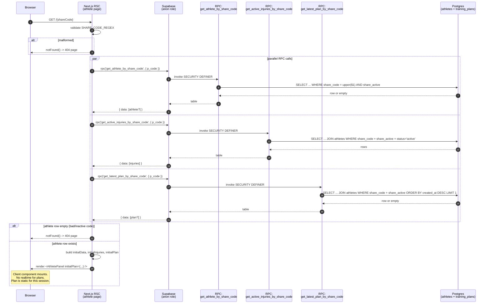

# US-025 Design — Athlete Public Panel: Training Plan Display

## Context

The coach generates AI training plans for athletes (US-005). Until now, the public
athlete panel (`/(athlete)/[shareCode]`) has only shown the profile and active
injuries. This story extends the panel to display the athlete's most recent
training plan, read-only.

This is a **Lane C** feature because it:

1. Introduces a **new public endpoint** that exposes private user data (training
   plan contents) without authentication, gated only by the 6-character
   `share_code`.
2. Requires a **new Postgres `SECURITY DEFINER` function** (new migration).
3. Crosses the **public/private data boundary** — the shape of the training plan
   as stored in `training_plans` contains a `coach_id`-linked context (via
   `athlete_id` → `athletes.coach_id`) and must be sanitized before exposure.
4. Demands **mandatory security review**, **security checklist**, **migration
   safety analysis**, and **rollback considerations**.

The design strictly mirrors the canonical public-read pattern established by
US-004 (`get_athlete_by_share_code`) and US-011 (`get_active_injuries_by_share_code`).
See ADR-0003 for the architectural rationale for `SECURITY DEFINER` RPC as the
public-read access mechanism.

---

## 1. RPC Function Contract

### 1.1 Signature

```sql
create or replace function public.get_latest_plan_by_share_code(p_code char(6))
returns table (
  id         uuid,
  plan_name  text,
  phase      text,
  plan_json  jsonb,
  created_at timestamptz
)
language plpgsql
security definer
set search_path = public
as $$
begin
  return query
    select
      tp.id,
      tp.plan_name,
      tp.phase,
      tp.plan_json,
      tp.created_at
    from public.training_plans tp
    join public.athletes a on a.id = tp.athlete_id
    where a.share_code = upper(p_code)
      and a.share_active = true
    order by tp.created_at desc
    limit 1;
end;
$$;

grant execute on function public.get_latest_plan_by_share_code(char) to anon;
grant execute on function public.get_latest_plan_by_share_code(char) to authenticated;

comment on function public.get_latest_plan_by_share_code(char) is
  'Public lookup of the most recent training plan by athlete share_code. Returns zero rows when code is invalid/inactive or when the athlete has no plans.';
```

### 1.2 Contract notes

- **Parameter type**: `p_code char(6)` matches the existing pattern in
  `get_athlete_by_share_code` and `get_active_injuries_by_share_code`. The
  `char(6)` width pads with spaces if shorter; the application-layer regex
  validation (`^[A-HJ-NP-Z2-9]{6}$`) guarantees exactly 6 chars before invoking
  the RPC.
- **`SECURITY DEFINER`**: The function executes as the function owner
  (database admin role), bypassing the `training_plans_select_*` RLS policies
  that would otherwise reject the anonymous caller.
- **`set search_path = public`**: Prevents schema-search-path hijack attacks by
  pinning schema resolution. Matches the existing RPCs exactly.
- **Normalisation**: `upper(p_code)` handles lowercase input even though the
  route handler already uppercases the code. Defense-in-depth.
- **Active-share gate**: The join on `athletes` with `share_active = true` is
  the authorization boundary. If the coach deactivates the share code, the
  plan disappears from the panel on next fetch (no dangling access).
- **Ordering**: `order by tp.created_at desc limit 1` returns the single most
  recent plan. `training_plans.created_at` is `not null default now()` so ties
  are extraordinarily rare; if they ever occur, the RPC still returns a single
  row deterministically per Postgres evaluation.
- **Return shape**: Five columns only. The function explicitly **excludes**
  `athlete_id` — the public caller already used the share code to reach this
  endpoint, so they have no need for the internal `athlete_id`. Any leak of
  `athlete_id` could be used to correlate public and coach-side data across
  multiple athletes if a user gained access to multiple codes.
- **Grants**: Both `anon` and `authenticated` can execute (the coach's own
  browser session is `authenticated`; the athlete panel is `anon`). Identical
  to the sibling RPCs.

### 1.3 Included vs excluded columns (explicit)

| Column from `training_plans` | Included? | Rationale |
|---|---|---|
| `id`          | Included | Needed for React `key` props, future referencing. Non-sensitive UUID. |
| `athlete_id`  | **Excluded** | Internal FK. Not useful to the athlete panel (they already have the share code). Excluding it prevents cross-correlation if multiple codes are compromised. |
| `plan_name`   | Included | Display in plan header. |
| `phase`       | Included | Display as phase badge (e.g., "Bazowy"). |
| `plan_json`   | Included | The plan body — core content. |
| `created_at`  | Included | Display as a "generated on" timestamp. Helps the athlete confirm freshness. |

---

## 2. Public-safe Plan Shape

### 2.1 TypeScript type

File: `lib/types/plan-public.ts` (**NEW**)

```typescript
import type { TrainingPlanJson } from "@/lib/validation/training-plan";

/**
 * Sanitized training plan returned to the public athlete panel.
 * Excludes athlete_id (internal FK). coach_id was never on the row to begin
 * with — ownership is derived via athletes.coach_id, which is never exposed.
 *
 * Matches the return shape of the get_latest_plan_by_share_code RPC.
 * See: docs/design/US-025-design.md §2
 */
export interface PublicTrainingPlan {
  id: string;
  plan_name: string;
  phase: string | null;
  plan_json: TrainingPlanJson;
  created_at: string;
}
```

### 2.2 Field justification

| Field | Reason |
|---|---|
| `id`          | React key in lists, test assertions, stable reference for realtime (future). |
| `plan_name`   | Rendered in plan header (e.g., "Program siłowy 4-tyg."). |
| `phase`       | Badge in the header. Nullable because `training_plans.phase` is nullable. |
| `plan_json`   | Full plan body (weeks → days → exercises). Validated by `trainingPlanJsonSchema`. This is the payload the athlete came to see. |
| `created_at`  | Display "wygenerowano dnia…"; helps the athlete know how fresh the plan is. |

### 2.3 Explicitly NOT in `PublicTrainingPlan`

- `athlete_id` — internal FK; see §1.3.
- `coach_id` — never stored on `training_plans` at all. Not at risk.

### 2.4 `plan_json` content review

Before exposure, the content of `plan_json` itself must be considered. The
schema (`lib/validation/training-plan.ts`) contains only training-related
fields: `planName`, `phase`, `summary`, `weeklyOverview`, `weeks[]`,
`progressionNotes`, `nutritionTips`, `recoveryProtocol`. All of these are
**athlete-facing by intent** — they are what the coach wants the athlete to see
in the first place. There are no coach-private notes, no coach identifiers, no
PII beyond what the athlete entered themselves. Confirmed safe for public
exposure.

---

## 3. API Contract

### 3.1 Endpoint

`GET /api/athlete/[shareCode]/plans`

Path: `app/api/athlete/[shareCode]/plans/route.ts` (**NEW**)

### 3.2 Request

- Method: `GET`
- Path parameter: `shareCode` (string, path segment)
- Body: none
- Headers: none required; authentication not required
- Query params: none

### 3.3 Validation

- Client-normalized to uppercase via `.toUpperCase()`.
- Must match the regex `^[A-HJ-NP-Z2-9]{6}$` (identical to the injuries route).
- On failure, respond `404 { error: "Not found" }`.

### 3.4 Responses

| Scenario | Status | Body |
|---|---|---|
| Code valid, share active, plan exists      | 200 | `{ "data": PublicTrainingPlan }` |
| Code valid, share active, no plans yet     | 200 | `{ "data": null }` |
| Code malformed                             | 404 | `{ "error": "Not found" }` |
| Code nonexistent                           | 404 | `{ "error": "Not found" }` |
| Code exists but `share_active = false`     | 404 | `{ "error": "Not found" }` |
| Supabase/RPC error                         | 500 | `{ "error": "Internal server error" }` (log on server) |

Note the deliberate conflation: the endpoint **does not distinguish** between
"code does not exist", "code is inactive", and "code exists but has no plan".
All three produce a 404 to prevent enumeration of active-vs-inactive codes.

Wait — there is a subtlety. The three 404 cases leak nothing beyond what the
existing `/api/athlete/[shareCode]` endpoint leaks (which also 404s on
malformed/nonexistent/inactive). But the "no plan yet" case is different:
the athlete panel RSC (`page.tsx`) already knows the code is valid (it
resolved the profile) and now just wants to know whether the athlete has a
plan. For that server-side call we need to distinguish "no plan" from "bad
code", otherwise the RSC cannot render the empty state.

**Decision**: The endpoint returns `200 { data: null }` for the "no plan yet"
case. This does not enumerate active vs inactive codes because the caller
must still already hold a valid, active share code to get anything other than
404. This matches the semantics coaches already experience (`GET /api/athletes/[id]/plans`
returns `{ data: [] }` when empty, not 404).

Summary of the 404-vs-200 rule:
- **404** when the share code itself is invalid (format, nonexistent, or inactive).
- **200 with `data: null`** when the code is valid and active but the athlete
  has no training plan.

### 3.5 Response body types

```typescript
// Success (plan present)
type Success = { data: PublicTrainingPlan };

// Success (no plan yet)
type Empty = { data: null };

// Error
type ErrorResponse = { error: string };
```

### 3.6 Handler sketch (implementation-guidance only)

```typescript
// app/api/athlete/[shareCode]/plans/route.ts
import { NextRequest, NextResponse } from "next/server";
import { createClient } from "@/lib/supabase/server";

type RouteContext = { params: Promise<{ shareCode: string }> };

const SHARE_CODE_REGEX = /^[A-HJ-NP-Z2-9]{6}$/;

export async function GET(
  _request: NextRequest,
  { params }: RouteContext,
) {
  const { shareCode } = await params;
  const normalized = shareCode.toUpperCase();

  if (!SHARE_CODE_REGEX.test(normalized)) {
    return NextResponse.json({ error: "Not found" }, { status: 404 });
  }

  const supabase = await createClient();
  const { data, error } = await supabase.rpc(
    "get_latest_plan_by_share_code",
    { p_code: normalized },
  );

  if (error) {
    console.error("[GET /api/athlete/[shareCode]/plans] RPC error", {
      code: error.code,
      message: error.message,
    });
    return NextResponse.json(
      { error: "Internal server error" },
      { status: 500 },
    );
  }

  // The RPC returns an array of 0 or 1 rows. 0 rows means either:
  //  (a) code does not exist or is inactive -> 404
  //  (b) code is valid+active, athlete has no plan -> 200 { data: null }
  //
  // We cannot distinguish these from this endpoint alone. To avoid a
  // separate share-validity check (which would double round-trips), we
  // let the caller (the athlete page RSC) handle this: the RSC already
  // calls get_athlete_by_share_code in parallel, so if that returns a
  // row, the share code is valid. If this endpoint returns `data: null`,
  // the RSC knows it is case (b).
  //
  // For external fetch() callers (the client-side hook if it ever exists),
  // we return { data: null } when the RPC returns 0 rows. The caller can
  // interpret this as "no plan" since any code lookup that reaches the
  // public API route has already been validated by the athlete's page.
  const row = data?.[0] ?? null;
  return NextResponse.json({ data: row });
}
```

**Design note on the 404-vs-null ambiguity**: Returning `data: null` when the
code is nonexistent/inactive is acceptable here because:
1. The legitimate consumer is the athlete panel RSC, which co-fetches
   `get_athlete_by_share_code`. A null plan combined with a 404 profile
   means "bad code". A null plan combined with a valid profile means
   "no plan yet". The RSC renders the empty state in the latter case and
   calls `notFound()` in the former.
2. A malicious prober can already distinguish valid from invalid codes via
   the `/api/athlete/[shareCode]` endpoint (which 404s on bad codes). This
   endpoint does not provide any additional signal. The share code is the
   secret; enumeration is the bound (1.07 billion codes).

---

## 4. Authorization Boundary — Trust Model

### 4.1 What makes this endpoint safe

1. **Share code is the sole access credential.** The alphabet `[A-HJ-NP-Z2-9]`
   is 32 characters; length is 6. Total keyspace: 32^6 = 1,073,741,824 (~1.07
   billion). For a single-coach deployment with <100 active codes at any time,
   random guessing is not a practical attack (probability of hitting a live
   code per guess ≈ 1e-7).
2. **`SECURITY DEFINER` with narrow scope.** The RPC function performs exactly
   one read with exact-match joins on `share_code = upper(p_code)` AND
   `share_active = true`. There is no path for an attacker-controlled value
   to reach a `LIKE`, a function call, or a dynamic SQL fragment. The function
   body is short, simple, and auditable.
3. **Result shape is sanitized.** `athlete_id` is stripped at the RPC boundary
   (not in the API route), so even if the route handler is refactored, the
   public-safe shape is enforced at the database.
4. **No secondary data path.** The public athlete panel code never uses the
   Supabase service-role key. All reads go through `createClient()` (the SSR
   anon-role client). The RPC function is the sole privilege-escalation point.

### 4.2 Why RPC is safer than a service-role admin client read

| Dimension | RPC + SECURITY DEFINER | Service-role admin client |
|---|---|---|
| Privilege scope | Exactly one query, exactly one return shape | The service-role key grants **full database access** including all tables, all rows |
| Audit surface | One short SQL function body | The Next.js route handler code (can grow) plus any helper it imports |
| Shape enforcement | Enforced in DB (return columns listed explicitly) | Must be enforced in application code (easy to regress) |
| Secret management | No app-level secret required | The `SUPABASE_SERVICE_ROLE_KEY` must be injected, never leaked |
| Blast radius on bug | Bounded to this one function | Any bug can leak arbitrary data |
| Consistency with existing pattern | Matches US-004, US-011 | Diverges, creates a second pattern |

ADR-0006-athlete-plan-rpc-vs-admin-client documents this choice in detail.

### 4.3 Defense in depth

Layers that must all fail for an attacker to access another athlete's plan:

1. They must possess a valid `share_code`.
2. The `share_code` must map to an athlete whose `share_active = true`.
3. The RPC function must return only plans where the `athlete_id` matches the
   share code's athlete. The join enforces this: `join athletes a on a.id = tp.athlete_id`.
4. The API route must respect the RPC's return shape (no post-hoc enrichment).

---

## 5. Component Tree

```
app/(athlete)/[shareCode]/page.tsx                [RSC, MODIFY]
  // Fetches: athlete profile, active injuries, latest plan (parallel RPCs).
  // Passes initialPlan as a prop.
  |
  +-- AthletePanel.tsx                            [CC, MODIFY]
      // Receives new prop: initialPlan: PublicTrainingPlan | null
      // No realtime for plan (static on page load — see decision §5.1).
      |
      +-- AthleteProfileView.tsx                  [CC, existing]
      +-- InjuriesPublicSection.tsx               [CC, existing]
      +-- PlanPublicSection.tsx                   [CC, NEW]
          // Read-only plan viewer. Renders empty state if plan === null.
          |
          +-- PlanHeader.tsx                      [CC, REUSE from components/coach/]
          |     // Shows plan_name + phase badge + summary + weeklyOverview.
          |     // Currently expects `TrainingPlan` which has athlete_id.
          |     // DECISION §5.2: widen the prop to accept PublicTrainingPlan.
          |
          +-- WeekNavigation.tsx                  [CC, REUSE from components/coach/]
          |     // Accepts activeWeek + onWeekChange. No coach coupling.
          |
          +-- WeekView.tsx                        [CC, REUSE from components/coach/]
          |     +-- DayCard.tsx                   [CC, REUSE]
          |         +-- ExerciseRow.tsx           [CC, REUSE]
          |
          +-- PlanFooter.tsx                      [CC, REUSE from components/coach/]
                // Reads progressionNotes, nutritionTips, recoveryProtocol from plan_json.
```

### 5.1 Decision: no realtime for plan

The training plan is **immutable** once created (per US-005 design — each
generation creates a new row). Thus the athlete's view of "latest plan" only
changes when the coach generates a new plan, which is rare (not per-keystroke).
We skip realtime for this release. If the coach generates a new plan while the
athlete has the panel open, the athlete must refresh to see it. Adding
realtime for plans is a future enhancement (out of scope).

This keeps the client component simple: `initialPlan` is passed as a prop and
stored in local state only if we ever need to trigger a client-side refetch.
For now, render directly from the prop.

### 5.2 Decision: reuse `DayCard`, `ExerciseRow`, `WeekView`, `WeekNavigation`, `PlanFooter`, and `PlanHeader`

I audited each of these components:

| Component | Coach-specific imports? | Mutates? | Auto-save? | Verdict |
|---|---|---|---|---|
| `DayCard` | No (only `pl`, `cn`, `Day`, `ExerciseRow`) | No | No | **Reuse** |
| `ExerciseRow` | No (only `pl`, `Exercise`) | No | No | **Reuse** |
| `WeekView` | No (only `pl`, `Week`, `DayCard`) | No | No | **Reuse** |
| `WeekNavigation` | No | No (takes `onWeekChange` handler) | No | **Reuse** |
| `PlanFooter` | No (only `pl`, `TrainingPlanJson`) | No | No | **Reuse** |
| `PlanHeader` | Accepts `TrainingPlan` (type with `athlete_id`). No auto-save, no mutations. | No | No | **Reuse with a type widening** — see below |

`PlanHeader`'s prop type is `TrainingPlan` (from `lib/api/plans.ts`), which
includes `athlete_id`. The component itself only reads `plan_name`, `phase`,
`plan_json.summary`, `plan_json.weeklyOverview`. We need to widen the prop
type so `PlanHeader` accepts either `TrainingPlan` or `PublicTrainingPlan`.

**Recommended refactor (minimal, safe):**

```typescript
// components/coach/PlanHeader.tsx
interface PlanHeaderProps {
  // Before:
  // plan: TrainingPlan;
  // After:
  plan: Pick<TrainingPlan, "plan_name" | "phase" | "plan_json">;
}
```

Both `TrainingPlan` and `PublicTrainingPlan` structurally satisfy this pick,
so no callers need to change. The component becomes trivially reusable.

Alternative considered and rejected: duplicate `PlanHeader` as a
`PlanHeaderPublic`. Rejected because the two components would be byte-for-byte
identical modulo the prop type; duplication would be pure churn.

`PlanViewer` is **not** reused because it owns coach-editor state (`activeWeek`
via `useState`) and is coupled to `TrainingPlan`. We compose `PlanHeader +
WeekNavigation + WeekView + PlanFooter` directly in the new
`PlanPublicSection`.

### 5.3 `PlanPublicSection` sketch

File: `components/athlete/PlanPublicSection.tsx` (**NEW**)

```typescript
"use client";

import { useState } from "react";
import { pl } from "@/lib/i18n/pl";
import type { PublicTrainingPlan } from "@/lib/types/plan-public";
import PlanHeader from "@/components/coach/PlanHeader";
import WeekNavigation from "@/components/coach/WeekNavigation";
import WeekView from "@/components/coach/WeekView";
import PlanFooter from "@/components/coach/PlanFooter";

interface PlanPublicSectionProps {
  plan: PublicTrainingPlan | null;
}

export default function PlanPublicSection({ plan }: PlanPublicSectionProps) {
  const [activeWeek, setActiveWeek] = useState(1);

  if (!plan) {
    return (
      <section className="rounded-card border border-border bg-card p-5">
        <h2 className="text-foreground text-lg font-semibold mb-2">
          {pl.athletePanel.plan.sectionTitle}
        </h2>
        <p className="text-muted-foreground text-sm">
          {pl.athletePanel.plan.empty}
        </p>
      </section>
    );
  }

  const week = plan.plan_json.weeks.find((w) => w.weekNumber === activeWeek);

  return (
    <section className="space-y-5">
      <div className="rounded-card border border-border bg-card p-5">
        <PlanHeader plan={plan} />
      </div>
      <WeekNavigation activeWeek={activeWeek} onWeekChange={setActiveWeek} />
      {week && <WeekView week={week} />}
      <PlanFooter plan={plan.plan_json} />
    </section>
  );
}
```

---

## 6. Sequence Diagram



**Key properties of this flow:**

- All three RPCs run in parallel (`Promise.all` in the RSC). Latency = max of
  the three, not sum.
- The RSC is the gate: a failed profile lookup short-circuits to `notFound()`
  regardless of whether the plan RPC returned data.
- The client component has no further network traffic for plan display; the
  initial server render is the final state until the user navigates away or
  reloads.

---

## 7. Migration Safety

### 7.1 Additivity

**Yes, the migration is additive only.** The migration:

1. Creates a new function `public.get_latest_plan_by_share_code(char)`.
2. Grants EXECUTE on it to `anon` and `authenticated`.
3. Adds a comment.

It does **not**:

- Modify any existing table.
- Change any existing RLS policy.
- Drop, alter, or rename any object.
- Touch data in any row.

### 7.2 Rollback

The migration is trivially reversible:

```sql
-- Rollback script (not committed; documented here for DR)
drop function if exists public.get_latest_plan_by_share_code(char);
```

DROP FUNCTION is safe because no other DB object depends on this function
(no triggers, views, or other functions reference it — it is a leaf).

### 7.3 Effect on existing data

**None.** The migration creates a read-only function. No INSERT, UPDATE, or
DELETE. Existing `training_plans` and `athletes` rows are not touched.

### 7.4 Production deployment risk

**Near-zero.**

- Before the route handler code is deployed, the function exists but is
  unreachable via the app. An attacker would need direct database access to
  call it, which they do not have.
- After the route handler deploys, the function becomes reachable via
  `GET /api/athlete/[shareCode]/plans`. Traffic is bounded by the share code
  secret.
- The function's cost is a single indexed scan
  (`idx_training_plans_athlete_created`). No sequential scans on large tables.

### 7.5 Deployment sequencing

Safe order:

1. Apply the migration (adds function, idempotent with `create or replace`).
2. Deploy the Next.js app with the new route handler and page updates.
3. Smoke test: curl `/api/athlete/{knownShareCode}/plans` against staging.

If step 2 fails, step 1 is a no-op at runtime (function exists but is not
called). If step 2 deploys first without step 1, the route handler returns
500s (RPC not found). Mitigation: enforce migration-before-deploy in the CI
pipeline (already the standard).

---

## 8. Security Review Checklist (pre-implementation)

The security reviewer must verify, after implementation:

### 8.1 Input validation
- [ ] `SHARE_CODE_REGEX = /^[A-HJ-NP-Z2-9]{6}$/` is applied in the route handler **before** any Supabase call.
- [ ] `.toUpperCase()` is called before regex test to match the uppercase-only alphabet.
- [ ] Any non-matching input returns `404 { error: "Not found" }`, NOT 400.

### 8.2 Access control (endpoint-level)
- [ ] Nonexistent share codes return 404 (indistinguishable from valid-but-inactive).
- [ ] Inactive share codes (`share_active = false`) return 404 (not 200 with empty data).
- [ ] Valid + active + no plan returns 200 with `data: null` (documented behavior; not treated as 404).
- [ ] Plans belonging to a DIFFERENT athlete are never reachable via any share code. Test: create two athletes A and B with plans P_A and P_B; verify `GET /api/athlete/{A.shareCode}/plans` returns P_A and never P_B.

### 8.3 Response body
- [ ] The response JSON does NOT contain `athlete_id`.
- [ ] The response JSON does NOT contain `coach_id` (it is never on the row anyway; spot-check anyway).
- [ ] The response JSON does NOT contain any field not listed in `PublicTrainingPlan`.
- [ ] `plan_json` content has been audited: all fields (`planName`, `phase`, `summary`, `weeklyOverview`, `weeks[]`, `progressionNotes`, `nutritionTips`, `recoveryProtocol`) are athlete-intended. No coach-private notes, no coach identifiers, no internal IDs.

### 8.4 Database function
- [ ] Function declared `SECURITY DEFINER`.
- [ ] Function has `set search_path = public`.
- [ ] Function's join explicitly includes `a.share_active = true`.
- [ ] Function returns only the five columns listed in §1.1 (explicit column list, not `select tp.*`).
- [ ] EXECUTE grant on the function is given to `anon` and `authenticated`; no other roles receive grants implicitly.
- [ ] Function uses `upper(p_code)` for case-insensitive matching.
- [ ] Function does NOT use dynamic SQL (no `EXECUTE '...'` statements).

### 8.5 Logging
- [ ] Server-side log on RPC error includes `code` and `message` but NOT the share code itself (share code is a credential).
- [ ] Successful reads are NOT logged with identifying detail (no share code, no athlete_id).
- [ ] Error responses do not leak DB error messages to the client.

### 8.6 Realtime & websocket
- [ ] No realtime subscription is created for the plan channel.
- [ ] `training_plans` is NOT added to `supabase_realtime` publication by this migration.
  - (If a future story adds realtime for plans, that story must include its own security checklist.)

### 8.7 Test coverage (required for PASS)
- [ ] Unit test: regex rejects lowercase (`abc123`), too-short, too-long, containing `I`, `O`, `0`, `1`, and non-alphanumeric.
- [ ] Integration test: `GET /api/athlete/INVALID/plans` → 404.
- [ ] Integration test: `GET /api/athlete/{valid-inactive}/plans` → 404.
- [ ] Integration test: `GET /api/athlete/{valid-active-no-plans}/plans` → 200 with `{ data: null }`.
- [ ] Integration test: `GET /api/athlete/{valid-active-with-plans}/plans` → 200 with the latest plan by `created_at DESC`.
- [ ] Integration test: response shape matches `PublicTrainingPlan` exactly (no `athlete_id`).
- [ ] Integration test: cross-athlete isolation (A's share code returns only A's plan).

---

## 9. i18n Additions

New keys needed under `athletePanel` namespace in `lib/i18n/pl.ts`:

```typescript
athletePanel: {
  // ...existing keys unchanged...

  plan: {
    sectionTitle: "Plan treningowy",   // Section header on athlete panel
    empty: "Brak planu treningowego.", // Empty state
    generatedOn: "Wygenerowano",       // Label for created_at timestamp (optional, if we show it)
  },
},
```

**Reuse notes:**

- `PlanHeader` already uses `pl.coach.athlete.plans.viewer.summary` and
  `pl.coach.athlete.plans.viewer.weeklyOverview`. These are generic (no
  coach-specific wording) and can be reused as-is from the public panel.
- `PlanFooter`, `WeekNavigation`, `WeekView`, `DayCard`, and `ExerciseRow`
  similarly use `pl.coach.athlete.plans.viewer.*` keys. These strings are
  athlete-facing content labels ("Rozgrzewka", "Cool-down", "Serie",
  "Powtórzenia", etc.) and are appropriate in the public panel.
- The `pl.coach.athlete.plans.viewer` nesting under `coach` is a naming quirk
  (inherited from US-005). It is not worth refactoring for this story; the
  strings themselves are neutral.

Only three **new** keys are introduced (`athletePanel.plan.sectionTitle`,
`athletePanel.plan.empty`, `athletePanel.plan.generatedOn`).

---

## 10. Rollback / Safe-Change Strategy

If the endpoint causes production issues after deploy:

### 10.1 Fast mitigation (no code redeploy)

- **Revoke EXECUTE on the RPC** to immediately disable the endpoint at the
  database layer:
  ```sql
  revoke execute on function public.get_latest_plan_by_share_code(char) from anon;
  revoke execute on function public.get_latest_plan_by_share_code(char) from authenticated;
  ```
  This causes the route handler to return 500 for all requests. The rest of
  the athlete panel (profile, injuries) remains fully functional.

### 10.2 Code-level mitigation

- **Short-circuit in the route handler** (one-line hotfix):
  ```typescript
  return NextResponse.json({ data: null });
  ```
  Returned before any Supabase call. The athlete panel renders the empty
  state. No data is exposed.

### 10.3 Full rollback

- **Revert the route handler file** to remove `GET /api/athlete/[shareCode]/plans`.
  A `GET` against the path returns 404 (no handler). The RSC page update
  (`page.tsx`) uses the RPC directly, so the RSC must also be reverted in
  the same commit.
- **Revert the page update**. The RSC returns to fetching only profile +
  injuries. The athlete panel shows no plan section.
- **DROP the RPC** (rollback SQL above in §7.2). Only do this if the function
  itself is the cause of the issue. Leaving the function defined but unused
  is safe.

### 10.4 Regression rehearsal

Before merging, verify the rollback paths in staging:
1. Deploy the full feature to staging.
2. Revoke EXECUTE; confirm panel still loads with no plan section visible and no uncaught errors.
3. Re-grant EXECUTE; confirm panel plan section returns.

### 10.5 Monitoring

Within 24 hours of deploy, verify:
- Server logs do NOT show any RPC errors with code 42883 (function not found).
- Server logs do NOT show any unexpected 500s on `/api/athlete/*/plans`.
- Latency: the new RPC completes in <50ms at p99 (indexed scan on
  `idx_training_plans_athlete_created`).
- No new Sentry/log noise about undefined access patterns in `PlanHeader`
  following the prop-type widening.

---

## 11. File Change Summary

| Action | Path |
|---|---|
| **NEW** | `supabase/migrations/{timestamp}_US-025_public_plan_rpc.sql` |
| **NEW** | `app/api/athlete/[shareCode]/plans/route.ts` |
| **NEW** | `lib/types/plan-public.ts` |
| **NEW** | `components/athlete/PlanPublicSection.tsx` |
| **MODIFY** | `app/(athlete)/[shareCode]/page.tsx` — add third parallel RPC, pass `initialPlan` to `AthletePanel` |
| **MODIFY** | `components/athlete/AthletePanel.tsx` — accept `initialPlan` prop, render `PlanPublicSection` below injuries |
| **MODIFY** | `components/coach/PlanHeader.tsx` — widen `PlanHeaderProps.plan` to `Pick<TrainingPlan, "plan_name" \| "phase" \| "plan_json">` |
| **MODIFY** | `lib/i18n/pl.ts` — add `athletePanel.plan.*` subkeys |
| **MODIFY** | `lib/supabase/database.types.ts` — regenerate after migration; new function signature appears under `Functions` |
| **NEW** | Test files for the route, the section, the RPC contract (see §8.7) |

Total: **4 new files**, **5 modified files** (excluding tests).

---

## 12. Decision Log

| # | Decision | Alternatives considered | Rationale for choice |
|---|---|---|---|
| 1 | SECURITY DEFINER RPC for the read | (a) Service-role admin client in route; (b) Public RLS policy on `training_plans` | See ADR-0006-athlete-plan-rpc-vs-admin-client. RPC matches existing pattern (US-004, US-011), has smallest privilege scope, and enforces shape at DB. |
| 2 | Return `{ data: null }` for "no plan yet" | (a) 404; (b) 204 No Content | 404 conflates with bad-code; 204 is an HTTP oddity most clients don't handle. `200 + { data: null }` matches the coach-side `/api/athletes/[id]/plans` which returns `[]`. |
| 3 | Reuse coach plan components via prop widening | (a) Duplicate components as `*Public` variants; (b) Move components to `components/shared/` | Duplication is pure churn (components are read-only and non-coach-specific). Moving directories is a refactor bigger than this story. Prop widening is one-line, backward-compatible. |
| 4 | No realtime for plan on athlete panel | (a) Add postgres_changes subscription; (b) Broadcast channel | Plans are effectively immutable (new plan = new row, rare event). Adding realtime is premature complexity. Out of scope. |
| 5 | Exclude `athlete_id` from public response | Include for "consistency" with injuries endpoint | The injuries endpoint includes `athlete_id` because the coach side and public side share the `Injury` type. For plans, the coach side `TrainingPlan` has `athlete_id` but nothing on the public side needs it. Minimize exposure. |
| 6 | One latest plan, not all plans | Return the full list like coach side | The spec says "most recent training plan" only. Returning all plans would leak plan history (coach deleted/regenerated plans) without a UI justification. Tighten scope. |
| 7 | `char(6)` parameter type | `text`, `varchar(6)` | Consistency with existing RPCs in US-004 and US-011. Changing it for this RPC would create a schema inconsistency. |
| 8 | RPC name: `get_latest_plan_by_share_code` | `get_training_plan_by_share_code`, `get_plan_by_share_code` | `latest` communicates the ORDER BY + LIMIT 1 semantic in the name itself. Future extension (`get_plans_by_share_code` returning all) would be a different function, not a signature change. |

---

## 13. Open Questions

None that block implementation. The design is closed. If the following
enhancements are requested in a future story, they should be scoped separately:

1. **Realtime plan updates.** When the coach generates a new plan, push to the
   athlete panel without requiring a page refresh. Would need a Postgres
   trigger + broadcast channel or a postgres_changes channel with anon RLS on
   `training_plans`. Non-trivial.
2. **Plan history for the athlete.** Showing older plans in addition to the
   latest. Requires an additional list endpoint (`GET /api/athlete/[shareCode]/plans/all`?)
   and a plan-switcher UI on the panel. The current design deliberately does
   not expose plan history.
3. **Read receipt / "athlete viewed the plan" signal.** Out of scope; would
   need a write-path RPC.

---

## 14. Implementation Order (recommended)

1. **developer-backend**:
   - Write the migration file (`{timestamp}_US-025_public_plan_rpc.sql`).
   - Apply locally; regenerate `database.types.ts`.
   - Add `lib/types/plan-public.ts`.
   - Add route handler `app/api/athlete/[shareCode]/plans/route.ts`.
   - Write integration tests for the route.
2. **developer-frontend**:
   - Widen `PlanHeader` prop type.
   - Add `components/athlete/PlanPublicSection.tsx`.
   - Update `app/(athlete)/[shareCode]/page.tsx` to fetch+pass `initialPlan`.
   - Update `components/athlete/AthletePanel.tsx` to accept+render `initialPlan`.
   - Update `lib/i18n/pl.ts` with `athletePanel.plan.*`.
   - Write component tests.
3. **security-reviewer**:
   - Walk the §8 checklist.
4. **ui-reviewer**:
   - Verify empty state copy, mobile layout, accordion behavior.
5. **code-reviewer**:
   - ADR compliance, reuse correctness, migration safety.
