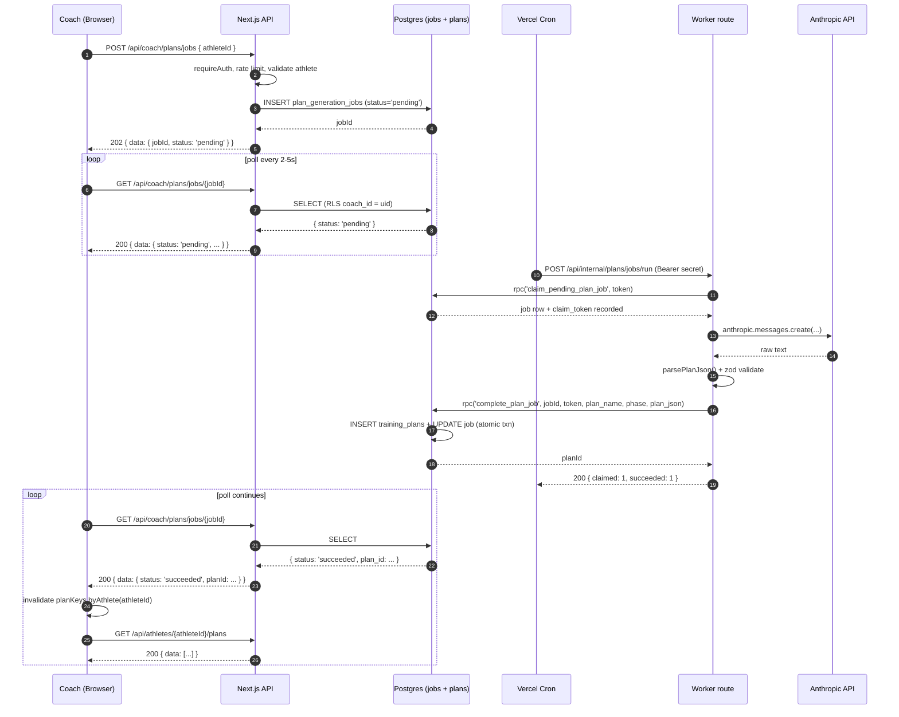
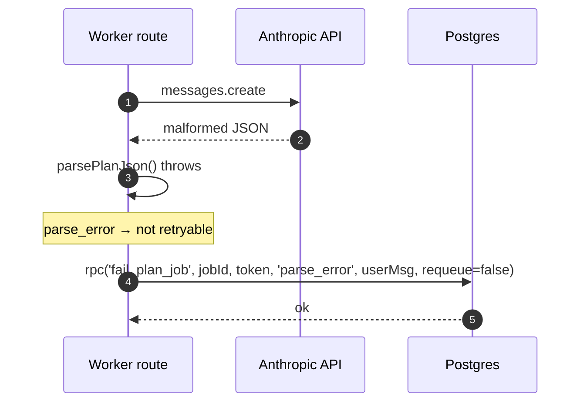
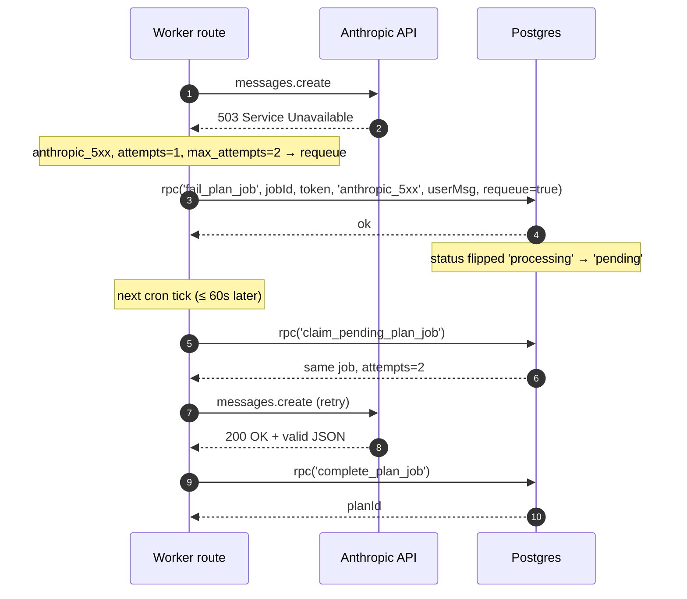
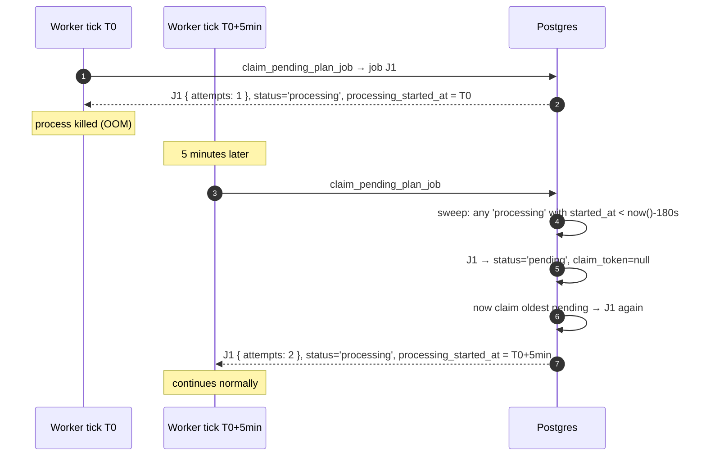

# US-026 Design — Async AI Plan Generation via Job Table & Polling

## 0. TL;DR

The synchronous `POST /api/athletes/[id]/plans` cannot complete inside the
Vercel function timeout (60s default for the Hobby tier; 90s upper bound on
Pro Fluid; we observed 504s at `max_tokens=6000`). We replace the synchronous
contract with a **job-queue + worker + polling** model:

1. The coach starts a job. The route returns 202 in < 500 ms.
2. A worker (Vercel Cron, every 1 minute) drains the `plan_generation_jobs`
   queue with `FOR UPDATE SKIP LOCKED`. The worker is the only piece that
   talks to Claude. Its function timeout is configured at the Vercel platform
   ceiling (60s on Hobby, 300s on Pro). Generation is allowed to take 60-120s.
3. The coach UI polls `GET /api/coach/plans/jobs/[jobId]` every 2 s with
   exponential cap; when `status === 'succeeded'`, the plan list is
   invalidated and the new card appears.
4. On `failed` (parse error, validation error, exhausted retries), the UI
   shows an actionable Polish error with a "Spróbuj ponownie" CTA that
   creates a fresh job.

The public athlete endpoint (`GET /api/athlete/[shareCode]/plans`, US-025) is
**unchanged**. The job table is generation metadata only. The source of truth
for completed plans remains `training_plans`.

---

## 1. Context

### 1.1 What we're solving

US-005 shipped a synchronous Claude call inside a Next.js route handler.
Production telemetry shows:

| `max_tokens` | Outcome |
|---|---|
| 3000 | Truncated JSON → zod parse fails → 500 to user |
| 4000 | Truncated JSON → zod parse fails → 500 to user |
| 6000 | Anthropic 60s SDK timeout / Vercel 504 |
| 8000 | (current default) — same shape as 6000, plus higher cost |

The story spec (US-005 AC-3) requires a 4-week plan with N days × 5-7
exercises × 7 plan-level fields. A faithful generation reliably exceeds the
60s synchronous budget for the current model (`claude-sonnet-4-6`).
Switching models is out of scope (separate cost/quality decision).

### 1.2 What we're NOT changing

- **`training_plans`** schema — unchanged. The worker writes the same row
  shape the synchronous route writes today.
- **The public athlete endpoint** `GET /api/athlete/[shareCode]/plans` —
  contract is frozen (US-025 / ADR-0006). It continues to read from
  `training_plans` via `get_latest_plan_by_share_code`. It must never read
  from the jobs table.
- **`trainingPlanJsonSchema`** — unchanged. The worker validates with the
  same zod schema and rejects malformed plans before persisting.
- **The AI prompt structure** (`buildSystemPrompt` /
  `buildUserPrompt`) — unchanged. The worker reuses
  `lib/ai/prompts/plan-generation.ts` verbatim.
- **The coach RLS model** for `training_plans` — unchanged. Plans remain
  scoped via `athlete_id IN (SELECT id FROM athletes WHERE coach_id = auth.uid())`.

### 1.3 Why "job table + polling" beats the alternatives

A full alternatives analysis lives in **ADR-0007**. Polling was selected over
Realtime push, longer Vercel timeout, switch to Opus, and in-band streaming
because:

- Polling is debuggable from the browser Network tab without a WebSocket
  inspector.
- The job table gives us free durable retry, observability, and replay
  semantics that Realtime does not.
- It is the smallest change consistent with the existing
  RouteHandler + TanStack Query pattern (ADR-0002).

---

## 2. Data model impact

### 2.1 New table: `plan_generation_jobs`

DDL pseudocode (the actual migration is written by `developer-backend`):

```sql
create type public.plan_job_status as enum (
  'pending',     -- waiting in the queue
  'processing',  -- claimed by a worker, generation in progress
  'succeeded',   -- plan written to training_plans, plan_id set
  'failed'       -- terminal failure; user must trigger a new job
);

create table public.plan_generation_jobs (
  id                      uuid          primary key default gen_random_uuid(),
  athlete_id              uuid          not null references public.athletes(id) on delete cascade,
  coach_id                uuid          not null references auth.users(id)     on delete cascade,
  status                  plan_job_status not null default 'pending',

  -- Inputs frozen at job creation so a re-run produces the same plan.
  -- Snapshot, not a live read of athletes/injuries/etc. — protects against
  -- mid-generation profile edits affecting an in-flight call.
  prompt_inputs           jsonb         not null,
    -- shape:
    --   {
    --     athleteSnapshot: { /* athletes row fields actually used by the prompt */ },
    --     injuriesSnapshot: [ ... ],
    --     diagnosticsSnapshot: [ ... ],
    --     progressionsSnapshot: [ ... ]
    --   }

  -- Output linkage (set on success only).
  plan_id                 uuid          references public.training_plans(id) on delete set null,

  -- Failure surface.
  error_code              text,           -- enum-like string: 'parse_error' | 'validation_error' | 'anthropic_5xx' | 'anthropic_timeout' | 'rate_limited' | 'unknown'
  error_message_user      text,           -- Polish, safe to show to coach
  -- NB: NO error_message_internal column. Internal detail goes to server logs only.

  -- Worker concurrency / claim metadata.
  attempts                integer       not null default 0,
  max_attempts            integer       not null default 2, -- 1 initial + 1 retry, mirrors US-005 §6
  claim_token             uuid,           -- set when a worker claims; cleared on success/failure
  processing_started_at   timestamptz,    -- set when status flips to 'processing'

  -- Lifecycle.
  created_at              timestamptz   not null default now(),
  updated_at              timestamptz   not null default now(),
  finished_at             timestamptz,    -- set when status becomes 'succeeded' or 'failed'

  -- Hard guards on coherence:
  constraint plan_jobs_status_processing_token
    check ((status <> 'processing') or (claim_token is not null and processing_started_at is not null)),
  constraint plan_jobs_status_succeeded_planid
    check ((status <> 'succeeded') or (plan_id is not null and finished_at is not null)),
  constraint plan_jobs_status_failed_finished
    check ((status <> 'failed') or (finished_at is not null and error_code is not null))
);

-- Auto-touch updated_at on every UPDATE (matches athletes pattern).
create trigger plan_generation_jobs_updated_at
  before update on public.plan_generation_jobs
  for each row execute function extensions.moddatetime(updated_at);
```

#### 2.1.1 State machine

```
                    +--------------+
                    |   pending    |
                    +------+-------+
                           |
                worker CLAIM (FOR UPDATE SKIP LOCKED)
                           v
                    +--------------+
                    |  processing  |
                    +------+-------+
                           |
        +------------------+------------------+
        | succeeded                            | failed
        v                                      v
   plan written +                          attempts < max
   plan_id set                                  |
                                       +--------+--------+
                                       | yes              | no
                                       v                  v
                                    pending           failed (terminal)
```

Allowed transitions (enforced by the worker, NOT by a DB trigger to keep the
migration minimal — every transition is gated by SQL `WHERE status = ...`
predicates so a stale claim cannot succeed):

- `pending → processing` (claim)
- `processing → succeeded` (commit success)
- `processing → failed` (terminal failure)
- `processing → pending` (worker requeue when `attempts < max_attempts`)
- `processing → pending` (stale-claim recovery — see §2.2.4)

### 2.2 Indexes

```sql
-- Worker queue scan: pending oldest-first.
create index idx_plan_jobs_pending_created
  on public.plan_generation_jobs (created_at)
  where status = 'pending';

-- Coach polling lookup (hot path; one-row index hit by primary key — see §6.2).
-- Already covered by the PK. No additional index needed for GET /jobs/[jobId].

-- Coach ownership (RLS predicate). athletes already has coach_id index;
-- jobs.coach_id is duplicated for fast RLS evaluation.
create index idx_plan_jobs_coach_id_status
  on public.plan_generation_jobs (coach_id, status);

-- Stale-claim sweep: find rows stuck in 'processing'.
create index idx_plan_jobs_processing_started
  on public.plan_generation_jobs (processing_started_at)
  where status = 'processing';
```

### 2.2.4 Why `coach_id` is denormalized on `plan_generation_jobs`

Two reasons:

1. **RLS without subquery cost.** The natural ownership chain is
   `jobs.athlete_id -> athletes.coach_id`. Putting `coach_id` directly on the
   row lets RLS read `auth.uid() = coach_id` instead of a subquery — same
   shape as `training_plans` policies (see US-005 migration).
2. **Worker can identify ownership without joining athletes.** The worker
   needs `coach_id` only for log labeling (we never echo it back to the
   client); the PG join is cheap, but the column is cheap too.

The application layer **MUST** populate `coach_id` from `auth.uid()` at job
creation time. The DB enforces consistency via a new `plan_generation_jobs_coach_consistent`
constraint trigger (sketch — implementation in the migration):

```sql
-- Trigger pseudocode: on INSERT, verify athlete_id.coach_id == NEW.coach_id.
-- Implementation choice in the migration; alternatives include a CHECK
-- using a deferred FK or a simple BEFORE INSERT trigger function.
```

### 2.3 RLS policies

Five policies — coach-only access. **No anon, no service-role grant.**

```sql
alter table public.plan_generation_jobs enable row level security;

-- Coach can SEE their own jobs.
create policy "jobs_select_own"
  on public.plan_generation_jobs
  for select to authenticated
  using (coach_id = auth.uid());

-- Coach can INSERT a new job for an athlete they own.
-- Note: the WITH CHECK enforces ownership chain explicitly; the trigger
-- enforces coach_id == athletes.coach_id.
create policy "jobs_insert_own"
  on public.plan_generation_jobs
  for insert to authenticated
  with check (
    coach_id = auth.uid()
    and athlete_id in (
      select id from public.athletes where coach_id = auth.uid()
    )
  );

-- Coach has NO direct UPDATE / DELETE on jobs.
-- All state transitions are performed by the worker via a SECURITY DEFINER
-- RPC (see §3.3) so the coach session can never poison job state.
-- Explicit RESTRICTIVE policies are intentionally absent — the absence of
-- a permissive UPDATE/DELETE policy is the gate.

-- (No anon policy. The jobs table is invisible to anonymous callers.)
```

Equivalent text-form RLS rule one-liners (for the security checklist):

- Authenticated coach SELECT: only rows where `coach_id = auth.uid()`.
- Authenticated coach INSERT: only when `coach_id = auth.uid()` AND athlete is owned.
- Authenticated coach UPDATE: forbidden (no policy).
- Authenticated coach DELETE: forbidden (no policy).
- `anon` role: no access (no policy).

### 2.4 SECURITY DEFINER RPCs

Two RPCs encapsulate the privileged worker operations, keeping the
service-role key out of the route handler (matches ADR-0006).

```sql
-- 2.4.1 Atomic claim with FOR UPDATE SKIP LOCKED.
create or replace function public.claim_pending_plan_job(
  p_worker_token uuid,         -- caller-generated; persisted as claim_token
  p_stale_after_seconds int default 180
)
returns table (
  id           uuid,
  athlete_id   uuid,
  coach_id     uuid,
  prompt_inputs jsonb,
  attempts     integer,
  max_attempts integer
)
language plpgsql
security definer
set search_path = public
as $$
declare
  v_job record;
begin
  -- 1. Reclaim stale 'processing' jobs whose claim has expired.
  --    A worker that died or is wedged leaves processing_started_at
  --    in the past. We flip it back to 'pending' so a fresh worker can pick it up.
  update public.plan_generation_jobs
  set status = 'pending',
      claim_token = null,
      processing_started_at = null
  where status = 'processing'
    and processing_started_at < now() - make_interval(secs => p_stale_after_seconds);

  -- 2. Pick the oldest pending row, lock it, and flip status atomically.
  with candidate as (
    select id
    from public.plan_generation_jobs
    where status = 'pending'
    order by created_at
    limit 1
    for update skip locked
  )
  update public.plan_generation_jobs j
  set status = 'processing',
      claim_token = p_worker_token,
      processing_started_at = now(),
      attempts = j.attempts + 1
  from candidate c
  where j.id = c.id
  returning j.id, j.athlete_id, j.coach_id, j.prompt_inputs, j.attempts, j.max_attempts
  into v_job;

  if v_job.id is null then
    return; -- no pending work
  end if;

  return query
    select v_job.id, v_job.athlete_id, v_job.coach_id, v_job.prompt_inputs,
           v_job.attempts, v_job.max_attempts;
end;
$$;

-- Only the worker (server-side caller authenticated as the worker role)
-- needs this. Grant ONLY to authenticated; the worker bearer-secret check
-- in the route handler is the real gate. The function does not check the
-- caller because the route handler does (see §3.3.1).
revoke all on function public.claim_pending_plan_job(uuid, int) from public;
revoke all on function public.claim_pending_plan_job(uuid, int) from anon;
revoke all on function public.claim_pending_plan_job(uuid, int) from authenticated;
grant execute on function public.claim_pending_plan_job(uuid, int) to service_role;

-- 2.4.2 Mark job complete with plan write — atomic.
create or replace function public.complete_plan_job(
  p_job_id      uuid,
  p_claim_token uuid,
  p_plan_name   text,
  p_phase       text,
  p_plan_json   jsonb
)
returns uuid -- the new training_plans.id
language plpgsql
security definer
set search_path = public
as $$
declare
  v_athlete_id uuid;
  v_plan_id    uuid;
begin
  -- 1. Verify the caller still holds the claim.
  select athlete_id into v_athlete_id
  from public.plan_generation_jobs
  where id = p_job_id
    and claim_token = p_claim_token
    and status = 'processing'
  for update;

  if v_athlete_id is null then
    raise exception 'Stale claim or job not in processing'
      using errcode = 'P0002';
  end if;

  -- 2. Insert the plan.
  insert into public.training_plans (athlete_id, plan_name, phase, plan_json)
  values (v_athlete_id, p_plan_name, p_phase, p_plan_json)
  returning id into v_plan_id;

  -- 3. Mark the job succeeded (idempotent if retried — see §4.4).
  update public.plan_generation_jobs
  set status = 'succeeded',
      plan_id = v_plan_id,
      claim_token = null,
      finished_at = now()
  where id = p_job_id;

  return v_plan_id;
end;
$$;

revoke all on function public.complete_plan_job(uuid, uuid, text, text, jsonb) from public, anon, authenticated;
grant execute on function public.complete_plan_job(uuid, uuid, text, text, jsonb) to service_role;

-- 2.4.3 Mark job failed (terminal or requeue).
create or replace function public.fail_plan_job(
  p_job_id            uuid,
  p_claim_token       uuid,
  p_error_code        text,
  p_error_message_user text,
  p_requeue           boolean
)
returns void
language plpgsql
security definer
set search_path = public
as $$
begin
  if p_requeue then
    update public.plan_generation_jobs
    set status = 'pending',
        claim_token = null,
        processing_started_at = null,
        error_code = p_error_code,
        error_message_user = p_error_message_user
    where id = p_job_id
      and claim_token = p_claim_token
      and status = 'processing'
      and attempts < max_attempts;
  else
    update public.plan_generation_jobs
    set status = 'failed',
        claim_token = null,
        finished_at = now(),
        error_code = p_error_code,
        error_message_user = p_error_message_user
    where id = p_job_id
      and claim_token = p_claim_token
      and status = 'processing';
  end if;
end;
$$;

revoke all on function public.fail_plan_job(uuid, uuid, text, text, boolean) from public, anon, authenticated;
grant execute on function public.fail_plan_job(uuid, uuid, text, text, boolean) to service_role;
```

### 2.5 Realtime publication

`plan_generation_jobs` is **NOT** added to `supabase_realtime`. Polling, not
push, is the chosen UX mechanism (see ADR-0007 §Rejected Alternatives —
Realtime).

---

## 3. API contract

### 3.1 `POST /api/coach/plans/jobs` — start a job

Path file: `app/api/coach/plans/jobs/route.ts` (new).

**Auth**: required (Supabase cookie session); reuses `requireAuth()`.

**Request body**:

```json
{
  "athleteId": "ddc1c2c0-1111-2222-3333-444455556666"
}
```

(Nothing else. The athlete-context snapshot is composed server-side and
written to `prompt_inputs` so the prompt is reproducible.)

**Validation**:

- `athleteId` must be a valid UUID.
- Coach must own the athlete (RLS-equivalent server-side check).
- Athlete must satisfy the same minimum-data check as US-005 (sport,
  training_days_per_week). Reuse the existing 422 path.
- Rate limit: reuse `checkRateLimit(user.id)`; same 3/min cap. Now applies
  to **job creation** (cheap) instead of Claude calls (expensive). Limit
  protects against runaway client retries.

**Behavior**:

1. Authenticate the coach.
2. Validate `athleteId`.
3. Check rate limit; on hit, 429.
4. Fetch athlete via RLS-aware client. On miss, 404.
5. Build the prompt inputs snapshot.
6. INSERT a `plan_generation_jobs` row with `status = 'pending'`,
   `coach_id = user.id`, `attempts = 0`. RLS enforces ownership.
7. Return 202.

**Response — 202 Accepted**:

```json
{
  "data": {
    "jobId": "0f9e4ad3-...-...",
    "status": "pending",
    "createdAt": "2026-04-28T11:22:33.444Z"
  }
}
```

**Error responses**:

| HTTP | `error` body | Cause |
|---|---|---|
| 400 | `{ "error": "Nieprawidłowy identyfikator zawodnika." }` | invalid UUID |
| 401 | `{ "error": "Brak autoryzacji." }` | no session |
| 404 | `{ "error": "Not found" }` | athlete missing or not owned |
| 422 | `{ "error": "Uzupełnij dane zawodnika..." }` | min data missing |
| 429 | `{ "error": "Zbyt wiele prób. Poczekaj chwilę." }` | rate limited; `Retry-After` header |
| 500 | `{ "error": "Nie udało się rozpocząć generowania planu." }` | unexpected DB error |

### 3.2 `GET /api/coach/plans/jobs/[jobId]` — poll job status

Path file: `app/api/coach/plans/jobs/[jobId]/route.ts` (new).

**Auth**: required. RLS guarantees the coach can only read their own jobs.

**Behavior**:

1. Authenticate.
2. SELECT the job by id (RLS gates ownership; missing → 404).
3. Return a sanitized projection (see below).

**Response — 200 OK**:

```json
{
  "data": {
    "jobId": "0f9e4ad3-...",
    "status": "pending",     // or "processing" | "succeeded" | "failed"
    "athleteId": "ddc1c2c0-...",
    "createdAt": "2026-04-28T11:22:33.444Z",
    "updatedAt": "2026-04-28T11:22:33.444Z",
    "finishedAt": null,      // ISO timestamp when succeeded/failed
    "planId": null,          // training_plans.id when succeeded
    "errorCode": null,       // string when failed
    "errorMessage": null,    // user-safe Polish message when failed
    "attempts": 0,
    "maxAttempts": 2
  }
}
```

**Sanitization**: do NOT include `prompt_inputs`, `claim_token`, `processing_started_at`. Those are internal worker metadata.

**Error responses**:

| HTTP | `error` body |
|---|---|
| 401 | `{ "error": "Brak autoryzacji." }` |
| 404 | `{ "error": "Not found" }` (also returned for jobs owned by another coach — indistinguishable) |
| 500 | `{ "error": "Internal server error" }` |

### 3.3 `POST /api/internal/plans/jobs/run` — worker driver

Path file: `app/api/internal/plans/jobs/run/route.ts` (new).

**Trigger**: Vercel Cron at `* * * * *` (every minute) per `vercel.json`.

**Auth**: shared-secret bearer token. The handler accepts the request iff
the `Authorization` header matches the constant-time-compared
`PLAN_JOBS_WORKER_SECRET` env var. The Vercel Cron config is signed and
includes the secret in the header — see `vercel.json` snippet in §10.4.

**Why a route handler instead of in-band background invocation**:

- Vercel does not support reliable post-response background work in the
  serverless runtime; `waitUntil()` is bounded by the function timeout and
  cannot extend it.
- The 60s coach-facing function timeout is too short. The worker route runs
  on a separate function with its own timeout configuration
  (`maxDuration: 60` on Hobby; bump to 300 on Pro if available — sized so
  one Claude call fits comfortably).
- Vercel Cron is the simplest reliable trigger that is part of the existing
  Vercel deployment surface (no Supabase Edge Functions, no external
  scheduler).

**Behavior** (one cron tick):

```
1. Verify shared-secret bearer header. On miss → 401 (silent in logs).
2. supabase = createServiceRoleClient()
3. Loop while (jobsClaimed < BATCH_LIMIT):
   3a. claim = supabase.rpc('claim_pending_plan_job', { p_worker_token: uuid(), p_stale_after_seconds: 180 })
   3b. If claim returned 0 rows → break (queue empty).
   3c. Try generate flow (see §4) under a per-job try/catch.
   3d. On success → complete_plan_job RPC (writes plan + flips status).
   3e. On failure → fail_plan_job RPC (terminal or requeue based on attempts).
4. Return 200 with summary { claimed: N, succeeded: K, failed: M, requeued: R }.
```

`BATCH_LIMIT = 1` is the recommended starting value: each Claude call can
take 60-120s and the function timeout is the gate. We process exactly one
job per cron tick. If the queue grows, US-026.1 (a follow-up) raises the
limit and parallelizes via `Promise.allSettled`.

#### 3.3.1 Worker authentication detail

```typescript
// Pseudocode
const expected = process.env.PLAN_JOBS_WORKER_SECRET;
const got = request.headers.get("authorization")?.replace(/^Bearer\s+/i, "");

// Constant-time compare to defeat timing attacks. Use timingSafeEqual on
// Buffers; both inputs padded to the same length first.
if (!expected || !got || !timingSafeEqual(expected, got)) {
  return new Response(null, { status: 401 });
}
```

The Vercel Cron config sets the `Authorization` header for cron-invoked
requests. Manual invocation (developer triggering a dry run) uses the same
secret.

---

## 4. Worker execution flow

### 4.1 Happy path

```
worker tick
  -> claim_pending_plan_job RPC
  -> got job J { id, athleteId, coachId, prompt_inputs, attempts: 1 }
  -> systemPrompt = buildSystemPrompt()  (already cached by Anthropic API)
  -> userPrompt = buildUserPrompt(promptInputs.athleteSnapshot, ...)
  -> rawText = anthropic.messages.create(...)   // generatePlan() reused
  -> planJson = parsePlanJson(rawText)          // parsePlanJson() reused
  -> complete_plan_job RPC -> training_plans row written, job.succeeded
```

### 4.2 Failure modes

| Failure | error_code | Requeue? | Coach sees |
|---|---|---|---|
| Anthropic 5xx (500/502/503/529) | `anthropic_5xx` | Yes if `attempts < max_attempts` | "Generowanie nie powiodło się. Spróbuj ponownie." (only after final attempt) |
| Anthropic 60s timeout | `anthropic_timeout` | Yes if `attempts < max_attempts` | same as above |
| `parsePlanJson` throws | `parse_error` | **No** (deterministic; matches US-005 §6) | "Błąd formatu odpowiedzi AI. Spróbuj ponownie." |
| zod validation fails | `validation_error` | **No** | same |
| Anthropic 4xx (400, 401, 403) | `anthropic_4xx` | **No** | "Generowanie nie powiodło się. Skontaktuj się z administratorem." |
| Anthropic rate limit (429) | `rate_limited` | Yes | "Tymczasowo zbyt duże obciążenie. Spróbuj za chwilę." |
| Postgres write error | `db_write_error` | Yes if `attempts < max_attempts` | "Generowanie nie powiodło się. Spróbuj ponownie." |
| Worker crash (process killed) | (unset) | Yes via stale-claim sweep | (no immediate signal; coach keeps polling, eventually requeued) |

### 4.3 Stale-claim recovery

A claimed-but-abandoned job (e.g., the worker process was OOM-killed mid
Claude call) leaves `status = 'processing'` with an aging
`processing_started_at`. The next cron tick's `claim_pending_plan_job`
performs the recovery sweep before claiming new work — see the SQL in
§2.4.1.

**Stale TTL = 180 s** (3 minutes). Justification:

- Largest expected real generation time: ~120 s.
- Worker function timeout cap: 60 s on Hobby (we MUST run on Pro to use
  this design — see §10.4 deployment note); 300 s on Pro.
- Buffer of 60 s above max generation time absorbs end-of-function
  cleanup time and DB-write latency.
- Setting it tighter risks a healthy slow run being snatched away mid-call.
  Setting it looser delays user feedback after a crash.

### 4.4 Idempotency

The risk: worker calls Claude → gets a valid plan → INSERTs `training_plans`
→ crashes before flipping `status = 'succeeded'`. On the next tick, the
stale-claim sweep flips the row to `pending`, a new worker claims it,
generates **another** plan, and INSERTs **a duplicate**.

Mitigation pattern (chosen):

- The `complete_plan_job` RPC is **a single transaction** that both INSERTs
  the plan and flips the job to `succeeded`. Postgres atomicity guarantees
  these two operations commit together or not at all.
- If the worker crashes BEFORE calling `complete_plan_job`, no plan was
  written; the requeued job legitimately produces a new plan.
- If the worker crashes DURING `complete_plan_job`, the transaction is
  aborted by Postgres on connection close; no plan was written.
- If the worker crashes AFTER `complete_plan_job` returns but before the
  HTTP response is sent, the plan is committed and the job is `succeeded`;
  the stale-claim sweep does not match (status is `succeeded`, not
  `processing`); no duplicate is generated.

**Therefore**: idempotency is achieved because the side-effect (plan write)
and the lifecycle marker (job status) are atomic with each other. There is
no window where a duplicate plan can be inserted by a re-run.

A weaker but additional safeguard: the `claim_pending_plan_job` reclaim
predicate filters `status = 'processing' AND processing_started_at <
now() - 180s`. A `succeeded` row never matches.

---

## 5. Frontend UX

### 5.1 New states

```
idle                -> coach has not clicked "Generuj plan"
posting_job         -> 0 to ~500 ms
pending_in_queue    -> job created, status = 'pending'
processing          -> worker has claimed the job
succeeded           -> plan_id populated; transient (~1 frame) before
                       TanStack Query invalidates the plan list
failed              -> show error + "Spróbuj ponownie" CTA
poll_timeout        -> polled past max budget without terminal status
                       (recovery: tell user to refresh — see §5.4)
```

### 5.2 Component layout (delta from US-005)

`components/coach/PlanGenerateSection.tsx` — modify:

- Replace the existing `useGeneratePlan` mutation (which awaited the
  synchronous POST) with `useStartPlanJob` + `usePlanJob(jobId)`.
- The button becomes a small state machine driven by the active job's
  `status`.

`components/coach/GeneratePlanButton.tsx` — modify:

- Disabled when `posting_job | pending_in_queue | processing`.
- Spinner copy:
  - `pending_in_queue` → "W kolejce..."
  - `processing` → "Generuję plan..."
- Success transient flash: "Plan wygenerowany" (1.5 s, fades).

`components/coach/PlanList.tsx` — unchanged. The list refreshes when the
`succeeded` event fires `queryClient.invalidateQueries({ queryKey: planKeys.byAthlete(athleteId) })`.

### 5.3 Hooks

```typescript
// lib/api/plan-jobs.ts (new)
export const planJobKeys = {
  all: ["planJobs"] as const,
  detail: (jobId: string) => [...planJobKeys.all, "detail", jobId] as const,
};

// useStartPlanJob — useMutation
//  - mutationFn: POST /api/coach/plans/jobs
//  - onSuccess: setActiveJobId(data.jobId)

// usePlanJob(jobId | null) — useQuery
//  - queryKey: planJobKeys.detail(jobId)
//  - queryFn: GET /api/coach/plans/jobs/[jobId]
//  - enabled: jobId !== null && terminal === false
//  - refetchInterval: see §5.4
//  - onSettled (in PlanTabContent):
//      if data.status === 'succeeded': invalidate plan list, clear activeJobId
//      if data.status === 'failed': show error; keep job pinned for retry CTA
```

### 5.4 Polling cadence

- Initial interval: **2000 ms** (matches "near-instant" feel).
- After 30 s of `processing`, back off to **3000 ms**.
- After 90 s, back off to **5000 ms**.
- **Max poll duration: 180 s**. After 180 s with no terminal status, stop
  polling and show: "Generowanie trwa dłużej niż zwykle. Odśwież stronę,
  aby sprawdzić ponownie." with a "Odśwież" CTA that re-runs the same
  `usePlanJob(jobId)` once on demand.
- **On tab close + reopen**: TanStack Query is in-memory only; no
  persistence. We do NOT remember the active job across reloads in v1. If
  the coach reopens the tab while a job is still running, the new plan will
  appear once the cron loop completes (the plan list query refetches on
  mount via TanStack Query staleTime defaults).

### 5.5 Error copy (Polish, all from `lib/i18n/pl.ts`)

New keys under `coach.athlete.plans` namespace:

```typescript
job: {
  queued: "W kolejce...",
  generating: "Generuję plan...",
  generationLong: "Generowanie trwa dłużej niż zwykle. Odśwież stronę, aby sprawdzić ponownie.",
  refreshNow: "Odśwież",
  succeeded: "Plan wygenerowany.",
  failedTransient: "Generowanie nie powiodło się. Spróbuj ponownie.",
  failedParse: "Błąd formatu odpowiedzi AI. Spróbuj ponownie.",
  failedRateLimited: "Tymczasowo zbyt duże obciążenie. Spróbuj za chwilę.",
  failedClient: "Generowanie nie powiodło się. Skontaktuj się z administratorem.",
  retry: "Spróbuj ponownie",
}
```

The keys map 1-to-1 to `error_code` values returned by the GET endpoint.

### 5.6 Mobile

The polling interval and copy are layout-neutral. No additional mobile work
beyond what already exists for the synchronous flow.

---

## 6. Sequence diagrams

### 6.1 Happy path



### 6.2 Failure path (parse error, no retry)



### 6.3 Failure path (transient, requeue)



### 6.4 Stale-claim recovery



---

## 7. Security checklist (G7)

The security reviewer must verify:

### 7.1 Coach session
- [ ] `requireAuth()` is called at the top of `POST /coach/plans/jobs` and `GET /coach/plans/jobs/[jobId]`.
- [ ] No service-role client is constructed in either coach-facing route.
- [ ] The 404 for missing or non-owned jobs is indistinguishable (no enumeration).

### 7.2 RLS
- [ ] `plan_generation_jobs` has RLS enabled.
- [ ] `jobs_select_own` policy uses `coach_id = auth.uid()`.
- [ ] `jobs_insert_own` policy uses `coach_id = auth.uid()` AND athlete-ownership subquery.
- [ ] No UPDATE or DELETE policy exists for authenticated. Confirm via `pg_policies` query.
- [ ] No anon policy exists. Confirm via `pg_policies` query filtered by `roles = '{anon}'`.
- [ ] Dual-coach test (manual or integration): coach B cannot SELECT coach A's job by id, returns 404.

### 7.3 RPCs
- [ ] All three RPCs (`claim_pending_plan_job`, `complete_plan_job`, `fail_plan_job`) declared `SECURITY DEFINER`.
- [ ] All three have `set search_path = public`.
- [ ] EXECUTE granted ONLY to `service_role`. Confirm `\df+` does NOT show grants to anon, authenticated.
- [ ] `complete_plan_job` is a single transaction (INSERT + UPDATE).
- [ ] `claim_pending_plan_job` uses `FOR UPDATE SKIP LOCKED`.

### 7.4 Worker route
- [ ] `Authorization: Bearer ${PLAN_JOBS_WORKER_SECRET}` is verified with constant-time compare.
- [ ] `PLAN_JOBS_WORKER_SECRET` is provisioned in Vercel as a sensitive env var (never logged).
- [ ] Vercel Cron config in `vercel.json` references the correct path and method.
- [ ] The route never accepts a JSON body that controls which jobs are claimed (no client-controlled job IDs).
- [ ] On 401 (missing/wrong secret), the response body is empty (no info leak).

### 7.5 Logging
- [ ] No `prompt_inputs` content is logged.
- [ ] No `share_code` is logged in any worker path (worker does not even read share_code).
- [ ] Error logs include `error_code`, `attempts`, `jobId` but NOT raw Claude responses.
- [ ] Failed-job `error_message_user` strings are pre-defined (Polish, sanitized); Claude error messages are NOT echoed to the user.

### 7.6 Public endpoint isolation
- [ ] `GET /api/athlete/[shareCode]/plans` is unmodified. Diff confirms zero changes to this file.
- [ ] No anon grant on `plan_generation_jobs`. Anon role has zero access.
- [ ] The athlete public panel makes zero requests to any `/coach/plans/jobs` or `/internal/plans/jobs/*` path.

### 7.7 Idempotency / abuse
- [ ] Rate limit on POST /coach/plans/jobs is the same 3/min as the synchronous endpoint.
- [ ] No way for a coach to inject a `coach_id` mismatch (the trigger or `with check` enforces consistency).
- [ ] No way for a coach to update or delete a job (no UPDATE/DELETE policy).

### 7.8 Migration safety
- [ ] Migration is purely additive (new enum, new table, new indexes, new RPCs). No existing object modified.
- [ ] Rollback is `DROP TABLE plan_generation_jobs CASCADE; DROP TYPE plan_job_status;` plus dropping the three RPCs. Documented in §10.

---

## 8. Test plan

| Layer | File | What |
|---|---|---|
| Unit | `tests/unit/lib/api/plan-jobs.test.ts` | `useStartPlanJob` and `usePlanJob` hook contract: dependencies on TanStack Query, polling config, error mapping. |
| Unit | `tests/unit/lib/ai/error-classification.test.ts` | A small helper module that maps `Anthropic.APIError` / parse errors / network errors to `error_code` strings. Each branch tested. |
| Unit | `tests/unit/lib/ai/parse-plan-json.test.ts` | Already exists (US-005). Verify still passes after the worker reuses it. |
| Integration | `tests/integration/coach/plans-jobs-route.test.ts` | `POST /api/coach/plans/jobs` happy path → 202; missing auth → 401; bad athlete → 404; incomplete → 422; rate limited → 429. Mocks Supabase. |
| Integration | `tests/integration/coach/plans-jobs-detail-route.test.ts` | `GET /api/coach/plans/jobs/[jobId]` returns sanitized projection; non-owner returns 404; pending/processing/succeeded/failed shapes. |
| Integration | `tests/integration/internal/plans-jobs-run-route.test.ts` | Worker route: 401 without secret; 200 with secret; full flow with mocked Claude (success); transient retry; parse error path; stale-claim recovery (set processing_started_at to now() - 200s in fixture, verify reclaim). |
| Integration | `tests/integration/db/plan-jobs-rls.test.ts` | (Connects to local Supabase or a test schema.) Coach A inserts job; coach B SELECT returns 0 rows. Anon SELECT returns 0 rows. UPDATE / DELETE by coach A fails (no policy). |
| Integration | `tests/integration/db/claim-race.test.ts` | Two concurrent calls to `claim_pending_plan_job` against the same single pending row → one wins, the other returns 0 rows (FOR UPDATE SKIP LOCKED). |
| Integration | `tests/integration/db/complete-stale-claim.test.ts` | Worker A claims, dies; worker B claims (status 'processing' with stale started_at) — confirm B gets the job and A's eventual `complete_plan_job` call fails with errcode 'P0002'. |
| E2E | `tests/e2e/US-026.spec.ts` | (a) Without `E2E_ALLOW_AI_CALL=1`: button shows "W kolejce...", PUT /api/coach/plans/jobs returns 202. (b) With opt-in: full path including cron-triggered worker run; final plan card visible within 180 s. |
| E2E | `tests/e2e/US-026-failure.spec.ts` | Mock Claude to return malformed JSON via test-only env override (or stub the worker); confirm UI shows `failedParse` copy + retry CTA. |

---

## 9. Implementation phases & PR breakdown

### PR 1 — Backend job infrastructure + worker

**Lane C** (schema + Supabase + worker). Owner: `developer-backend`.

Files created:

- `supabase/migrations/{ts}_US-026_plan_generation_jobs.sql`
  - Creates enum, table, indexes, RLS policies, three RPCs, ownership trigger.
- `app/api/coach/plans/jobs/route.ts` (POST)
- `app/api/coach/plans/jobs/[jobId]/route.ts` (GET)
- `app/api/internal/plans/jobs/run/route.ts` (POST; cron + manual)
- `lib/ai/error-classification.ts` — maps thrown errors to `error_code`.
- `lib/api/plan-jobs.ts` — types + fetch helpers (server-import-safe so the
  worker can reuse the typed contract).
- `vercel.json` — Vercel Cron entry referencing the worker route.
- All integration + RLS tests listed above.

Files modified:

- `lib/supabase/database.types.ts` — regenerated after migration applies.
- `lib/i18n/pl.ts` — add `coach.athlete.plans.job.*` keys.
- `app/api/athletes/[id]/plans/route.ts` — **leave POST in place** but
  feature-flag it off in production via env (see §10.2). Tag the file with a
  TODO and link to ADR-0007 for removal in a follow-up cleanup PR.

Gate sequence for PR 1:
G3 (impl complete) → G5 (qa: unit + integration) → G7 (security) → G6 (review) → merge.

### PR 2 — Frontend UX + integration

**Lane B** (no schema change, but mandatory G7 because it touches an
auth-restricted UI flow). Owner: `developer-frontend`.

Files created:

- `lib/hooks/useStartPlanJob.ts`
- `lib/hooks/usePlanJob.ts`

Files modified:

- `components/coach/PlanGenerateSection.tsx` — drive the new state machine.
- `components/coach/GeneratePlanButton.tsx` — new spinner copy variants.
- `components/coach/PlanTabContent.tsx` — wire onSettled invalidation.
- New E2E spec.

Gate sequence for PR 2: G3 → G4 (UI review) → G5 (qa) → G6 (review) → merge.

### Why two PRs

- Backend can ship behind a feature flag without changing user-visible
  behavior. UI ships once the backend is verified in preview.
- Each PR has a self-contained rollback (drop migration + revert files vs.
  just revert frontend).

---

## 10. Rollback plan

### 10.1 Additivity confirmation

The migration is purely additive:

- New enum: `plan_job_status` — drop with `DROP TYPE`.
- New table: `plan_generation_jobs` — drop with `DROP TABLE ... CASCADE`.
- New indexes — dropped by `DROP TABLE`.
- New RLS policies — dropped by `DROP TABLE`.
- New RPC functions — `DROP FUNCTION` each.
- No modification to `training_plans`, `athletes`, or any existing RLS.

### 10.2 Feature flag

Introduce `NEXT_PUBLIC_PLAN_GENERATION_MODE` (read in the
PlanGenerateSection client component) with values:

- `sync` — old US-005 behavior (default until cutover; preserves the
  previous synchronous route as the active path).
- `async` — new US-026 behavior.

The synchronous route handler at `POST /api/athletes/[id]/plans` remains
deployed but **disabled** when `mode === 'async'` (frontend never calls it).
This gives a one-line revert: flip the env var to `sync` and redeploy. No
DB change required for rollback.

### 10.3 If it breaks in production

Severity ladder:

1. **UI shows wrong copy / retry loops endlessly**: revert PR 2 only.
   Backend stays.
2. **Worker fails repeatedly**: revoke EXECUTE on the three RPCs from
   `service_role`. The worker route returns 500 on every call; the cron
   keeps polling but no jobs are processed. Coach UI eventually shows
   "Generowanie trwa dłużej..." after 180 s. No data corruption. Then flip
   the feature flag to `sync` for a full revert.
3. **Migration causes Postgres lock**: unlikely (additive only) but the
   rollback SQL is documented in §10.5.
4. **Public athlete endpoint regresses**: independent — should not be
   possible because we don't touch its files. If somehow regression occurs,
   revert PR 1 and PR 2 wholesale and redeploy.

### 10.4 Vercel Cron / function timeout

Vercel Cron is configured in `vercel.json`:

```json
{
  "crons": [
    {
      "path": "/api/internal/plans/jobs/run",
      "schedule": "* * * * *"
    }
  ],
  "functions": {
    "app/api/internal/plans/jobs/run/route.ts": {
      "maxDuration": 60
    }
  }
}
```

`maxDuration: 60` requires Vercel Hobby tier minimum. **If the project is
on a paid tier**, raise this to 300 to give Claude headroom (the
`anthropic.messages.create()` SDK timeout in `lib/ai/client.ts` is 60 s
today; if we switch to a slower model, the timeout will need to grow with
it). This is an operational note — confirm tier with the project owner
before deploying.

### 10.5 Rollback SQL (kept out of repo; documented for DR)

```sql
-- Reverse order of migration:
drop function if exists public.fail_plan_job(uuid, uuid, text, text, boolean);
drop function if exists public.complete_plan_job(uuid, uuid, text, text, jsonb);
drop function if exists public.claim_pending_plan_job(uuid, int);
drop trigger if exists plan_generation_jobs_updated_at on public.plan_generation_jobs;
drop table if exists public.plan_generation_jobs;
drop type if exists public.plan_job_status;
```

The `training_plans` table remains; any plans the worker wrote stay valid.

---

## 11. File change summary

| Action | Path |
|---|---|
| **NEW** | `supabase/migrations/{ts}_US-026_plan_generation_jobs.sql` |
| **NEW** | `app/api/coach/plans/jobs/route.ts` |
| **NEW** | `app/api/coach/plans/jobs/[jobId]/route.ts` |
| **NEW** | `app/api/internal/plans/jobs/run/route.ts` |
| **NEW** | `lib/ai/error-classification.ts` |
| **NEW** | `lib/api/plan-jobs.ts` |
| **NEW** | `lib/hooks/useStartPlanJob.ts` |
| **NEW** | `lib/hooks/usePlanJob.ts` |
| **NEW** | `vercel.json` |
| **MODIFY** | `lib/supabase/database.types.ts` (regenerate) |
| **MODIFY** | `lib/i18n/pl.ts` |
| **MODIFY** | `components/coach/PlanGenerateSection.tsx` |
| **MODIFY** | `components/coach/GeneratePlanButton.tsx` |
| **MODIFY** | `components/coach/PlanTabContent.tsx` |
| **MODIFY** | `app/api/athletes/[id]/plans/route.ts` (gate POST behind feature flag; GET unchanged) |
| **NEW** | All test files in §8. |
| **UNCHANGED** | `app/api/athlete/[shareCode]/plans/route.ts` (frozen per US-025) |
| **UNCHANGED** | `lib/ai/client.ts`, `lib/ai/parse-plan-json.ts`, `lib/ai/prompts/plan-generation.ts`, `lib/validation/training-plan.ts` |

Total: **9 new files**, **6 modified files** (excluding tests and the
generated database types file).

---

## 12. Decision log

| # | Decision | Alternatives | Rationale |
|---|---|---|---|
| D1 | Vercel Cron at 1-minute interval | (a) in-band post-response `waitUntil`; (b) Supabase Edge Function with pg_cron; (c) external scheduler (e.g., Upstash QStash) | (a) is unreliable on Vercel — `waitUntil` is bounded by the function timeout. (b) adds a second runtime (Deno) and a second deployment surface; we have zero Edge Functions today. (c) adds a vendor. Vercel Cron is already part of the deployment surface and adequate for a single coach's traffic. |
| D2 | `FOR UPDATE SKIP LOCKED` for claim | (a) Postgres advisory locks; (b) Optimistic check-and-set on a `claim_token` column; (c) a queue extension (pgmq, etc.) | `FOR UPDATE SKIP LOCKED` is the textbook Postgres queue pattern, supported on every Supabase tier, and avoids extension install. (a) leaks lock state across transactions. (b) requires a tight retry loop and can starve workers under contention. |
| D3 | Stale-claim TTL = 180 s | (a) 60 s; (b) 600 s | 180 s = (max generation time ~120 s) + (function cleanup buffer 60 s). 60 s is too tight: a healthy slow generation could be reclaimed mid-call (and the original worker's `complete_plan_job` would then 404 with a stale-claim error — wasted Claude $). 600 s leaves the user staring for 10 minutes if a worker dies. |
| D4 | Polling interval 2 s → 3 s after 30 s → 5 s after 90 s | (a) fixed 1 s; (b) fixed 5 s; (c) Realtime push | (a) creates 90 polls in 90 s = noisy logs and DB load for one user. (b) feels sluggish at the start. (c) adds a Realtime channel + RLS for jobs and complicates the security model — see ADR-0007 §rejected. |
| D5 | Max poll budget 180 s | (a) 60 s; (b) 600 s | 180 s = stale-claim TTL. After this, the next cron tick would have run twice; if the job is still pending the user knows to refresh. 600 s wastes browser polling cycles. |
| D6 | Feature flag for cutover | (a) hard switch on merge; (b) parallel routes both serving production | The synchronous route still works correctly for fast-enough generations and is the production fallback. A flag lets us flip back instantly without a redeploy when something breaks. |
| D7 | Coach RLS denies UPDATE/DELETE on jobs | Allow the coach to "cancel" a job by deleting | A user-initiated cancel adds complexity (worker may already have started Claude $; need cancellation token). v1 ships without it; if requested, add via a dedicated `cancel_plan_job` RPC in a follow-up. |
| D8 | `prompt_inputs` snapshot stored on job row | (a) Re-derive at worker time from current athlete state | Snapshotting protects the worker from mid-generation profile edits and is the correct semantic for "coach asked for a plan based on these inputs". Cost: one extra JSONB write per job, immaterial. |
| D9 | One job per cron tick (BATCH_LIMIT = 1) | (a) parallel, e.g., 3 jobs per tick | A single coach typically queues 1 plan at a time. Parallel processing requires the function to fan out; given a 60-300 s budget per Claude call, parallelizing inside one function would require sub-budgeting. Defer to a follow-up if queue depth ever > 1. |
| D10 | Shared-secret bearer for worker auth | (a) Vercel Cron signed header (`x-vercel-cron-signature`); (b) Supabase JWT for a worker user | Vercel Cron does add a signed header, but the secret approach is portable (we can manually invoke the worker for ops/debugging) and the constant-time check is trivial. We can layer Vercel's signed header on top later if needed; for v1, one mechanism suffices. |
| D11 | Public athlete endpoint untouched | (a) Refactor to also serve from jobs table on the fly | The athlete panel must never see "generation in progress" because there's no athlete-side feedback for it; the panel reads finished plans only, period. Keeping the contract frozen also avoids reopening the security review of US-025. |

---

## 13. Open questions / blockers

### Q1 — Vercel tier function timeout

**Blocker for G3 backend.** `maxDuration: 60` requires Vercel Pro or
Enterprise; on Hobby we're capped at 10s for serverless functions (and 60s
on Edge runtime, which the Anthropic SDK does not support). **Action**:
project owner confirms current Vercel tier and is willing to upgrade if
needed. If still on Hobby, design must change (e.g., move worker to
Supabase Edge Functions with Deno-compatible Anthropic client). Recommend
clarifying before backend implementation begins.

### Q2 — Shared secret rotation policy

`PLAN_JOBS_WORKER_SECRET` is a long-lived bearer. Rotation today requires
updating both `vercel.json` cron config (no — Vercel cron picks up env
automatically) and the Vercel env var, then redeploying. **Resolution
suggested**: document rotation runbook at deploy time; not a v1 blocker.

### Q3 — Job retention / cleanup

`plan_generation_jobs` accumulates. After 30 days, succeeded jobs are
purely audit data (the plan lives in `training_plans`). **Resolution
suggested**: add a daily Vercel Cron (or `pg_cron` once available) to
DELETE `succeeded` jobs older than 30 days and `failed` jobs older than 90
days. **Out of scope for v1**; documented for a follow-up.

### Q4 — Concurrent jobs per athlete

The current design allows the coach to start a second job for the same
athlete while the first is processing. The plan list will eventually
contain both (succeeded jobs both write to `training_plans`). **Resolution
suggested**: out of scope for v1 (no UX harm; both plans are valid). If
desired, add a partial-unique-index (`status IN ('pending','processing')`,
`athlete_id`) to allow at most one in-flight job per athlete. Documented
for follow-up.

### Q5 — Observability

We log to `console.error` today. Production observability for stuck jobs
(e.g., "0 jobs claimed for 30 minutes despite pending rows") would benefit
from a metrics tap. **Resolution suggested**: not a blocker; leave a TODO
to wire OpenTelemetry / Vercel Analytics in a follow-up.

None of Q2-Q5 block implementation. **Q1 is the only true blocker**: the
worker route timeout depends on Vercel tier. If unresolved, the design
needs to fall back to Supabase Edge Functions and we redo §3.3 / §10.4.

